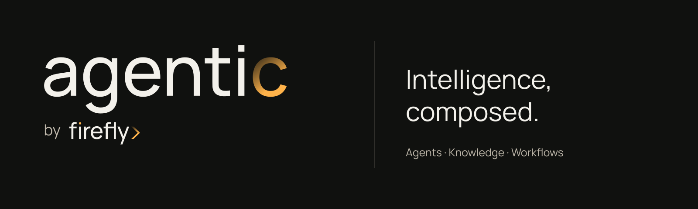
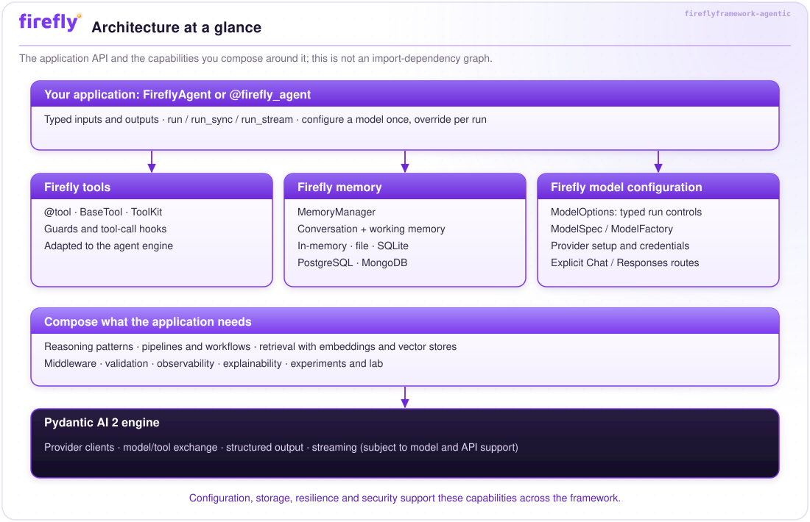
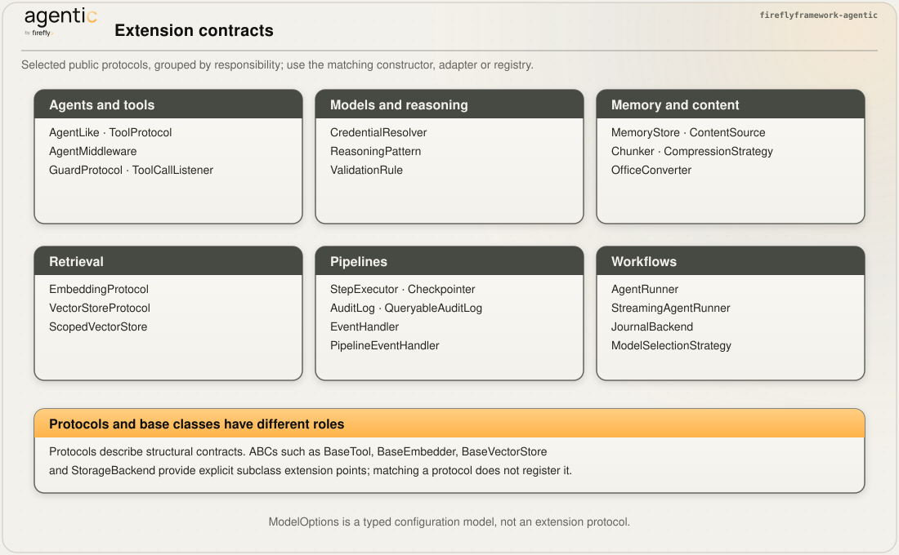
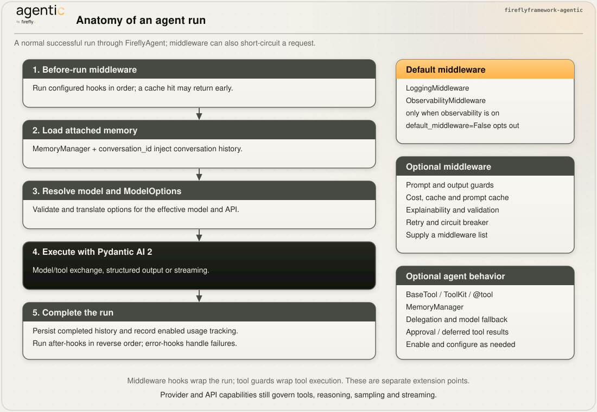
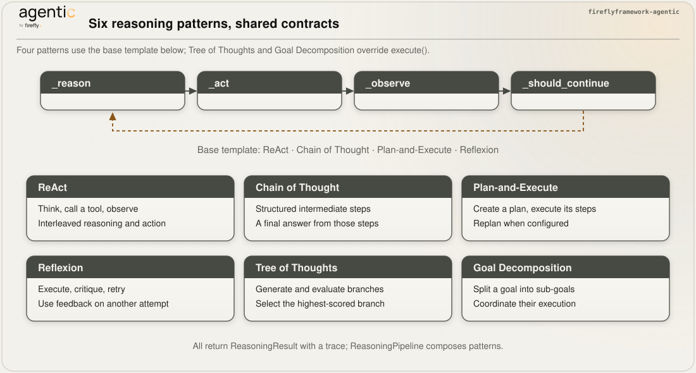
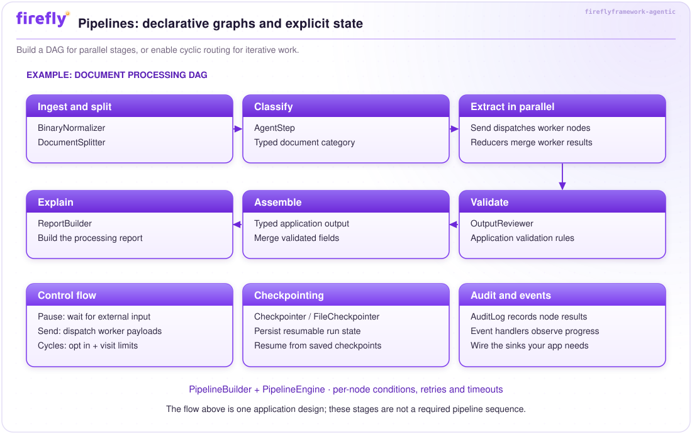
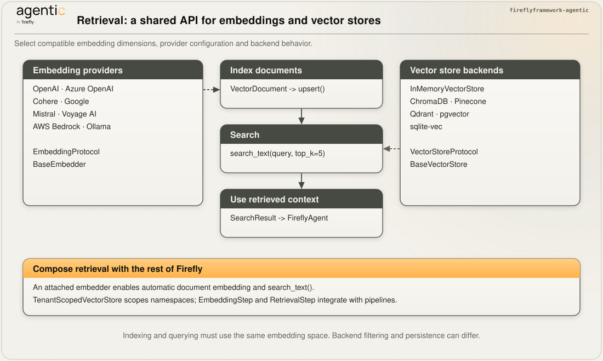
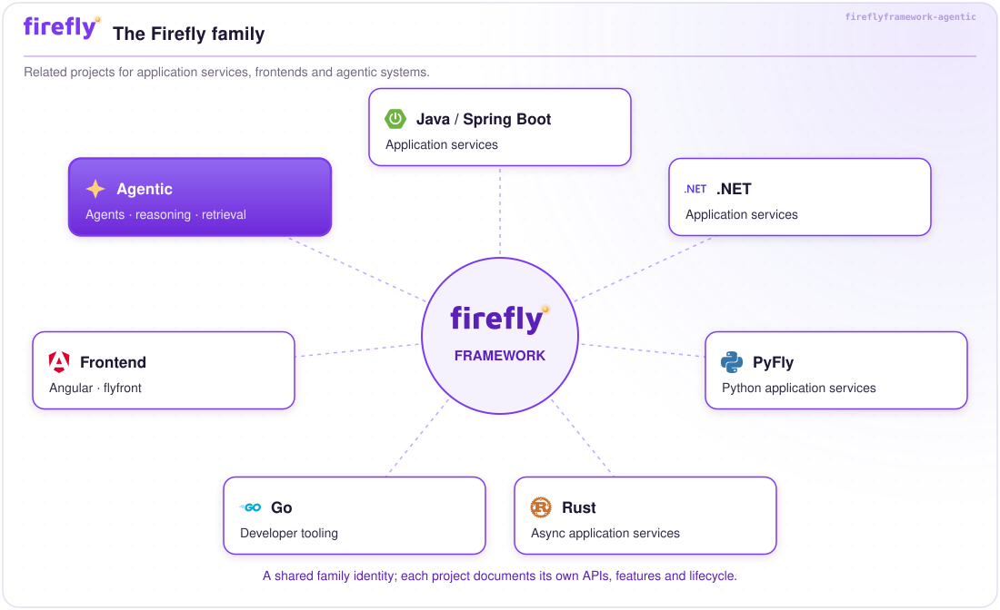

<p align="center">
  <a href="https://fireflyframework.github.io/fireflyframework-agentic/"></a>
</p>

<h1 align="center">Firefly Agentic</h1>

<p align="center">
  <strong>The production-grade agentic metaframework, built on <a href="https://ai.pydantic.dev/">Pydantic AI</a>.</strong>
</p>

<p align="center">
  <a href="https://github.com/fireflyframework/fireflyframework-agentic/releases/latest"></a>
  <a href="https://github.com/fireflyframework/fireflyframework-agentic/actions/workflows/pr-gate.yml"></a>
  <a href="https://github.com/fireflyframework/fireflyframework-agentic/actions/workflows/nightly.yml"></a>
  <a href="https://www.python.org/downloads/"></a>
  <a href="LICENSE"></a>
  <a href="https://ai.pydantic.dev/"></a>
  <a href="https://docs.astral.sh/ruff/"></a>
  <a href="https://microsoft.github.io/pyright/"></a>
</p>

<p align="center">
  <em>Build with Firefly agents, tools, memory and typed model options — gain lifecycle hooks, delegation, reasoning patterns, validation loops, RAG, and DAG pipelines, all protocol-driven and swappable.</em>
</p>

<p align="center">
  <a href="docs/tutorial.md"><b>📘 The Tutorial</b></a> &nbsp;·&nbsp;
  <a href="#5-minute-quick-start"><b>Quick Start</b></a> &nbsp;·&nbsp;
  <a href="#models-and-api-compatibility">Models and APIs</a> &nbsp;·&nbsp;
  <a href="#why-fireflyframework-agentic">Why</a> &nbsp;·&nbsp;
  <a href="#architecture-at-a-glance">Architecture</a> &nbsp;·&nbsp;
  <a href="#feature-highlights">Features</a> &nbsp;·&nbsp;
  <a href="#learn-the-framework">Docs</a> &nbsp;·&nbsp;
  <a href="#the-firefly-ecosystem">Ecosystem</a> &nbsp;·&nbsp;
  <a href="CHANGELOG.md">Changelog</a>
</p>

<p align="center">
  <sub>Copyright 2026 Firefly Software Foundation · Licensed under the Apache License 2.0</sub>
</p>

<details>
<summary><b>Table of contents</b></summary>

- [Why Firefly Agentic?](#why-fireflyframework-agentic)
- [Models and API Compatibility](#models-and-api-compatibility)
- [Key Principles](#key-principles)
- [Architecture at a Glance](#architecture-at-a-glance)
- [Feature Highlights](#feature-highlights)
- [The Firefly Ecosystem](#the-firefly-ecosystem)
- [Requirements](#requirements)
- [Installation](#installation)
- [5-Minute Quick Start](#5-minute-quick-start)
- [Using in Jupyter Notebooks](#using-in-jupyter-notebooks)
- [Learn the Framework](#learn-the-framework)
- [Development](#development)
- [Contributing](#contributing)
- [License](#license)

</details>

---

## Why fireflyframework-agentic?

[Pydantic AI](https://ai.pydantic.dev/) provides an excellent foundation: type-safe,
model-agnostic agents with structured output. But a production agentic system demands
far more than a single agent call. You need to orchestrate multi-step reasoning,
validate and retry LLM outputs against schemas, manage conversation memory across
turns, observe every call with traces and metrics, and run A/B experiments to compare
models — all without coupling your domain logic to infrastructure concerns.

**fireflyframework-agentic is the production framework built on top of Pydantic AI.**
It extends the engine with composable layers — from core configuration through
agent management, intelligent reasoning, experimentation, and pipeline orchestration —
so that every concern has a dedicated, protocol-driven module.
You write your business logic; the framework provides the architecture.

**What "metaframework" means in practice:**

- Use `FireflyAgent`, `@firefly_tool`, `MemoryManager`, and `ModelOptions` as the
  application interface; native Pydantic AI APIs remain available for advanced integrations.
- The framework wraps them with lifecycle hooks, registries, delegation routers,
  reasoning patterns, validation loops, and DAG pipelines — all
  optional, all composable, all swappable through Python protocols.
- Keep provider selection in configuration and validate options against each model's
  capabilities. Swap memory backends or other protocol implementations independently.

---

## Models and API Compatibility

Your application uses **`FireflyAgent` + Firefly tools + `MemoryManager` +
`ModelOptions`**. Pydantic AI handles the underlying model calls. Select the provider,
model, and API in configuration; keep the same agent code, tools, and memory API.

| Model selector | API used by Firefly | Compatibility |
|---|---|---|
| `openai:` or `openai-chat:` | OpenAI Chat Completions | Existing `openai:` agents keep their API |
| `openai-responses:` | OpenAI Responses | Explicit opt-in for Responses features |
| `azure:` or `azure-chat:` | Azure Chat Completions | Existing `azure:` agents keep their API |
| `azure-responses:` | Azure Responses | Requires a deployment that supports Responses |
| Other supported provider prefixes | The selected provider's API | Same Firefly agent, tool, memory, and options interface |

Set `FIREFLY_AGENTIC_DEFAULT_MODEL`, or pass `model=` to an agent. Firefly preserves
the legacy meaning of `openai:` even though Pydantic AI 2.x changed its default
routing. Without an override, Firefly still uses `openai:gpt-4o`.

<p align="center">
  <a href="assets/model-routing.svg"></a>
</p>

Model controls are abstracted too:

| Firefly option | Purpose |
|---|---|
| `max_tokens`, `request_timeout` | Output limit and per-request timeout |
| `temperature`, `top_p`, `top_k`, `seed`, `stop_sequences` | Sampling and generation controls where supported |
| `reasoning` or `reasoning_budget_tokens` | Reasoning effort or an explicit thinking budget |
| `parallel_tool_calls` | Parallel tool-call policy |
| `store_responses`, `output_verbosity` | Provider response storage and output detail where supported |

Pass `ModelOptions` to an agent, decorator, `ModelSpec`, or individual run.
Per-run options inherit agent settings and override explicitly supplied fields;
explicit `None` clears an inherited option. Firefly translates these controls and
raises `ModelOptionsError` for unsupported combinations. Portability does not make
every provider support every feature: choose a model with the tools, structured
output, and reasoning capabilities your application needs. Native `model_settings`
remain available for advanced integrations.

See the [model and options reference](docs/models.md),
[migration guide](docs/migration.md#pydantic-ai-2-and-openai-api-selection), and
[Responses example](examples/openai_responses.py). For GPT-6 reasoning with tools,
use Responses and leave `FIREFLY_AGENTIC_DEFAULT_TEMPERATURE` unset; the
[model compatibility guide](docs/models.md#gpt-6-model-selection) lists endpoint
constraints.

---

## Key Principles

1. **Explicit extension contracts** — Components expose Python protocols or
   abstract base classes; protocols marked `@runtime_checkable` also support runtime checks. Contracts span every
   layer — `AgentLike`, `ToolProtocol`, `GuardProtocol`,
   `AgentMiddleware`, `DelegationStrategy`, `ReasoningPattern`, `ValidationRule`,
   `StepExecutor`, `Checkpointer`, `Chunker`, `MemoryStore`, `EmbeddingProtocol`,
   `VectorStoreProtocol`, plus the new workflow ports (`AgentRunner`, `JournalBackend`,
   `ModelSelectionStrategy`) and more — so you can swap or extend any component without
   modifying framework internals.

2. **Convention over configuration** — Sensible defaults everywhere.
   `FireflyAgenticConfig` is a Pydantic Settings singleton that reads from environment
   variables prefixed with `FIREFLY_AGENTIC_` and `.env` files. One config object
   governs model defaults, retry counts, token limits, telemetry emission
   (`observability_enabled`), strict-cost mode (`cost_strict`), memory backends, and
   validation thresholds — override only what you need.

3. **Layered composition** — Core, agent, intelligence, experimentation, and
   orchestration group related responsibilities. Applications compose these modules
   through explicit contracts; the architecture diagram is a conceptual map,
   not an enforced Python import hierarchy.

4. **Optional dependencies** — Storage and numerical libraries (`chromadb`,
   `pinecone`, `asyncpg`, `numpy`) are declared as pip extras
   (`[vectorstores-chroma]`, `[postgres]`, `[embeddings]`, `[all]`). The framework
   imports them lazily so that you install only what your deployment requires.
   Agent provider integrations are declared explicitly with the Pydantic AI dependency.

---

## Architecture at a Glance

Follow the [visual guide](docs/diagrams.md) for a reading path through the diagrams
and their implementation guides. Open any diagram at full size to inspect its labels.

<p align="center">
  <a href="assets/architecture.svg"></a>
</p>

### Protocol Hierarchy

Implement a module's protocol or abstract base class to create your own components.
The diagram distinguishes structural protocols from inheritance-based extension points.

<p align="center">
  <a href="assets/protocols.svg"></a>
</p>

---

## Feature Highlights

- **Models and options** — `ModelOptions` translates typed request controls for the
  selected model and API. `ModelSpec`, `Credential`, and `ModelFactory` support
  application-managed model catalogues and credentials. Explicit Chat Completions
  and Responses routing preserves existing agents while enabling newer APIs;
  unsupported option combinations raise `ModelOptionsError`.

- **Agents** — `FireflyAgent` wraps `pydantic_ai.Agent` with metadata, lifecycle hooks,
  and automatic registration. `AgentRegistry` provides singleton name-based discovery.
  `DelegationRouter` routes prompts across agent pools via seven strategies
  (`RoundRobinStrategy`, `CapabilityStrategy`, `ContentBasedStrategy`,
  `CostAwareStrategy`, `ChainStrategy`, `FallbackStrategy`, `WeightedStrategy`).
  A composable middleware stack (`MiddlewareChain` over `AgentMiddleware`) wraps every
  run — with `default_middleware=True`, `LoggingMiddleware` is installed and
  `ObservabilityMiddleware` is added when `observability_enabled`, with `PromptGuardMiddleware`, `OutputGuardMiddleware`,
  `CostGuardMiddleware`, `CacheMiddleware`, `PromptCacheMiddleware`,
  `ExplainabilityMiddleware`, `ValidationMiddleware`, `RetryMiddleware`, and `CircuitBreakerMiddleware` available to
  add. `FallbackModelWrapper` / `run_with_fallback` provide automatic model failover, and
  `ResultCache` / `CacheStatistics` back response caching. The `@firefly_agent`
  decorator defines an agent in one statement. Five template factories
  (`create_summarizer_agent`, `create_classifier_agent`, `create_extractor_agent`,
  `create_conversational_agent`, `create_router_agent`) cover common use cases out of
  the box.

<p align="center">
  <a href="assets/agent-anatomy.svg"></a>
</p>

- **Tools** — `ToolProtocol` (duck-typed) and `BaseTool` (inheritance) let you choose
  your extensibility style. `ToolBuilder` provides a fluent API for building tools
  without subclassing. Four guard types (`ValidationGuard`, `RateLimitGuard`,
  `SandboxGuard`, `CompositeGuard`) intercept calls before execution (a rejected guard
  raises `ToolGuardError`). For **human-in-the-loop**, mark a tool `requires_approval=True`:
  the agent run **pauses** before executing it and returns a `DeferredToolRequests`
  (detected via `is_deferred(result)`), which you resume with `deferred_tool_results=` —
  approving (`ToolApproved`), denying (`ToolDenied`), or auto-deciding inline via an
  `approval_handler=`. The native deferred-tools types are re-exported from
  `fireflyframework_agentic.tools`. Three composition patterns (`SequentialComposer`, `FallbackComposer`,
  `ConditionalComposer`) build higher-order tools. `ToolKit` groups tools for
  bulk registration. Nine built-in tools (calculator, datetime, filesystem, HTTP,
  JSON, search, shell, text, database) are ready to attach to any agent.

- **Prompts** — `PromptTemplate` renders Jinja2 templates with variable validation
  and token estimation. `PromptRegistry` maps names to versioned templates.
  Three composers (`SequentialComposer`, `ConditionalComposer`, `MergeComposer`)
  combine templates at render time. `PromptValidator` enforces token limits and
  required sections. `PromptLoader` loads templates from strings, files, or
  entire directories.

- **Reasoning** — Six pluggable patterns share the `ReasoningPattern` interface and
  structured results. The base loop is `_reason` → `_act` → `_observe` →
  `_should_continue`; Tree of Thoughts and Goal Decomposition override execution:
  **ReAct** (observe-think-act), **Chain of Thought** (step-by-step),
  **Plan-and-Execute** (goal → plan → steps with optional replanning),
  **Reflexion** (execute → critique → retry), **Tree of Thoughts** (branch →
  evaluate → select), and **Goal Decomposition** (goal → phases → tasks).
  All produce structured `ReasoningResult` with `ReasoningTrace`. Prompts are
  slot-overridable. Each pattern's structured output is wrapped in a pydantic-ai
  output mode — selected per-pattern via `output_mode=` or framework-wide via the
  `reasoning_output_mode` config — `"tool"` (`ToolOutput`), `"native"` (provider
  structured output), or `"prompted"` (`PromptedOutput`, portable to any model).
  `OutputReviewer` can validate final outputs. `ReasoningPipeline`
  chains patterns sequentially.

<p align="center">
  <a href="assets/reasoning.svg"></a>
</p>

- **Content** — `TextChunker` splits by tokens, sentences, or paragraphs with
  configurable overlap; `MarkdownChunker` chunks structure-aware on Markdown
  headings. `DocumentSplitter` detects page breaks and section
  separators. `ImageTiler` computes tile coordinates for VLM processing.
  `BatchProcessor` runs chunks through an agent concurrently with a semaphore.
  `ContextCompressor` delegates to pluggable strategies (`TruncationStrategy`,
  `SummarizationStrategy`, `MapReduceStrategy`) — `ContextCompressor.compress` is
  async. `SlidingWindowManager` maintains a rolling token-budgeted context window.
  The `[binary]`-gated `content.binary` submodule normalises uploaded files into
  consumer-ready artifacts: `BinaryNormalizer` (with `BinaryConfig`) produces
  `BinaryArtifact`s, `sniff_media_type` detects formats, `build_office_converter`
  selects an `OfficeConverter` (`GotenbergConverter`, `LibreOfficeConverter`,
  `NoOpOfficeConverter`), and `PdfGuard`, `ImageNormalizer`, `ArchiveUnpacker`, and
  `EmailUnpacker` handle PDFs, images, archives, and emails.

- **Memory** — `ConversationMemory` stores per-conversation turn history with
  token-budget enforcement (selecting the newest turns that fit). `WorkingMemory` provides
  a scoped key-value scratchpad backed by `MemoryStore` (`InMemoryStore`, `FileStore`,
  `SQLiteStore`, `PostgreSQLStore`, or `MongoDBStore`). `MemoryManager` composes both
  behind a unified API and supports
  `fork()` for isolating working memory in delegated agents or pipeline branches
  while sharing conversation context. `create_llm_summarizer` builds an LLM-backed
  history summarizer for long conversations. Completed streaming turns retain
  provider metadata and reasoning state. Close database-backed managers with
  `close()` or `aclose()` when their owning application shuts down.

- **Validation** — Five composable rules (`RegexRule`, `FormatRule`, `RangeRule`,
  `EnumRule`, `CustomRule`) feed into `FieldValidator` and `OutputValidator`.
  `OutputReviewer` wraps agent calls with parse-then-validate retry logic: on
  failure it builds a feedback prompt and retries up to N times. `RubricReviewer`
  adds LLM-as-judge grading against a rubric (`RubricReviewer.from_rubric_file`).
  QoS guards (`ConfidenceScorer`, `ConsistencyChecker`, `GroundingChecker`, plus
  the `QoSGuard` aggregator returning a `QoSResult`) detect hallucinations and
  low-quality extractions before they propagate downstream.

- **Pipeline** — `DAG` holds `DAGNode` and `DAGEdge` objects with cycle detection
  and topological sort. `PipelineEngine` schedules nodes as their dependencies
  complete, with per-node condition gates, retries, and timeouts. `PipelineBuilder` offers a fluent API (`add_node` / `add_edge` /
  `chain`). Step types adapt agents, patterns, and functions to DAG nodes:
  `AgentStep`, `ReasoningStep`, `CallableStep`, `FanInStep`, `BatchLLMStep`,
  `EmbeddingStep`, and `RetrievalStep`. State-based routing uses `.branch()` and
  `Send`; legacy `BranchStep` and `FanOutStep` are deprecated. State reducers
  (`append`, `extend`, `merge_dict`, `replace`) merge fan-out results, and control
  signals (`Pause`, `Send`) drive branching and human-in-the-loop pauses.
  `Checkpointer` / `FileCheckpointer` (with `CheckpointRecord`) persist and resume
  long runs, and a pluggable audit-log family (`AuditLog`, `FileAuditLog`,
  `LoggingAuditLog`, `OtelAuditLog`, `QueryableAuditLog` over `AuditEntry`) records
  execution traces.

<p align="center">
  <a href="assets/pipeline.svg"></a>
</p>

- **Workflows** — `@workflow` defines a **code-defined orchestration DSL**;
  `await subworkflow(...)` composes child workflows over your agents — a complement to the declarative `pipeline` DAG,
  both living in the Orchestration layer. Compose async primitives — `agent()`,
  `parallel()`, `pipeline()`, `stream()`, `phase()`, `human()` (human-in-the-loop),
  `map_agents()` and `log()` — inside a `WorkflowContext` that carries a `WorkflowBudget`
  (concurrency, agent-count and token/cost ceilings), a `Journal` (`JournalBackend` /
  `FileJournalBackend`) for **replaying completed operations**, and a pluggable `AgentRunner`.
  `FireflyAgentRunner` (the default) runs every sub-agent call through a full
  `FireflyAgent` (middleware, guards, budget, model fallback); `DefaultAgentRunner` is the
  lightweight path. `SmartRoutingRunner` selects a model through its configured
  `ModelSelectionStrategy` (`ComplexityHeuristicStrategy`, `CostFloorStrategy`), and
  verification helpers (`cascade`, `adversarial_verify`, `judge_panel`, `loop_until_dry`)
  add quality checks. Replay requires stable control flow and call order; application
  side effects need idempotency. See [docs/workflows.md](docs/workflows.md).

<p align="center">
  <a href="assets/workflows.svg"></a>
</p>

- **Observability** — `FireflyTracer` creates OpenTelemetry spans scoped to agents,
  tools, and reasoning steps. `FireflyMetrics` records tokens (total, prompt,
  completion), latency, cost, errors, and reasoning depth via the OTel metrics API.
  `FireflyEvents` emits structured log records. `@traced` and `@metered` decorators
  instrument any function with one line. **Native pydantic-ai instrumentation is on
  by default** — rich GenAI-convention spans (and metrics) per model request and
  tool call, nested under the framework's agent span, with prompt/response content
  stripped by default for privacy (toggle via `native_instrumentation_enabled`). The
  framework emits model and agent telemetry purely through the OpenTelemetry API; the
  host application owns OTel SDK and exporter configuration. `UsageTracker` automatically records token usage, cost
  estimates, and latency for every agent run, reasoning step, and pipeline
  execution. Cost is computed through a resolver chain (`resolve_cost`,
  `genai_prices_cost`, `provider_reported_cost`, `DEFAULT_RESOLVERS`); set
  `cost_strict` to raise `UnknownModelCostError` when no price is found. `BudgetGate`
  enforces token/cost budgets per scope (`BudgetRule`, `BudgetMode`, `BudgetWindow`),
  and a pluggable sink family (`LoggingSink`, `JSONLFileSink`, `OTelMetricsSink`,
  `EventBusSink`, `CostSink`) routes usage records wherever you need them.

- **Explainability** — `TraceRecorder` captures every LLM call, tool invocation,
  and reasoning step as `DecisionRecord` objects. `ExplanationGenerator` turns
  records into human-readable narratives. `AuditTrail` provides an append-only,
  immutable log with JSON export for compliance. `ReportBuilder` produces
  Markdown and JSON reports with statistics.

- **Security** — `PromptGuard` scans inbound prompts for injection and jailbreak
  patterns; `OutputGuard` redacts secrets and PII from model output
  (`default_prompt_guard` / `default_output_guard` provide ready-to-use instances).
  At-rest protection comes from `AESEncryptionProvider` (behind the
  `EncryptionProvider` protocol) and `EncryptedMemoryStore`, which encrypts
  `MemoryEntry.content` while leaving keys, metadata, and timestamps in plaintext.
  Inbound request authentication and authorization are a hosting concern, not the
  framework's.

- **Resilience** — `CircuitBreaker` trips after a configurable failure threshold
  and rejects calls with `CircuitBreakerOpenError` while open, transitioning through
  `CircuitState` (closed → open → half-open). `CircuitBreakerMiddleware` plugs it
  into the agent middleware chain so a failing model is short-circuited before it
  drains your budget.

- **Storage** — `StorageBackend` abstracts blob/object storage with `LocalBackend`
  out of the box; `DatabaseStore` persists artifacts with leasing
  (`WriteSession`, `LockToken`), a configurable `RetryPolicy`, and `StorageMetadata`.
  Typed errors (`StorageUploadError`, `StorageDownloadError`, `StorageLeaseError`,
  `StorageTransientError`, `StoreUnavailableError`) make failure handling explicit.

- **Experiments** — `Experiment` defines variants with model, temperature, and
  prompt overrides. `ExperimentRunner` executes all variants against a dataset via
  an `agent_factory` callable. `ExperimentTracker` persists results with optional
  JSON export. `VariantComparator` computes latency, output length, and comparison
  summaries.

- **Lab** — `LabSession` manages interactive agent sessions with history.
  `Benchmark` runs agents against standardised inputs and reports p95 latency.
  `EvalOrchestrator` scores agent outputs with pluggable `Scorer` functions.
  `EvalDataset` loads/saves test cases from JSON. `ModelComparison` runs the
  same prompts across multiple agents for side-by-side analysis.

- **Evaluation** — LLM-as-judge metrics (faithfulness, relevancy, answer correctness,
  RAGAS, …) and deterministic retrieval metrics (recall@k, MRR, MAP, nDCG, …) for
  assessing LLM and pipeline outputs. Each metric is a plain function you call directly.
  Install with `pip install "fireflyframework-agentic[evaluation]"`.
  See [docs/evaluation.md](docs/evaluation.md) for the full guide.

  > **Optional developer tooling.** `fireflyframework_agentic.experiments` (A/B
  > experiments) and `fireflyframework_agentic.lab` (offline evaluation /
  > benchmarking) are leaf modules — nothing in the core imports them and they add
  > no third-party dependencies. Import them only if you run experiments or
  > evaluations; agent-building consumers can ignore them.

- **Embeddings** — `EmbeddingProtocol` (duck-typed) and `BaseEmbedder`
  (inheritance with auto-batching) provide provider-agnostic text embedding.
  Eight providers ship out of the box: **OpenAI**, **Azure OpenAI**, **Cohere**,
  **Google**, **Mistral**, **Voyage AI**, **AWS Bedrock**, and **Ollama** (local).
  `EmbedderRegistry` manages named instances. Built-in similarity utilities
  (`cosine_similarity`, `euclidean_distance`, `dot_product`) compare vectors
  without external dependencies. Configuration via `embedding_batch_size`,
  `embedding_max_retries`, and `default_embedding_model`.

- **Vector Stores** — `VectorStoreProtocol` and `BaseVectorStore` provide
  pluggable storage and retrieval with six backends: **InMemoryVectorStore**
  (zero-dependency, brute-force cosine), **ChromaVectorStore**, **PineconeVectorStore**,
  **QdrantVectorStore**, **PgVectorVectorStore** (Postgres + pgvector), and
  **SqliteVecVectorStore** (embedded sqlite-vec). A multi-tenant isolation layer
  (`ScopedVectorStore`, `TenantScopedVectorStore`, plus `scope_namespace` /
  `parse_scope_namespace` helpers) namespaces documents per tenant or scope.
  Auto-embedding upserts documents without pre-computed vectors. `search_text`
  embeds a query string and searches in one call, and `SearchFilter` narrows results
  by metadata. Namespace scoping isolates document collections. `VectorStoreRegistry`
  manages named instances. `EmbeddingStep` and `RetrievalStep` integrate directly
  into DAG pipelines for retrieval-augmented workflows.

<p align="center">
  <a href="assets/rag.svg"></a>
</p>

- **Studio** — moved to its own repository:
  [fireflyframework-agentic-studio](https://github.com/fireflyframework/fireflyframework-agentic-studio).
  A browser-based visual IDE for building agent pipelines (drag-and-drop
  canvas, code generation, AI assistant, time-travel debugging). Install
  with `pip install fireflyframework-agentic-studio` and launch with
  `firefly studio`.

---

## The Firefly Ecosystem

Firefly Agentic is the **agentic member** of the [Firefly Framework](https://github.com/fireflyframework) — a polyglot platform that brings one cohesive programming model to many runtimes. Each member shares the same firefly-in-the-dark identity, recolored per language.

<p align="center">
  <a href="assets/ecosystem.svg"></a>
</p>

- **[PyFly](https://github.com/fireflyframework/fireflyframework-pyfly)** — the Python implementation (Spring-Boot DX, async-native).
- **[Firefly for Rust](https://github.com/fireflyframework/fireflyframework-rust)** — reactive, `tokio` + `axum` microservices.
- **[Firefly Studio](https://github.com/fireflyframework/fireflyframework-agentic-studio)** — a browser-based visual IDE for building agent pipelines.

---

## Requirements

**Runtime:**

- **Python 3.13** or later
- [Git](https://git-scm.com/) when installing from source
- [UV](https://docs.astral.sh/uv/) package manager (recommended) or pip

**Core dependencies** (installed automatically):

- [pydantic-ai](https://ai.pydantic.dev/) `>=2.51.0,<3` — Agent engine (model calls, tool dispatch, streaming), with provider extras declared explicitly
- [pydantic](https://docs.pydantic.dev/) `>=2.13,<3` — Data validation and settings
- [pydantic-settings](https://docs.pydantic.dev/latest/concepts/pydantic_settings/) `>=2.14.2,<3` — Environment-based configuration
- [Jinja2](https://jinja.palletsprojects.com/) `>=3.1.0` — Prompt template engine
- [httpx](https://www.python-httpx.org/) `>=0.28.0` — Async HTTP client (built-in HTTP tool, Gotenberg converter)
- [OpenTelemetry API](https://opentelemetry.io/docs/languages/python/) `>=1.29.0` — Tracing and metrics
- [OpenTelemetry SDK](https://opentelemetry.io/docs/languages/python/) `>=1.29.0` — Telemetry primitives
- [genai-prices](https://pypi.org/project/genai-prices/) `>=0.1.9,<0.2` — LLM pricing data for cost resolution
- [markdown-it-py](https://pypi.org/project/markdown-it-py/) `>=3.0` — Structure-aware Markdown chunking
- [python-dotenv](https://pypi.org/project/python-dotenv/) `>=1.0.0` — `.env` loading for example scripts
- [PyYAML](https://pyyaml.org/) `>=6.0` — YAML prompt and skill metadata

**Optional dependencies** (installed via extras):

- `[embeddings]` — [numpy](https://numpy.org/) for fast in-memory vector math
- `[openai-embeddings]` — [openai](https://github.com/openai/openai-python) `>=1.0.0` for OpenAI/Azure embeddings
- `[vectorstores-chroma]` — [chromadb](https://www.trychroma.com/) `>=0.5.0`
- `[vectorstores-pinecone]` — [pinecone](https://www.pinecone.io/) `>=5.0.0`
- `[vectorstores-qdrant]` — [qdrant-client](https://qdrant.tech/) `>=1.12.0`
- `[vectorstores-pgvector]` — [asyncpg](https://magicstack.github.io/asyncpg/) `>=0.30.0` for Postgres + pgvector
- `[vectorstores-sqlite-vec]` — [sqlite-vec](https://github.com/asg017/sqlite-vec) `>=0.1.6` for embedded vector search
- `[binary]` — pypdf, Pillow, pillow-heif, cairosvg, py7zr, extract-msg for `content.binary`
- `[script-execution]` — Pydantic Monty for sandboxed Python execution
- `[evaluation]` — Ragas and LangChain adapters; see the [dependency caveat](docs/migration.md#optional-evaluation-dependencies)
- `[all]` — Runtime integration bundle (memory backends, security, embedding providers, vector stores, watch, binary, script execution); excludes evaluation, reasoning-eval, and dev tools

**Hosted LLM credentials** (for the provider you select):

- `OPENAI_API_KEY` for OpenAI models
- `ANTHROPIC_API_KEY` for Anthropic models
- `GEMINI_API_KEY` for Google Gemini models
- `GROQ_API_KEY` for Groq models
- Or any [Pydantic AI-supported provider](https://ai.pydantic.dev/models/)

Local models and test models may not require a provider API key.

---

## Installation

### Install a Release

Install the wheel published with [v26.09.0](https://github.com/fireflyframework/fireflyframework-agentic/releases/tag/v26.09.0)
in a Python 3.13+ virtual environment:

```bash
python -m pip install "https://github.com/fireflyframework/fireflyframework-agentic/releases/download/v26.09.0/fireflyframework_agentic-26.9.0-py3-none-any.whl"
```

To include an optional integration, use a direct-reference requirement:

```bash
python -m pip install "fireflyframework-agentic[postgres] @ https://github.com/fireflyframework/fireflyframework-agentic/releases/download/v26.09.0/fireflyframework_agentic-26.9.0-py3-none-any.whl"
```

Releases use **`YY.MM.Patch`**, starting at patch `0` for each new month. Python
normalizes `26.09.0` to `26.9.0` in package metadata and filenames. GitHub Releases
provides both the wheel and source archive; the release workflow does not publish
to PyPI. The wheel above pins the framework version for CI; lock your application's
dependencies as well when you need a reproducible environment.

### One-Line Installer

The interactive installer detects your platform, checks Python and UV, lets you
choose extras, and installs from the repository's current `main` branch.

**macOS / Linux:**

```bash
curl -fsSL https://raw.githubusercontent.com/fireflyframework/fireflyframework-agentic/main/install.sh | bash
```

**Windows (PowerShell):**

```powershell
irm https://raw.githubusercontent.com/fireflyframework/fireflyframework-agentic/main/install.ps1 | iex
```

The PowerShell installer also accepts explicit non-interactive options after you
download `install.ps1`:

```powershell
# Windows — install with all extras, no prompts
.\install.ps1 -NonInteractive -Extras all
```

### Install from Source

```bash
git clone https://github.com/fireflyframework/fireflyframework-agentic.git
cd fireflyframework-agentic
uv sync --extra all # or: pip install -e ".[all]"
```

### Optional Extras

| Extra | What it adds | When you need it |
|---|---|---|
| `postgres` | asyncpg, SQLAlchemy | PostgreSQL memory / storage persistence |
| `mongodb` | motor, pymongo | MongoDB memory persistence |
| `security` | cryptography | At-rest encryption (`EncryptedMemoryStore`, `AESEncryptionProvider`) |
| `embeddings` | numpy | Fast in-memory vector math |
| `openai-embeddings` | openai | OpenAI / Azure text embeddings |
| `cohere-embeddings` | cohere | Cohere text embeddings |
| `google-embeddings` | google-generativeai | Google text embeddings |
| `mistral-embeddings` | mistralai | Mistral text embeddings |
| `voyage-embeddings` | voyageai | Voyage AI text embeddings |
| `azure-embeddings` | openai | Azure OpenAI text embeddings |
| `bedrock-embeddings` | boto3 | AWS Bedrock text embeddings |
| `ollama-embeddings` | httpx | Ollama local text embeddings |
| `vectorstores-chroma` | chromadb | ChromaDB vector store backend |
| `vectorstores-pinecone` | pinecone | Pinecone vector store backend |
| `vectorstores-qdrant` | qdrant-client | Qdrant vector store backend |
| `vectorstores-pgvector` | asyncpg | Postgres + pgvector vector store backend |
| `vectorstores-sqlite-vec` | sqlite-vec | Embedded sqlite-vec vector store backend |
| `binary` | pypdf, Pillow, pillow-heif, cairosvg, py7zr, extract-msg | `content.binary` file normalisation |
| `watch` | watchfiles | File-watching for content sources |
| `script-execution` | pydantic-monty | Sandboxed Python execution and Firefly Code Mode |
| `reasoning-eval` | numpy, pandas | Reasoning quality comparisons |
| `evaluation` | Ragas, LangChain provider adapters | LLM-as-judge and retrieval evaluation; [compatibility constraints](docs/migration.md#optional-evaluation-dependencies) apply |
| `dev` | pytest, Ruff, Pyright, pre-commit, Testcontainers | Framework development and checks |
| `all` | Runtime integrations above | Excludes `reasoning-eval`, `evaluation`, and `dev`; `uv sync --all-extras` includes these too |

### Verify Installation

```bash
python -c "import fireflyframework_agentic; print(fireflyframework_agentic.__version__)"
```

### Uninstall

**macOS / Linux:**

```bash
curl -fsSL https://raw.githubusercontent.com/fireflyframework/fireflyframework-agentic/main/uninstall.sh | bash
```

**Windows (PowerShell):**

```powershell
irm https://raw.githubusercontent.com/fireflyframework/fireflyframework-agentic/main/uninstall.ps1 | iex
```

Or manually remove the cloned directory and its virtual environment.

---

## 5-Minute Quick Start

### 1. Configure the Model

Create a `.env` file beside your script:

```dotenv
OPENAI_API_KEY=your-api-key
FIREFLY_AGENTIC_DEFAULT_MODEL=openai-responses:gpt-6-luna
```

Keep `.env` out of version control. To use another provider, change the model
selector and supply that provider's credentials. Choose a model that supports tool
calling. The script below loads `.env`; existing environment variables take
precedence.

### 2. Run an Agent with a Tool and Memory

Save this complete script as `app.py`. It uses only Firefly's agent, tool, memory,
and model-options APIs:

```python
import asyncio

from dotenv import load_dotenv

load_dotenv()

from fireflyframework_agentic.agents import FireflyAgent
from fireflyframework_agentic.memory import MemoryManager
from fireflyframework_agentic.models import ModelOptions
from fireflyframework_agentic.tools import firefly_tool

GLOSSARY = {
    "bounded retries": "Retry a failed operation up to a configured attempt limit.",
    "backoff": "Increase the delay between retry attempts to reduce load.",
}


@firefly_tool("lookup", auto_register=False)
async def lookup(term: str) -> str:
    """Look up an engineering term in the local glossary."""
    return GLOSSARY.get(term.strip().lower(), "No glossary entry exists for that term.")


async def main() -> None:
    memory = MemoryManager()
    agent = FireflyAgent(
        name="glossary",
        instructions="Use the lookup tool for glossary definitions. Keep answers brief.",
        tools=[lookup],
        memory=memory,
        model_options=ModelOptions(max_tokens=4096),
        auto_register=False,
    )
    conversation_id = memory.new_conversation()

    first = await agent.run(
        "Use the glossary to explain bounded retries.",
        conversation_id=conversation_id,
    )
    print(first.output)

    follow_up = await agent.run(
        "Which term did I ask you to explain?",
        conversation_id=conversation_id,
        model_options=ModelOptions(max_tokens=2048),
    )
    print(follow_up.output)


if __name__ == "__main__":
    asyncio.run(main())
```

```bash
python app.py
```

This makes real provider requests. `tools=[lookup]` attaches the tool to the agent;
reusing `conversation_id` preserves the conversation. Changing the configured model
or supported API does not require rewriting the tool or memory code.

For the configured GPT-6 Luna Responses model, add `reasoning="low"` to
`ModelOptions` when reasoning is useful. Other models and APIs have their own
reasoning/tool constraints; consult the model compatibility guide.
Responses-specific storage is controlled with `store_responses=False`; these
options are validated against the selected model and API. See the
[Responses example](examples/openai_responses.py) for reasoning, structured output,
and streaming with those controls.

### 3. Extend the Same Application

| Add | Guide or runnable example |
|---|---|
| Plain Pydantic output schemas and streaming | [Model-agnostic agent](examples/model_agnostic_agent.py) |
| Decorator-defined agents | [Agent decorators](docs/agents.md#using-the-decorator) |
| Tool approval and deferred runs | [Human-in-the-loop tools](docs/tools.md#human-in-the-loop-tool-approval) |
| Persistent working memory and conversation export/import | [Memory](docs/memory.md) |
| Reasoning patterns | [Reasoning](docs/reasoning.md) |
| Output validation and review | [Validation](docs/validation.md) |
| Multi-agent pipelines | [Pipeline](docs/pipeline.md) |
| Embeddings and retrieval | [Vector stores](docs/vectorstores.md) |

Browse the [example catalogue](examples/README.md) for setup requirements,
credentials, and offline or live execution modes.

---

## Using in Jupyter Notebooks

firefly-agentic works seamlessly in Jupyter notebooks and JupyterLab.
Since the framework is async-first, use `await` directly in notebook cells
(Jupyter provides a running event loop automatically).

### Setup

```bash
# From your clone directory
cd fireflyframework-agentic
source .venv/bin/activate # activate the venv created by the installer
pip install ipykernel # install Jupyter kernel support
python -m ipykernel install --user --name fireflyagentic --display-name "Firefly Agentic"
jupyter lab # or: jupyter notebook
```

Then select the **Firefly Agentic** kernel when creating a new notebook.

### Example Notebook

```python
# Cell 1 — configure
import os
from getpass import getpass
from dotenv import load_dotenv

load_dotenv()
if not os.environ.get("OPENAI_API_KEY"):
    os.environ["OPENAI_API_KEY"] = getpass("OpenAI API key: ")
os.environ["FIREFLY_AGENTIC_DEFAULT_MODEL"] = "openai-responses:gpt-6-luna"
```

```python
# Cell 2 — create an agent
from fireflyframework_agentic.agents import FireflyAgent

from fireflyframework_agentic.models import ModelOptions

agent = FireflyAgent(name="notebook-bot", model_options=ModelOptions(max_tokens=4096))
result = await agent.run("Explain quantum entanglement in two sentences.")
print(result.output)
```

```python
# Cell 3 — use memory for multi-turn conversations
from fireflyframework_agentic.memory import MemoryManager

memory = MemoryManager(max_conversation_tokens=32_000)
agent_with_mem = FireflyAgent(name="chat", memory=memory)

cid = memory.new_conversation()
result = await agent_with_mem.run("My name is Alice.", conversation_id=cid)
print(result.output)

result = await agent_with_mem.run("What is my name?", conversation_id=cid)
print(result.output) # Alice
```

```python
# Cell 4 — reasoning patterns
from fireflyframework_agentic.reasoning import ReActPattern

react = ReActPattern(max_steps=5)
result = await react.execute(agent, "What are the top 3 uses of Python in 2026?")
print(result.output)
```

```python
# Cell 5 — structured output with validation
from pydantic import BaseModel
from fireflyframework_agentic.validation import OutputReviewer

class Summary(BaseModel):
    title: str
    bullet_points: list[str]
    confidence: float

summary_agent = FireflyAgent(name="summary", output_type=Summary)
reviewer = OutputReviewer(output_type=Summary, max_retries=2)
result = await reviewer.review(summary_agent, "Summarize the benefits of async Python.")
result.output # displays the structured Summary object in the notebook
```

> **Tip:** You do not need `asyncio.run()` or `nest_asyncio` in Jupyter — `await`
> works at the top level of any cell because Jupyter runs its own event loop.

---

## Learn the Framework

### The Complete Tutorial ("The Bible")

**[docs/tutorial.md](docs/tutorial.md)** is an 18-chapter, hands-on guide that teaches
every concept from zero to expert through a real-world **Intelligent Document Processing**
pipeline. Start here if you want to learn the framework thoroughly.

### Use Case: IDP Pipeline

**[docs/use-case-idp.md](docs/use-case-idp.md)** is a focused walkthrough of building a
7-phase IDP pipeline that ingests, splits, classifies, extracts, validates, assembles,
and explains data from corporate documents — using agents, reasoning, document splitting,
content processing, validation, explainability, and pipelines.

### Module Reference

Detailed guides for each module:

- [Architecture](docs/architecture.md) — Design principles and layer diagram
- [Agents](docs/agents.md) — Lifecycle, registry, delegation, decorators, human-in-the-loop approval
- [Models](docs/models.md) — Model factory, provider settings, Chat Completions/Responses selection, model capabilities
- [Migration](docs/migration.md) — Pydantic AI 2.x, OpenAI API selection, tool and workflow changes
- [Template Agents](docs/templates.md) — Summarizer, classifier, extractor, conversational, router
- [Tools](docs/tools.md) — Protocol, builder, guards, composition, built-ins, native HITL approval (`requires_approval`, deferred resume)
- [Prompts](docs/prompts.md) — Templates, versioning, composition, validation
- [Reasoning Patterns](docs/reasoning.md) — 6 patterns, structured outputs, output modes (`output_mode`/`reasoning_output_mode`), custom patterns
- [Content](docs/content.md) — Chunking, compression, batch processing
- [Memory](docs/memory.md) — Conversation history, working memory, storage backends
- [Validation](docs/validation.md) — Rules, QoS guards, output reviewer
- [Embeddings](docs/embeddings.md) — 8 providers, auto-batching, similarity, registry
- [Vector Stores](docs/vectorstores.md) — 6 backends, tenant scoping, auto-embedding, search_text, namespaces
- [Pipeline](docs/pipeline.md) — DAG orchestrator, parallel execution, checkpointing, audit log, retries
- [Dynamic Workflows](docs/workflows.md) — Code-defined orchestration DSL over agents: `@workflow`, `agent`/`parallel`/`pipeline`/`stream`, budgets, journal resume, smart routing, sub-workflows, HITL, `FireflyAgentRunner`
- [Observability](docs/observability.md) — Tracing, native pydantic-ai instrumentation, metrics, events, provider-agnostic cost resolvers, budget gates
- [Resilience](docs/resilience.md) — Circuit breaker (state machine + middleware), fast-fail on cascading failures
- [Storage](docs/storage.md) — Managed-SQLite durable layer: atomic writes, cross-process leasing
- [Explainability](docs/explainability.md) — Decision recording, audit trails, reports
- [Security](docs/security.md) — Prompt/output guards, at-rest encryption
- [Secure Script Execution](docs/execution.md) — Deny-by-default Monty sandbox, static safety pre-screen, `SecureScriptRunner`, Firefly Code Mode
- [Experiments](docs/experiments.md) — A/B testing, variant comparison
- [Lab](docs/lab.md) — Benchmarks, datasets, evaluators
- [Evaluation](docs/evaluation.md) — LLM-as-judge metrics, RAGAS, retrieval metrics
- Studio — moved to [fireflyframework-agentic-studio](https://github.com/fireflyframework/fireflyframework-agentic-studio)
---

## Development

```bash
git clone https://github.com/fireflyframework/fireflyframework-agentic.git
cd fireflyframework-agentic
uv sync --all-extras
```

```bash
uv run pytest -m "not nightly"
uv run ruff check .
uv run ruff format --check .
uv run pyright
uv tool run --with-requirements docs/requirements.txt mkdocs build --strict
```

The PostgreSQL integration tests start a disposable Docker container. Without
Docker, use `uv run pytest -m "not nightly and not integration"` for a smaller
suite. Live provider tests require credentials and are opt-in nightly tests.
See [the test guide](tests/README.md) for coverage and execution boundaries.

**Dev dependencies** (the `[dev]` extra, included by `uv sync --all-extras`):
[pytest](https://docs.pytest.org/) `>=8.3.0`,
[pytest-asyncio](https://pytest-asyncio.readthedocs.io/) `>=0.24.0`,
[pytest-cov](https://pytest-cov.readthedocs.io/) `>=6.0.0`,
[ruff](https://docs.astral.sh/ruff/) `>=0.9.0`,
[pyright](https://microsoft.github.io/pyright/) `>=1.1.0`,
[httpx](https://www.python-httpx.org/) `>=0.28.0`.

## Contributing

See [CONTRIBUTING.md](CONTRIBUTING.md) for guidelines.

## Changelog

See [CHANGELOG.md](CHANGELOG.md) for notable changes.

## License

Apache License 2.0. See [LICENSE](LICENSE) for the full text.
