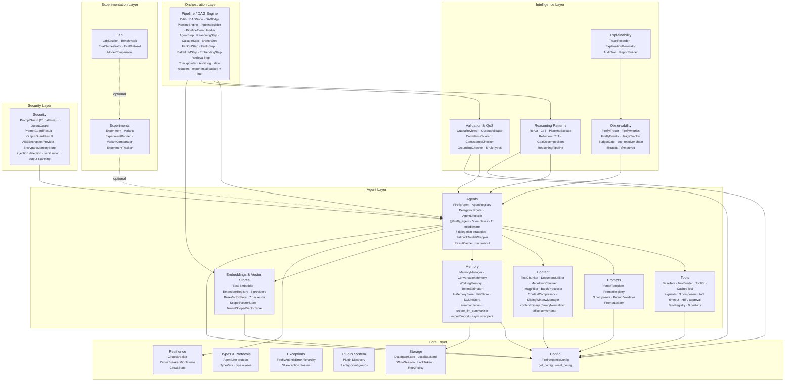
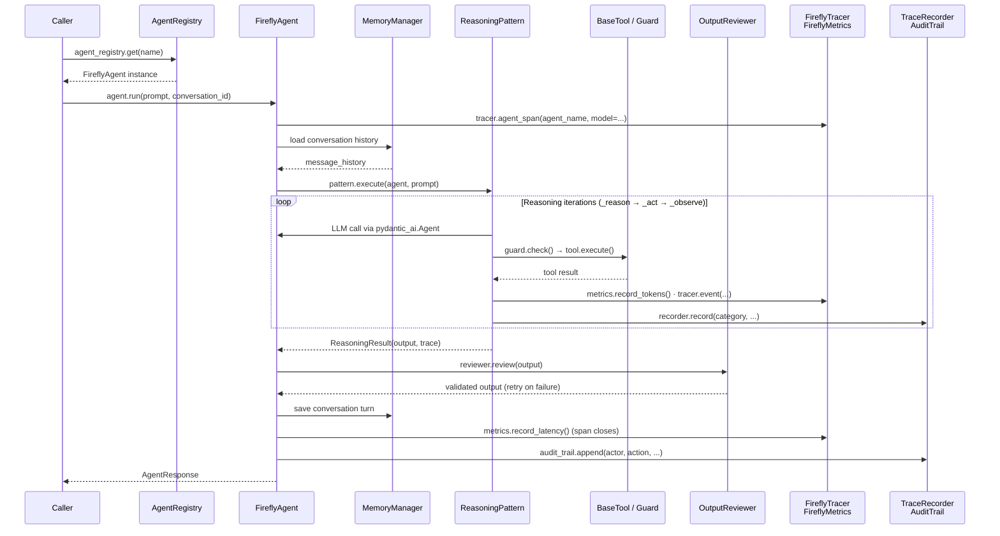
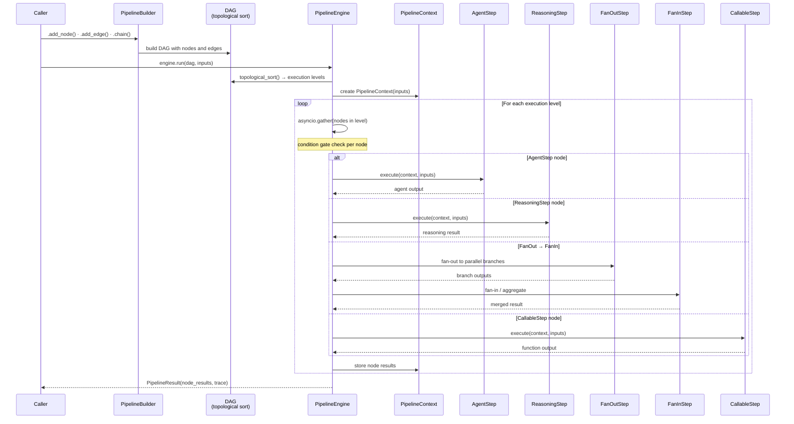
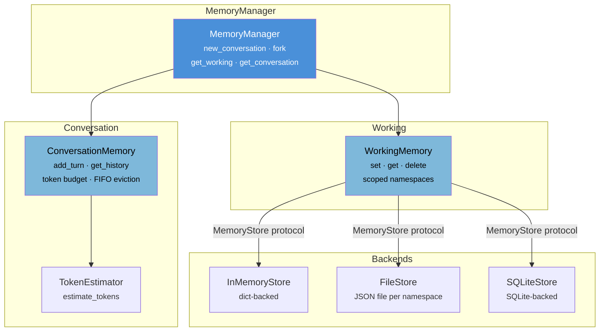
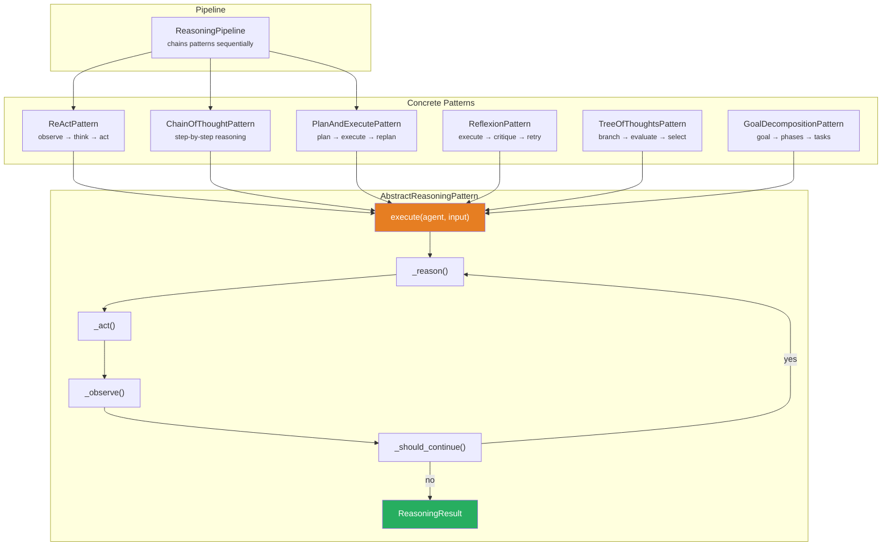
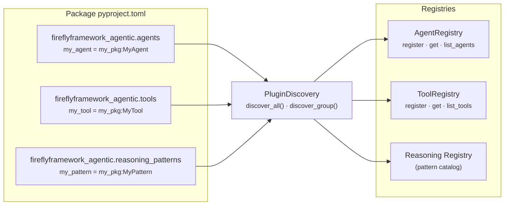

# Architecture Guide

Copyright 2026 Firefly Software Foundation. Licensed under the Apache License 2.0.

This document describes the high-level architecture of fireflyframework-agentic, the
relationships between its modules, and the design principles that guided its construction.

---

## Design Principles

The framework follows four guiding principles:

1. **Protocol-driven contracts** -- Public APIs are defined as Python `Protocol` classes
   or abstract base classes. This allows any module to be replaced or extended without
   modifying framework internals.

2. **Convention over configuration** -- Sensible defaults are provided for every setting.
   A single `FireflyAgenticConfig` object (backed by Pydantic Settings) centralises
   configuration and supports environment-variable overrides.

3. **Layered composition** -- Modules are organised into layers (Core, Security, Agent,
   Intelligence, Orchestration, plus optional Experimentation dev-tooling). Higher layers
   depend on lower layers but never the reverse.

4. **Optional dependencies** -- Heavy third-party libraries (embedding providers, vector
   store clients, storage backends, document-conversion tooling) are declared as extras. The
   core framework imports them lazily so that users only install what they need.

5. **Pure in-process library** -- fireflyframework-agentic is a library, not a server. It
   serves no HTTP port and consumes no message broker; the host service owns all serving,
   hosting, and inbound authentication. The framework *emits* model and agent spans and
   metrics through the OpenTelemetry API, but configuring the OTel SDK, exporters, and
   cross-service trace propagation is the host's responsibility.

---

## Layer Diagram



### Protocol & Class Hierarchy

Every extension point is a `@runtime_checkable` protocol. Implement the protocol to
provide your own components; the framework discovers them via duck typing.

```mermaid
classDiagram
    class AgentLike {
        <<Protocol>>
        +run(prompt, **kwargs) Any
    }
    class ToolProtocol {
        <<Protocol>>
        +name: str
        +description: str
        +execute(**kwargs) Any
    }
    class GuardProtocol {
        <<Protocol>>
        +check(tool_name, kwargs) GuardResult
    }
    class ReasoningPattern {
        <<Protocol>>
        +execute(agent, input, **kwargs) ReasoningResult
    }
    class StepExecutor {
        <<Protocol>>
        +execute(context, inputs) Any
    }
    class DelegationStrategy {
        <<Protocol>>
        +decide(agents, prompt, **kwargs) RoutingDecision
    }
    class CompressionStrategy {
        <<Protocol>>
        +compress(text, max_tokens) str
    }
    class MemoryStore {
        <<Protocol>>
        +save(namespace, entry)
        +load(namespace) list
        +delete(namespace, entry_id)
        +clear(namespace)
    }
    class ValidationRule {
        <<Protocol>>
        +name: str
        +validate(value) ValidationRuleResult
    }

    AgentLike <|.. FireflyAgent
    AgentLike <|.. pydantic_ai.Agent
    ToolProtocol <|.. BaseTool
    ToolProtocol <|.. SequentialComposer
    ToolProtocol <|.. FallbackComposer
    ToolProtocol <|.. ConditionalComposer
    GuardProtocol <|.. ValidationGuard
    GuardProtocol <|.. RateLimitGuard
    GuardProtocol <|.. SandboxGuard
    GuardProtocol <|.. CompositeGuard
    ReasoningPattern <|.. AbstractReasoningPattern
    ReasoningPattern <|.. ReasoningPipeline
    StepExecutor <|.. AgentStep
    StepExecutor <|.. ReasoningStep
    StepExecutor <|.. CallableStep
    StepExecutor <|.. BranchStep
    StepExecutor <|.. FanOutStep
    StepExecutor <|.. FanInStep
    DelegationStrategy <|.. RoundRobinStrategy
    DelegationStrategy <|.. CapabilityStrategy
    DelegationStrategy <|.. ContentBasedStrategy
    DelegationStrategy <|.. CostAwareStrategy
    DelegationStrategy <|.. ChainStrategy
    DelegationStrategy <|.. FallbackStrategy
    DelegationStrategy <|.. WeightedStrategy
    CompressionStrategy <|.. TruncationStrategy
    CompressionStrategy <|.. SummarizationStrategy
    CompressionStrategy <|.. MapReduceStrategy
    MemoryStore <|.. InMemoryStore
    MemoryStore <|.. FileStore
    MemoryStore <|.. SQLiteStore
    ValidationRule <|.. RegexRule
    ValidationRule <|.. FormatRule
    ValidationRule <|.. RangeRule
    ValidationRule <|.. EnumRule
    ValidationRule <|.. CustomRule
```



---

## Module Responsibilities

### Core Layer

The Core layer provides foundational types, configuration, exceptions, and the plugin
system. Every other module depends on at least one Core component.

- **types.py** -- Enumerations for model providers, agent states, and log levels, the
  `AgentLike` protocol, TypeVars, and shared type aliases. (The other extension-point
  protocols -- `ToolProtocol`, `GuardProtocol`, `ReasoningPattern`, `StepExecutor`,
  `DelegationStrategy`, `CompressionStrategy`, `MemoryStore`, `ValidationRule` -- live in
  their respective modules, not in `types.py`.)
- **config.py** -- `FireflyAgenticConfig`, a Pydantic Settings singleton that reads
  from environment variables and `.env` files. It actively rejects removed serving/exposure
  config fields (e.g. `otlp_endpoint`, `rbac_enabled`, `cors_allowed_origins`,
  `cost_calculator`) with a `ValueError`.
- **exceptions.py** -- A structured exception hierarchy of 42 classes rooted at
  `FireflyAgenticError`.
- **plugin.py** -- `PluginDiscovery` discovers and loads entry-point plugins at startup.
- **resilience/circuit_breaker.py** -- `CircuitBreaker` (with `CircuitState` and
  `CircuitBreakerOpenError`) and `CircuitBreakerMiddleware` for guarding agent runs against
  cascading failures.
- **storage/** -- `DatabaseStore` and `LocalBackend` (behind the `StorageBackend` protocol)
  for binary/large-object persistence, with `WriteSession`, `LockToken` leasing,
  `RetryPolicy`, `StorageMetadata`, and a family of storage error types.

### Security Layer

The Security layer provides input sanitisation and prompt injection defence.

- **security/prompt_guard.py** -- `PromptGuard` scans user prompts for 25 known injection
  patterns (including encoding bypass, zero-width evasion, multi-language, jailbreak,
  and system prompt extraction), reports matches, and optionally sanitises suspicious
  fragments. `default_prompt_guard` provides a shared instance.
- **security/output_guard.py** -- `OutputGuard` scans LLM responses for PII (6 patterns),
  secrets (9 patterns), harmful content (4 patterns), custom patterns, and deny
  patterns. `default_output_guard` provides a shared instance. See the
  [Security Guide](security.md).
- **security/encryption.py** -- `EncryptionProvider` protocol with `AESEncryptionProvider`,
  and `EncryptedMemoryStore(store, encryption_key, provider=None)` which transparently
  encrypts `MemoryEntry.content` at rest (keys, metadata, and timestamps stay plaintext).

> Inbound-request authorization (RBAC/JWT) is intentionally **not** part of the framework --
> it is a hosting concern owned by the host service.

### Agent Layer

The Agent layer wraps Pydantic AI's `Agent` class and adds lifecycle management,
a global registry, delegation strategies, and declarative decorators.

- **base.py** -- `FireflyAgent` wraps `pydantic_ai.Agent` with metadata, hooks,
  middleware chain, run timeout, and streaming usage tracking.
- **registry.py** -- `AgentRegistry` is a thread-safe singleton that maps names to agents.
- **lifecycle.py** -- `AgentLifecycle` handles init, warmup, and shutdown hooks.
- **delegation.py** -- Multi-agent delegation. Strategies return
  `RoutingDecision` objects (ranked, scored `Candidate` tuples plus
  metadata). Built-ins: `RoundRobinStrategy`, `CapabilityStrategy`,
  `ContentBasedStrategy` (LLM routing), and `CostAwareStrategy` (priced
  via the cost resolver chain, pool-relative normalisation).
  Combinators `ChainStrategy`, `FallbackStrategy`, and `WeightedStrategy`
  nest strategies without subclassing. `DelegationRouter` separates
  `decide()` (pure, emits the `firefly.routing.decision` OTel event)
  from `execute()` (runs the chosen agent, forks memory); `route()`
  remains the one-call convenience.
- **context.py** -- `AgentContext` carries request-scoped data through an agent run.
- **decorators.py** -- `@firefly_agent` registers an agent declaratively.
- **middleware.py** -- `AgentMiddleware` protocol, `MiddlewareContext`, and `MiddlewareChain`
  for pluggable before/after hooks on every agent run.
- **builtin_middleware.py** -- The concrete middleware stack: `LoggingMiddleware`,
  `PromptGuardMiddleware`, `CostGuardMiddleware`, `ObservabilityMiddleware`,
  `ExplainabilityMiddleware`, `CacheMiddleware`, `OutputGuardMiddleware`,
  `ValidationMiddleware`, and `RetryMiddleware`. Two more live elsewhere:
  `PromptCacheMiddleware` (`prompt_cache.py`) and `CircuitBreakerMiddleware`
  (`resilience/`) -- 11 concrete middleware in total. By default `FireflyAgent` auto-wires
  `LoggingMiddleware` always, and `ObservabilityMiddleware` when `config.observability_enabled`
  is set; the rest are opt-in. (Rate-limit retry is handled inside `FireflyAgent.run()`
  rather than by `RetryMiddleware`.)
- **prompt_cache.py** -- `PromptCacheMiddleware` and `CacheStatistics` for prompt-level
  response caching.
- **fallback.py** -- `FallbackModelWrapper` and `run_with_fallback()` for
  automatic model failover. Accepts both `str` and `Model` objects for
  cross-provider fallback chains.
- **model_utils.py** -- Centralized model identity extraction
  (`extract_model_info`, `get_model_identifier`, `detect_model_family`) for
  uniform handling of both `"provider:model"` strings and `Model` objects
  across the framework's observability and resilience layers.
- **cache.py** -- `ResultCache` with TTL, LRU eviction, and thread-safe access.
- **templates/** -- Pre-built template agents (summarizer, classifier, extractor,
  conversational, router) available as factory functions. See the
  [Template Agents Guide](templates.md).

### Intelligence Layer

- **reasoning/** -- Pluggable reasoning patterns (ReAct, Chain of Thought, etc.)
  with a pipeline for chaining patterns sequentially.
- **observability/** -- Emits OpenTelemetry spans (`FireflyTracer`), custom metrics
  (`FireflyMetrics`), and events (`FireflyEvents`) through the OTel API; `UsageTracker`
  rolls up token usage, cost is resolved via the resolver chain (`resolve_cost`,
  `genai_prices_cost`, `provider_reported_cost`, `DEFAULT_RESOLVERS`; gated by the
  `cost_strict` config flag), and `BudgetGate` enforces budgets. Configuring the OTel SDK
  and exporters is the host service's responsibility.
- **explainability/** -- Decision recording (`TraceRecorder.record(category, ...)` with a
  `.records` property), natural-language explanation generation (`ExplanationGenerator`),
  audit trails (`AuditTrail.append(actor, action, ...)`), and report building
  (`ReportBuilder(title=...).build(records)`).

### Memory Layer

- **memory/conversation.py** -- `ConversationMemory`: token-aware, per-conversation
  chat history wrapping pydantic-ai's `message_history` mechanism.
- **memory/working.py** -- `WorkingMemory`: scoped key-value scratchpad for session
  facts, entities, and intermediate state.
- **memory/store.py** -- `MemoryStore` protocol with `InMemoryStore`, `FileStore`, and
  `SQLiteStore` backends (`MemoryScope` namespacing). `create_llm_summarizer` builds an
  LLM-backed history summarizer.
- **memory/manager.py** -- `MemoryManager` facade composing conversation and working
  memory, with `fork()` for multi-agent scope isolation.

### Embeddings & Vector Store Layer

These modules are reusable building blocks for retrieval-augmented workflows; the framework
ships no turnkey corpus/RAG agent, but `RetrievalStep` and `EmbeddingStep` (orchestration)
let you assemble retrieval pipelines.

- **embeddings/** -- `BaseEmbedder` (the `EmbeddingProtocol`), `EmbedderRegistry`, similarity
  helpers (`cosine_similarity`, `dot_product`, `euclidean_distance`), and 8 provider backends
  under `embeddings/providers/`: OpenAI, Azure, Cohere, Google, Mistral, Voyage, Bedrock,
  and Ollama.
- **vectorstores/** -- `BaseVectorStore` (the `VectorStoreProtocol`), `VectorStoreRegistry`,
  `VectorDocument`, `SearchFilter`/`SearchResult`, and 7 backends: `InMemoryVectorStore`,
  `ChromaVectorStore`, `PineconeVectorStore`, `QdrantVectorStore`, `PgVectorVectorStore`,
  and `SqliteVecVectorStore`. The scoped layer (`ScopedVectorStore`,
  `TenantScopedVectorStore`, `scope_namespace`, `parse_scope_namespace`) partitions a
  shared store by tenant/scope.

### Content Layer

- **content/chunking.py** -- `TextChunker`, `DocumentSplitter`, `ImageTiler`, and
  `BatchProcessor` for splitting large inputs into model-friendly chunks.
- **content/markdown_chunker.py** -- `MarkdownChunker` for structure-aware Markdown splitting.
- **content/compression.py** -- `ContextCompressor` with pluggable strategies
  (`TruncationStrategy`, `SummarizationStrategy`, `MapReduceStrategy`) and
  `SlidingWindowManager`. `ContextCompressor.compress(...)` is async.
- **content/binary/** (the `[binary]` extra) -- A document-conversion subsystem.
  `BinaryNormalizer` (configured by `BinaryConfig`) turns uploaded files into
  `BinaryArtifact`s: `sniff_media_type` detects the type, office documents are converted via
  `build_office_converter` (`GotenbergConverter` / `LibreOfficeConverter` /
  `NoOpOfficeConverter`, all implementing `OfficeConverter`), `PdfGuard` rejects encrypted or
  corrupt PDFs, `ImageNormalizer` standardises images, and `ArchiveUnpacker` / `EmailUnpacker`
  expand archives and email attachments.

### Validation Layer

- **validation/rules.py** -- Composable validation rules (`RegexRule`, `FormatRule`,
  `RangeRule`, `EnumRule`, `CustomRule`), `FieldValidator`, `OutputValidator`, and
  `ValidationReport`.
- **validation/qos.py** -- `ConfidenceScorer`, `ConsistencyChecker`,
  `GroundingChecker`, and `QoSGuard` (returning `QoSResult`) for post-generation quality
  checks.
- **validation/reviewer.py** -- `OutputReviewer` and `RubricReviewer` (LLM-as-judge, with
  `from_rubric_file(...)`) for criteria-based review, returning `ReviewResult` with
  `RetryAttempt` history.

### Orchestration Layer

- **pipeline/dag.py** -- `DAG`, `DAGNode`, `DAGEdge` with topological sort, cycle
  detection, execution-level grouping, and per-node `FailureStrategy`.
- **pipeline/engine.py** -- `PipelineEngine` runs DAGs with eager scheduling, concurrency,
  retries, timeouts, condition gates, and failure strategy enforcement.
- **pipeline/builder.py** -- Fluent `PipelineBuilder` for constructing pipelines.
- **pipeline/steps.py** -- Step executors implementing the `StepExecutor` protocol:
  `AgentStep`, `ReasoningStep`, `CallableStep`, `BranchStep`, `FanOutStep`, `FanInStep`,
  `BatchLLMStep`, `EmbeddingStep`, and `RetrievalStep`
  (`RetrievalStep(store, *, embedder=None, top_k=5, input_key="input")`).
- **pipeline/context.py** -- `PipelineContext` shared data bus, with state reducers
  (`append`, `extend`, `merge_dict`, `replace`) and control signals (`Pause`, `Send`).
- **pipeline/result.py** -- `NodeResult`, `PipelineResult`, and `ExecutionTraceEntry`.
- **pipeline checkpointing & audit** -- `Checkpointer` / `FileCheckpointer` (recording
  `CheckpointRecord`s) for resumable runs, and the audit-log family `AuditLog` /
  `FileAuditLog` / `LoggingAuditLog` / `OtelAuditLog` / `QueryableAuditLog` (emitting
  `AuditEntry`s). Event hooks are wired via `EventHandler` / `PipelineEventHandler`.

### Experimentation Layer (optional dev-tooling)

These are optional, leaf dev-tooling modules; the core framework never imports them.

- **experiments/** -- Define experiments with named variants, run them through an
  `ExperimentRunner(experiment, agent_factory, *, context=None)`, track metrics with
  `ExperimentTracker(storage_path=...)`, and compare results with `VariantComparator`.
- **lab/** -- Interactive sessions, benchmarks, datasets, side-by-side comparisons,
  and pluggable evaluators.

---

## Request Flow

The following diagram shows the typical lifecycle of an in-process agent run: a caller
resolves an agent from the registry and invokes it, the agent reasons with tools, and
observability and explainability artefacts are produced.



### Pipeline Execution Flow

When agents are orchestrated through a `DAG` pipeline, `PipelineEngine` executes
nodes level-by-level. Each node wraps a `StepExecutor` implementation.



### Memory Architecture

`MemoryManager` composes `ConversationMemory` and `WorkingMemory`, delegating
persistence to a pluggable `MemoryStore` backend.



### Reasoning Pattern Architecture

All six reasoning patterns extend `AbstractReasoningPattern`, which provides a
template-method loop: `_reason` → `_act` → `_observe` → `_should_continue`.



---

## Multi-Provider Support

The framework is **provider-agnostic**: it never re-implements a provider client.
Model construction is delegated entirely to pydantic-ai, so any provider pydantic-ai
supports — OpenAI, Anthropic, Google/Gemini, Groq, Bedrock, Mistral, Cohere,
DeepSeek, xAI, OpenRouter, Azure, Ollama, … — works by passing either a
`"provider:model"` string or a pydantic-ai `Model` object to any agent. Everything
the framework adds on top is built to be provider-uniform:

- **Identity normalisation** — `model_utils` (`get_model_identifier`,
  `extract_model_info`, `detect_model_family`) turns both `"provider:model"`
  strings and `Model` objects (reading the provider from the model's own
  `_provider.name`) into a canonical `provider:model` string. This single key feeds
  cost lookup, quota/backoff, and usage grouping, so a model object never "drops"
  its provider.
- **Cost** — pricing keys off that identifier across all providers, with
  provider-aware nuances: Gemini `thoughts_tokens` are counted (OpenAI/Anthropic
  fold reasoning into output), Bedrock vendor-prefixed ids get a retry on the bare
  model name, and an authoritative provider cost (OpenRouter `usage.cost`) wins when
  available. See [Observability → Cost Resolution](observability.md#cost-resolution).
- **Prompt caching** — routed by model *family*: Anthropic writes `cache_control`
  breakpoints, OpenAI supplies a routing key (its caching is automatic), Gemini uses
  `cachedContent`; Claude **via Bedrock/OpenRouter is skipped with a warning**
  (those backends cache differently). See [Agents → PromptCacheMiddleware](agents.md#promptcachemiddleware).
- **Tool schemas** — real `python_type`s keep tool schemas portable, with one
  caveat: **Gemini rejects free-form `dict[str, Any]` object schemas** — use a JSON
  string or a nested model instead. See [Tools](tools.md#full-fidelity-schemas--runcontext).
- **Failover & rate limits** — `FallbackModelWrapper` / `run_with_fallback` fail over
  across providers, and rate-limit backoff prefers a provider's structured retry hint
  (e.g. Gemini `retry_delay`) before falling back to exponential backoff.

This is validated end-to-end against a real provider by
`tests/integration/test_real_anthropic_e2e.py` (nightly; see [tests/README](../tests/README.md)).

---

## Plugin System

Plugins are discovered via Python entry points under three well-known groups:
`fireflyframework_agentic.agents`, `fireflyframework_agentic.tools`, and
`fireflyframework_agentic.reasoning_patterns`. The `PluginDiscovery` class scans
these groups and loads the referenced objects so they can self-register with
their respective registries.



To create a plugin, add entry points in your package's `pyproject.toml`:

```toml
[project.entry-points."fireflyframework_agentic.agents"]
my_agent = "my_package.agents:MyAgent"

[project.entry-points."fireflyframework_agentic.tools"]
my_tool = "my_package.tools:MyTool"
```

Then call discovery at startup:

```python
from fireflyframework_agentic.plugin import PluginDiscovery

result = PluginDiscovery.discover_all()
print(f"Loaded {len(result.successful)} plugins, {len(result.failed)} failed")
```

---

## Configuration

All configuration is managed through `FireflyAgenticConfig`, which reads values from
environment variables prefixed with `FIREFLY_AGENTIC_`. For example:

```bash
export FIREFLY_AGENTIC_DEFAULT_MODEL=openai:gpt-4o
export FIREFLY_AGENTIC_LOG_LEVEL=DEBUG
export FIREFLY_AGENTIC_OBSERVABILITY_ENABLED=true
export FIREFLY_AGENTIC_NATIVE_INSTRUMENTATION_ENABLED=true  # native pydantic-ai GenAI spans (see observability.md)
export FIREFLY_AGENTIC_REASONING_OUTPUT_MODE=prompted  # reasoning structured-output strategy (see reasoning.md)
```

> The framework emits telemetry through the OpenTelemetry API but does **not** configure the
> OTel SDK or any exporter. Wiring up the SDK/exporter endpoint (including any OTLP endpoint)
> is the host service's responsibility; `config.observability_enabled` only gates whether the
> framework emits spans and metrics. Supplying removed serving/exposure fields (e.g.
> `otlp_endpoint`, `rbac_enabled`, `cors_allowed_origins`) raises a `ValueError`.

The configuration singleton is available via:

```python
from fireflyframework_agentic.core import FireflyAgenticConfig

config = FireflyAgenticConfig()
print(config.default_model)
```
