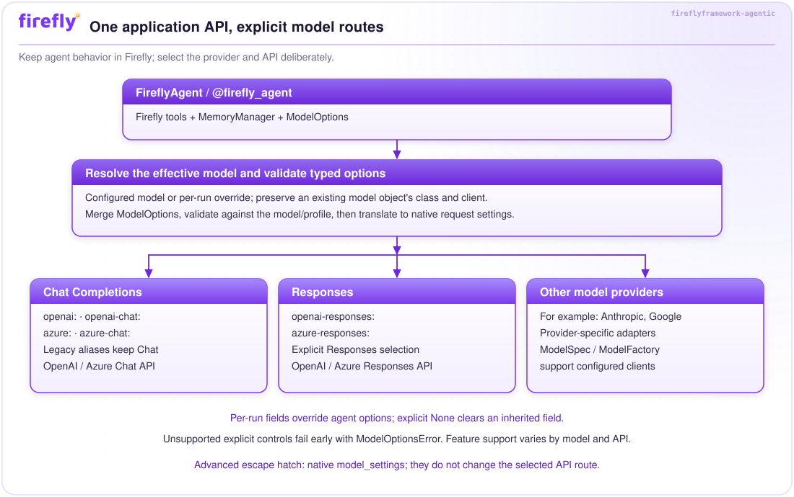
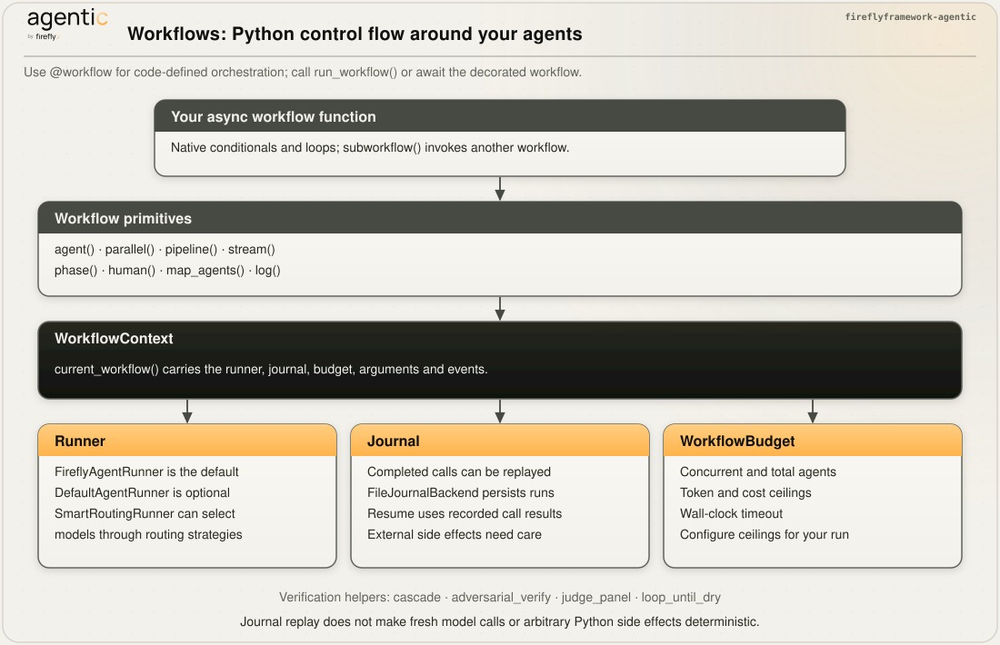

# Visual Guide

Start with the application boundary, then follow a request to its model. Each
figure links to a guide with runnable examples and precise behavior. Select a
figure to open the SVG at full size; the text below it also explains its purpose.
In the detailed guides, use **Expand diagram** to read dense Mermaid diagrams
and scroll horizontally, then **Fit diagram to page** to return to the overview.

## 1. The application boundary

Build with `FireflyAgent`, Firefly tools, `MemoryManager`, and `ModelOptions`.
Pydantic AI supplies the model engine. Reasoning patterns, validation, experiments,
and orchestration are capabilities you compose around that boundary. The layers
organize responsibilities; they do not assert an enforced import hierarchy.

Read [Architecture](architecture.md) for component responsibilities and extension points.

## 2. Model selection and API compatibility

The model selector chooses the provider and API. Typed options are merged and
validated before a request. Existing `openai:` / `azure:` selectors retain Chat
Completions; `openai-responses:` / `azure-responses:` select Responses explicitly.
The application interface stays the same, while each model's capabilities still
constrain tools, reasoning, sampling and structured output.

Read [Models and options](models.md) for precedence, credentials, capability
validation and model-specific constraints, or [Migration](migration.md) when upgrading.

## 3. A request through an agent

`FireflyAgent` coordinates model options, memory, middleware, tools and lifecycle
hooks. Logging middleware is installed automatically; observability follows its
configuration. Other middleware is explicitly attached. A regular agent call does
not automatically run a reasoning pattern or output reviewer.

Read [Agents](agents.md) for run modes and lifecycle details, [Tools](tools.md) for
guards and deferred approval, and [Memory](memory.md) for retention rules.
Conversation history is process-local unless exported and imported; a persistent
`MemoryStore` backs working memory, not automatic conversation persistence.

## 4. Extend a component

Structural protocols and abstract base classes offer different extension styles.
Attach or register your implementation through the relevant module's API. Runtime
instance checks apply only to protocols declared runtime-checkable.

Read [Architecture](architecture.md), [Tools](tools.md), [Embeddings](embeddings.md)
and [Vector stores](vectorstores.md) for the corresponding contracts.

## 5. Add deliberate reasoning

Choose a reasoning pattern when an application needs a multi-step strategy. The
patterns produce structured results and traces; their control loops and stop
conditions differ. These application-visible traces are structured records, not a
guarantee that a provider exposes its internal reasoning.

Read [Reasoning](reasoning.md) to choose a pattern, bound execution and manage memory.

## 6. Orchestrate agents

Pipelines schedule ready nodes from dependency edges. Conditional `Send` routing
and `Pause` are separate controls; checkpointing and resumption are explicit.

Dynamic workflows express orchestration in Python. Their runner calls agents,
while a journal records completed operations for resumable execution. Tools with
external side effects still need application-level idempotency.

Read [Pipelines](pipeline.md) and [Workflows](workflows.md) to select the appropriate
orchestration model. The [IDP walkthrough](use-case-idp.md) combines these concepts
in document processing.

## 7. Ground answers with retrieval

Embedding and vector-store interfaces are separate from chat-model selection.
Ingest and embed documents, retrieve relevant passages, then supply that context
to an agent. The framework provides the components; the application wires the
retrieval and generation steps together.

Read [Embeddings](embeddings.md) and [Vector stores](vectorstores.md), then explore
the [example catalogue](https://github.com/fireflyframework/fireflyframework-agentic/blob/main/examples/README.md).

## Maintaining these diagrams

The branded SVGs are generated from one source and mirrored into the documentation
site. Mermaid diagrams live beside the explanations in each guide. The
[asset guide](https://github.com/fireflyframework/fireflyframework-agentic/blob/main/assets/README.md)
describes regeneration; the
[documentation contributor guide](https://github.com/fireflyframework/fireflyframework-agentic/blob/main/docs/README.md)
covers strict builds, links and browser rendering checks.
