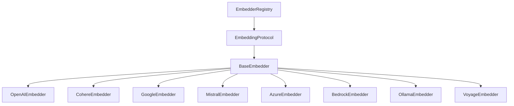

# Embeddings Guide

Copyright 2026 Firefly Software Foundation. Licensed under the Apache License 2.0.

The Embeddings module provides provider-agnostic text embedding generation with
auto-batching, heuristic token estimation, and a pluggable provider registry. It
supports 8 embedding providers out of the box and pairs with the vector store
backends to build retrieval and similarity-search workflows.

---

## Architecture

The embedding subsystem follows the framework's three-layer extensibility model:



- **EmbeddingProtocol** -- Duck-typed `@runtime_checkable` protocol with `embed()` and `embed_one()`.
- **BaseEmbedder** -- Abstract base class providing auto-batching, token estimation, and error wrapping.
- **Concrete Providers** -- Provider-specific implementations that override `_embed_batch()`.
- **EmbedderRegistry** -- Named registry for managing multiple embedder instances.

---

## Quick Start

```python
from fireflyframework_agentic.embeddings.providers import OpenAIEmbedder

# Create an embedder
embedder = OpenAIEmbedder(model="text-embedding-3-small")

# Embed multiple texts (auto-batched)
result = await embedder.embed(["Hello world", "How are you?"])
print(result.embeddings)      # [[0.012, -0.034, ...], [0.056, ...]]
print(result.dimensions)       # 1536
print(result.usage.total_tokens)  # 8

# Embed a single text (returns raw vector)
vector = await embedder.embed_one("Hello world")
print(len(vector))  # 1536
```

### Result types

`embed()` returns an `EmbeddingResult`; `embed_one()` returns a raw `list[float]`.
Both types are exported from `fireflyframework_agentic.embeddings`:

| Type | Fields |
|------|--------|
| `EmbeddingResult` | `embeddings: list[list[float]]`, `model: str`, `usage: EmbeddingUsage \| None`, `dimensions: int` |
| `EmbeddingUsage` | `total_tokens: int` |

> **Note on token counts.** `usage.total_tokens` is a *heuristic estimate* computed by
> `BaseEmbedder` (~4 characters per token), not a provider-reported figure. Treat it as a
> rough guide, not exact billing data.

### Error handling

Provider calls raise `EmbeddingProviderError` on API failure. `BaseEmbedder.embed()`
re-raises any `EmbeddingError` subclass unchanged and wraps other exceptions in
`EmbeddingError`. Both live in `fireflyframework_agentic.exceptions`
(`EmbeddingProviderError` is a subclass of `EmbeddingError`).

```python
from fireflyframework_agentic.exceptions import EmbeddingError, EmbeddingProviderError

try:
    result = await embedder.embed(["Hello world"])
except EmbeddingProviderError as exc:
    ...  # provider/API-level failure
except EmbeddingError as exc:
    ...  # any other embedding failure
```

---

## Providers

### OpenAI

```python
from fireflyframework_agentic.embeddings.providers import OpenAIEmbedder

embedder = OpenAIEmbedder(
    model="text-embedding-3-small",  # or "text-embedding-3-large"
    dimensions=512,                   # optional dimension reduction
    api_key="sk-...",                 # falls back to OPENAI_API_KEY env var
)
```

Install: `pip install fireflyframework-agentic[openai-embeddings]`

### Azure OpenAI

```python
from fireflyframework_agentic.embeddings.providers import AzureEmbedder

embedder = AzureEmbedder(
    model="my-embedding-deployment",
    azure_endpoint="https://my-resource.openai.azure.com/",
    api_version="2024-02-01",
    api_key="...",                    # falls back to AZURE_OPENAI_API_KEY env var
    dimensions=512,                   # optional
)
```

Install: `pip install fireflyframework-agentic[azure-embeddings]`

### Cohere

```python
from fireflyframework_agentic.embeddings.providers import CohereEmbedder

embedder = CohereEmbedder(
    model="embed-english-v3.0",
    api_key="...",                    # falls back to CO_API_KEY env var
    input_type="search_document",     # or "search_query"
)
```

Install: `pip install fireflyframework-agentic[cohere-embeddings]`

### Google Generative AI

```python
from fireflyframework_agentic.embeddings.providers import GoogleEmbedder

embedder = GoogleEmbedder(
    model="models/text-embedding-004",
    api_key="...",                    # falls back to GOOGLE_API_KEY env var
)
```

Install: `pip install fireflyframework-agentic[google-embeddings]`

### Mistral

```python
from fireflyframework_agentic.embeddings.providers import MistralEmbedder

embedder = MistralEmbedder(
    model="mistral-embed",
    api_key="...",                    # falls back to MISTRAL_API_KEY env var
)
```

Install: `pip install fireflyframework-agentic[mistral-embeddings]`

### Voyage AI

```python
from fireflyframework_agentic.embeddings.providers import VoyageEmbedder

embedder = VoyageEmbedder(
    model="voyage-3",
    api_key="...",                    # falls back to VOYAGE_API_KEY env var
)
```

Install: `pip install fireflyframework-agentic[voyage-embeddings]`

### AWS Bedrock

```python
from fireflyframework_agentic.embeddings.providers import BedrockEmbedder

embedder = BedrockEmbedder(
    model="amazon.titan-embed-text-v2:0",
    region="us-east-1",                 # default; passed to boto3 as region_name
)
```

Install: `pip install fireflyframework-agentic[bedrock-embeddings]`

### Ollama (Local)

```python
from fireflyframework_agentic.embeddings.providers import OllamaEmbedder

embedder = OllamaEmbedder(
    model="nomic-embed-text",
    base_url="http://localhost:11434",  # default
)
```

Install: `pip install fireflyframework-agentic[ollama-embeddings]`

---

## Similarity Utilities

Built-in functions for comparing embedding vectors:

```python
from fireflyframework_agentic.embeddings import cosine_similarity, euclidean_distance, dot_product

a = [0.1, 0.2, 0.3]
b = [0.4, 0.5, 0.6]

cosine_similarity(a, b)    # 0.0 to 1.0 (higher = more similar)
euclidean_distance(a, b)   # 0.0+ (lower = more similar)
dot_product(a, b)          # raw dot product
```

---

## Registry

Manage multiple named embedder instances:

```python
from fireflyframework_agentic.embeddings import EmbedderRegistry
from fireflyframework_agentic.embeddings.providers import OpenAIEmbedder, CohereEmbedder

registry = EmbedderRegistry()
registry.register("openai", OpenAIEmbedder())
registry.register("cohere", CohereEmbedder())

embedder = registry.get("openai")
result = await embedder.embed(["test"])

print(registry.list_names())  # ["openai", "cohere"]
registry.unregister("cohere")
```

---

## Auto-Batching

`BaseEmbedder` automatically splits large text lists into provider-sized batches
(default: 100, configurable via `FireflyAgenticConfig.embedding_batch_size`).
Subclasses only need to implement `_embed_batch()` for a single batch.

```python
# This automatically splits into batches of 100
texts = ["text"] * 500
result = await embedder.embed(texts)
assert len(result.embeddings) == 500
```

Per-instance `batch_size` and `max_retries` can be passed to any embedder constructor
(via `**kwargs`) to override the global config defaults for that instance:

```python
embedder = OpenAIEmbedder(model="text-embedding-3-small", batch_size=256, max_retries=5)
```

---

## Configuration

Global defaults via environment variables (prefix `FIREFLY_AGENTIC_`):

| Setting | Env Variable | Default |
|---------|-------------|---------|
| `default_embedding_model` | `FIREFLY_AGENTIC_DEFAULT_EMBEDDING_MODEL` | `openai:text-embedding-3-small` |
| `embedding_batch_size` | `FIREFLY_AGENTIC_EMBEDDING_BATCH_SIZE` | `100` |
| `embedding_max_retries` | `FIREFLY_AGENTIC_EMBEDDING_MAX_RETRIES` | `3` |

---

## Custom Provider

To create a custom embedding provider, subclass `BaseEmbedder` and implement `_embed_batch()`:

```python
from fireflyframework_agentic.embeddings.base import BaseEmbedder

class MyEmbedder(BaseEmbedder):
    def __init__(self, model: str = "my-model", **kwargs):
        super().__init__(model=model, **kwargs)

    async def _embed_batch(self, texts: list[str], **kwargs) -> list[list[float]]:
        # Call your embedding API here
        return [[0.0] * 384 for _ in texts]
```

---

## Pipeline Integration

Use embeddings as a node in a DAG pipeline. Build the pipeline with
`PipelineBuilder` and add an `EmbeddingStep`, then run the resulting
`PipelineEngine`:

```python
from fireflyframework_agentic.pipeline import EmbeddingStep, PipelineBuilder

engine = (
    PipelineBuilder("embed-pipeline")
    .add_node("embed", EmbeddingStep(my_embedder))  # input_key="input" by default
    .build()
)

result = await engine.run(inputs="Hello world")
embed_result = result.outputs["embed"].output  # an EmbeddingResult
print(embed_result.dimensions)
```

`EmbeddingStep(embedder, *, input_key="input")` reads the text(s) to embed from
`inputs[input_key]` (a single string is wrapped into a list) and returns an
`EmbeddingResult`.

See also: [Vector Stores Guide](vectorstores.md) for retrieval workflows with `RetrievalStep`.
