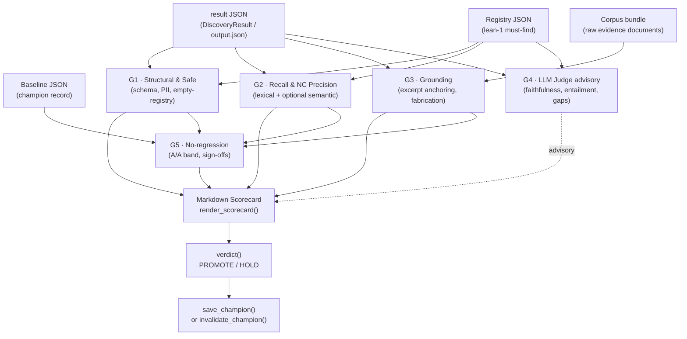

# Evaluation Guide

Copyright 2026 Firefly Software Foundation. Licensed under the Apache License 2.0.

The Evaluation subpackage provides gate-based quality gates, LLM-as-judge advisory scoring,
champion/challenger tracking, and deterministic retrieval metrics for assessing agent outputs.

---

## Concepts

### Gate pipeline

The evaluation framework runs **five gates** in sequence. Every gate always runs — a failed
gate raises a *flag*, not a veto, so the scorecard always carries the complete picture.

| Gate | Name | Kind | Description |
|------|------|------|-------------|
| G1 | Structural & Safe | Deterministic | Schema validity, PII non-disclosure, empty-registry guard. |
| G2 | Must-finds & Negative Controls | Deterministic | Lexical/semantic recall against the must-find registry; NC precision. |
| G3 | Evidence (Grounding) | Deterministic | Excerpt-to-corpus anchoring; fabricated-evidence detection. |
| G4 | LLM-as-a-Judge | Advisory (non-blocking) | Semantic faithfulness, entailment, gap detection — never changes the verdict. |
| G5 | No-regression / Promotion | Human decision | Champion/challenger comparison with A/A noise band; collects sign-offs. |

**No gate vetoes.** Failures append to the `GateResult` flags list and scoring continues.
The scorecard carries every signal regardless of which gates fired.

### GateResult

`GateResult` is a dataclass returned by each gate:

```python
@dataclass
class GateResult:
    gate: str       # "G1", "G2", …, "G5"
    passed: bool
    reason_code: str = ""   # e.g. "SCHEMA_INVALID", "NC_HIT", "UNGROUNDED"
    details: dict = field(default_factory=dict)
```

`str(gate_result)` prints `[G2] PASS` or `[G2] FLAG:NC_HIT`.

### Verdict

`verdict(gate_results)` returns `VERDICT_PROMOTE` or `VERDICT_HOLD`:

- `VERDICT_PROMOTE` — all gates passed **and** G5 (the human sign-off gate) is present.
- `VERDICT_HOLD` — any gate flagged, or G5 is missing.

The CLI exits `0` on PROMOTE and `1` on HOLD, so it composes into CI.

### Must-find registry

A registry (`lean-1` schema) is a JSON file listing items the discovery output is
expected to surface (`tier` L0–L3) and negative controls (NC) it must *not* assert.

```json
{
  "schema_version": "lean-1",
  "corpus": "banca-cordobesa",
  "items": [
    { "id": "ao-pep-4eyes", "tier": "L0", "scope": "decision",
      "description": "PEP cases require a second analyst sign-off (4-eyes)",
      "keywords": ["PEP", "4-eyes"],
      "evidence": ["SOP-002-kyc-edd.md"] },
    { "id": "ao-nc-realtime", "tier": "NC", "scope": "finding",
      "description": "KYC-Hub synchronises in real time — factually false" }
  ]
}
```

Tier semantics: L0 = must-find control (a single miss flags the run), L1 = high-priority,
L2 = important, L3 = nice-to-have (not counted in the recall floor).

### Advisory judge (G4)

G4 calls a chat LLM (or local Ollama model) for semantic checks the deterministic gates
cannot perform: faithfulness, entailment, numeric/temporal fidelity, actionability,
fabricated-entity detection, and more. It is:

- **Non-blocking** — `AdvisoryReport` is carried separately and never enters `verdict()`.
- **Non-deterministic** — each metric runs `judge_runs` times (default: 3) and the
  median score is reported.
- **Opt-in** — pass `--judge-model provider:model` to activate it; omit the flag to skip.

### Champion/challenger pattern

Champions are **per-corpus**. `ChampionRecord` persists the best-known run so that
promotion decisions are made against a stable, signed baseline rather than the last run.

```
               ┌──────────────────────────────────────────┐
               │  run result JSON (challenger)            │
               └──────────────┬───────────────────────────┘
                              │
              ┌───────────────▼───────────────┐
              │  G1 · G2 · G3 (deterministic) │
              │  G4 (advisory, opt-in)         │
              └───────────────┬───────────────┘
                              │  flags + scores
              ┌───────────────▼───────────────┐
              │  G5 — no-regression vs        │
              │  champion baseline + A/A band │
              └───────────────┬───────────────┘
                              │
              ┌───────────────▼───────────────┐
              │  Markdown scorecard           │
              │  PROMOTE / HOLD               │
              └───────────────────────────────┘
```

`invalidate_champion()` marks a baseline invalid. The `EMPTY_MUST_FIND` guard in G1
prevents a fake-100% champion being created against an empty registry.

---

## Installation

The evaluation subpackage requires `scipy` and `numpy`. Install the optional extra:

```bash
pip install "fireflyframework-agentic[evaluation]"
```

The `flyeval` CLI entry-point is registered automatically by the package. Verify:

```bash
flyeval --version
```

---

## CLI

All subcommands exit `0` on PROMOTE and `1` on HOLD.

### `flyeval gate`

Run the full gate pipeline against a result JSON and print a Markdown scorecard.

```bash
flyeval gate \
  --result      runs/2026-06-18/output.json \
  --registry    registries/banca-cordobesa.json \
  --baseline    baselines/banca-cordobesa.json \
  --judge-model anthropic:claude-3-5-haiku \
  --judge-runs  3
```

Key flags:

| Flag | Default | Description |
|------|---------|-------------|
| `--result` | required | Path to the run's `output.json`. |
| `--registry` | required | Must-find registry (lean-1 JSON). |
| `--baseline` | — | Champion baseline JSON for G5 regression check. |
| `--judge-model` | — | `provider:model` for G4 advisory judge. |
| `--judge-runs` | 3 | Number of independent judge calls (median aggregation). |
| `--no-judge` | — | Skip G4 entirely. |
| `--recall-floor` | 0.70 | Minimum G2 recall before flagging. |
| `--grounding-floor` | 0.90 | Minimum G3 grounding rate before flagging. |
| `--corpus` | — | Path to the evidence corpus bundle for G3 verification. |
| `--pii-list` | — | Path to a JSON array of names to scan for PII leaks (G1). |
| `--embedder` | — | `provider:model` for semantic recall (G2 embedding path). |
| `--model-id` | "unknown" | Identifier of the model under evaluation (for scorecard). |

### `flyeval aa-band`

Compute the A/A noise band from multiple repeated runs of the same model to establish
the noise floor before setting up the champion comparison.

```bash
flyeval aa-band \
  --results runs/aa-run-1/output.json runs/aa-run-2/output.json runs/aa-run-3/output.json \
  --registry registries/banca-cordobesa.json
```

The command prints per-metric variance and recommended noise floors.

### `flyeval day-zero`

Promote the very first champion for a corpus (Day-Zero protocol). Requires at least
`--signoffs` sign-offs (default: 2) before PROMOTE is issued.

```bash
flyeval day-zero \
  --result   runs/2026-06-18/output.json \
  --registry registries/banca-cordobesa.json \
  --baseline baselines/banca-cordobesa.json \
  --signoffs 2
```

The command writes the new `ChampionRecord` into `--baseline` on success.

### `flyeval invalidate`

Mark the current champion invalid with a documented reason. Use this when the registry
changes in a way that makes the existing champion incommensurable.

```bash
flyeval invalidate \
  --baseline baselines/banca-cordobesa.json \
  --reason   "Registry expanded from 39 to 94 items (lean-1 v2)."
```

---

## Python API

### Running gates

```python
import json
from fireflyframework_agentic.evaluation import (
    run_gates,
    render_scorecard,
    verdict,
    load_registry,
    VERDICT_PROMOTE,
)

result = json.loads(open("runs/2026-06-18/output.json").read())
registry = load_registry("registries/banca-cordobesa.json")

gate_results = run_gates(result, registry)
scorecard_md = render_scorecard(
    gate_results,
    corpus="banca-cordobesa",
    model_id="anthropic:claude-3-5-sonnet",
    run_id="2026-06-18-sonnet-01",
)
print(scorecard_md)

v = verdict(gate_results)
print("Verdict:", v)  # "PROMOTE" or "HOLD"
assert v == VERDICT_PROMOTE
```

### Champion management

```python
from fireflyframework_agentic.evaluation import (
    load_champion,
    save_champion,
    invalidate_champion,
    ChampionRecord,
)

# Load the current champion (returns None on Day Zero).
champ = load_champion("baselines/banca-cordobesa.json")
if champ is None:
    print("Day Zero — no champion yet.")
else:
    print(f"Champion: {champ.run_id} | {champ.primary_metric()}={champ.primary_score():.3f}")

# Save a new champion after a successful PROMOTE.
new_champ = ChampionRecord(
    corpus="banca-cordobesa",
    run_id="2026-06-18-sonnet-01",
    model_id="anthropic:claude-3-5-sonnet",
    registry_sha256=registry.sha256(),
    scores={"lexical_recall": 0.857, "grounding_pct": 0.941},
    human_sign_offs=["alice", "bob"],
)
save_champion("baselines/banca-cordobesa.json", new_champ)

# Invalidate when the registry changes materially.
invalidate_champion(
    "baselines/banca-cordobesa.json",
    reason="Registry expanded from 39 to 94 items.",
)
```

### EvalConfig

`EvalConfig` is a Pydantic model that captures the parameters of a single evaluation run.
Use it to build reproducible, serialisable run records.

```python
from fireflyframework_agentic.evaluation.models import EvalConfig

cfg = EvalConfig(
    model_id="anthropic:claude-3-5-sonnet",
    corpus="banca-cordobesa",
    run_id="2026-06-18-sonnet-01",
    registry_path="registries/banca-cordobesa.json",
    corpus_path="corpora/banca-cordobesa/",
    baseline_path="baselines/banca-cordobesa.json",
    judge_model="anthropic:claude-3-5-haiku",
    judge_runs=3,
)
print(cfg.model_dump_json(indent=2))
```

### Advisory judge (G4)

```python
from fireflyframework_agentic.evaluation import run_judge, JudgeClient, build_embedder

client = JudgeClient(
    chat_fn=my_chat_fn,        # callable(system: str, user: str) -> dict
    embed_fn=build_embedder("ollama:bge-m3"),
)

advisory = run_judge(
    result=result,
    registry=registry,
    client=client,
    runs=3,
    missed_ids=[],   # IDs the deterministic G2 missed — judge tries to recover them
)
print(advisory.scores)   # dict of metric -> float
print(advisory.errors)   # any metrics that failed (best-effort, never raises)
```

---

## Retrieval Metrics

The `compute_retrieval_metrics()` function computes standard IR metrics over ranked
retrieval results. It is imported from `fireflyframework_agentic.lab.retrieval_metrics`
and re-exported by the evaluation package.

Supported metrics at cut-offs k ∈ {1, 5, 10}:

- **Hit@k** — at least one gold document in top-k.
- **Recall@k** — fraction of gold documents in top-k.
- **Precision@k** — fraction of top-k results that are gold.
- **MRR@10** — mean reciprocal rank of the first gold hit.
- **MAP@10** — mean average precision.
- **nDCG@10** — normalised discounted cumulative gain.

```python
from fireflyframework_agentic.evaluation import compute_retrieval_metrics, RetrieverMetrics

# Each row is a query; each row's "retrieved" list is ranked (rank=1 is top).
rows = [
    {
        "query": "KYC enhanced due diligence steps",
        "gold": ["SOP-002-kyc-edd.md"],
        "retrieved": [
            {"rank": 1, "source_id": "SOP-002-kyc-edd.md", "is_gold": True},
            {"rank": 2, "source_id": "SOP-001-account-opening.md", "is_gold": False},
            {"rank": 3, "source_id": "INT-002-KYC-Jaime.md", "is_gold": True},
        ],
    },
]

metrics: RetrieverMetrics = compute_retrieval_metrics(rows)
print(f"Recall@5:  {metrics.recall_5:.3f}")
print(f"nDCG@10:   {metrics.ndcg_10:.3f}")
print(f"MRR@10:    {metrics.mrr_10:.3f}")
```

`RetrieverMetrics` also carries optional fields when the raw rows include them:
`no_answer_rate`, `citation_precision`, `mean_search_ms`, `mean_answer_ms`.

---

## Architecture



---

## Reference

### Exports

All symbols below are importable from `fireflyframework_agentic.evaluation`.

| Symbol | Kind | Description |
|--------|------|-------------|
| `EvalConfig` | Pydantic model | Parameters for a single evaluation run. |
| `GateResult` | Dataclass | Result of one gate: `gate`, `passed`, `reason_code`, `details`. |
| `Verdict` | Constants class | `Verdict.PROMOTE`, `Verdict.HOLD`. |
| `VERDICT_PROMOTE` | `str` | `"PROMOTE"`. |
| `VERDICT_HOLD` | `str` | `"HOLD"`. |
| `run_gates()` | Function | Run all four deterministic gates (G1–G3, G5 shape) and return results. |
| `g2_recall_precision()` | Function | Run only G2 (recall + NC precision) and return `GateResult`. |
| `verdict()` | Function | Derive PROMOTE/HOLD from a list of `GateResult`. |
| `render_scorecard()` | Function | Render a Markdown scorecard from gate results and metadata. |
| `ChampionRecord` | Dataclass | Per-corpus champion metadata and scores. |
| `load_champion()` | Function | Load the current champion from `baseline.json`; returns `None` on Day Zero. |
| `save_champion()` | Function | Persist a new champion to `baseline.json`. |
| `invalidate_champion()` | Function | Mark the champion invalid with a reason string. |
| `AdvisoryReport` | Dataclass | G4 judge output: `scores`, `errors`, `raw`. |
| `run_judge()` | Function | Run the LLM-as-a-Judge advisory pass. |
| `JudgeClient` | Dataclass | Holds `chat_fn` and `embed_fn` for the judge. |
| `OllamaEmbedder` | Class | Local Ollama embedding callable (default BGE-M3). |
| `build_embedder()` | Function | Factory: `"ollama:bge-m3"` → `OllamaEmbedder`. |
| `cosine()` | Function | Cosine similarity between two numpy vectors. |
| `Registry` | Dataclass | Parsed must-find registry with real items and NC items. |
| `RegistryItem` | Dataclass | One must-find or NC item: `id`, `tier`, `scope`, `description`, …. |
| `load_registry()` | Function | Parse and validate a lean-1 registry JSON file. |
| `registry_sha256()` | Function | SHA-256 of a registry file path. |
| `load_corpus()` | Function | Load and index a corpus bundle for G3 evidence verification. |
| `corpus_sha256()` | Function | SHA-256 of a corpus directory or bundle. |
| `verify_evidence_index()` | Function | Check each `evidence_index` entry against the corpus. |
| `EMPTY` / `FABRICATED` / `SOURCE_UNKNOWN` / `VERIFIED` | `str` | Evidence verification status constants. |
| `RetrieverMetrics` | Pydantic model | IR metrics: `recall_k`, `precision_k`, `ndcg_10`, `mrr_10`, `map_10`. |
| `compute_retrieval_metrics()` | Function | Compute IR metrics from a list of ranked-retrieval result rows. |
| `anchored()` | Function | True if claim and evidence share at least one non-trivial token. |
| `matches()` | Function | Gate predicate: does a candidate match a registry item? |
| `source_stem()` | Function | Normalise a `locator` path to its file stem for dedup. |
| `tokens()` | Function | Tokenise text to a list of lowercase word strings. |
| `aa_band()` | Function | Compute per-metric A/A noise floor from repeated runs. |
| `aggregate_grounding()` | Function | Summarise grounding stats across a result's findings. |
| `left_skew_flag()` | Function | True when the score distribution is left-skewed (over-optimistic). |
