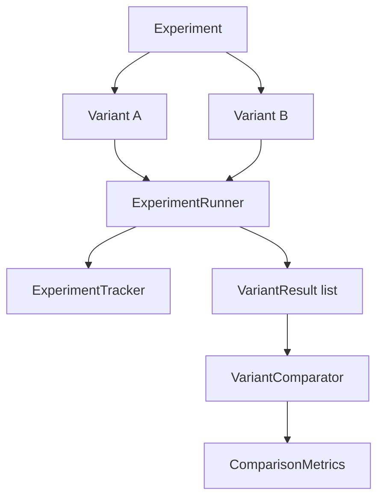
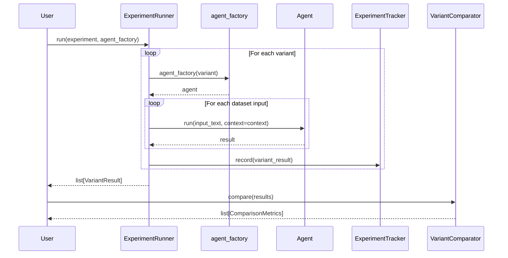

# Experiments Guide

Copyright 2026 Firefly Software Foundation. Licensed under the Apache License 2.0.

The Experiments module provides A/B testing for agent variants, result tracking,
and variant comparison. It is an **optional leaf dev-tooling subpackage**: the
framework core never imports it, and it pulls in no extra dependencies beyond the
core install.

---

## Concepts

An experiment compares two or more variants of an agent configuration. Each
`Variant` defines a different model, system prompt template, temperature, or any
other parameter. The `ExperimentRunner` builds an agent for each variant via a
factory callable, runs every variant against the experiment's dataset, records a
`VariantResult` per variant in an `ExperimentTracker`, and the `VariantComparator`
turns those results into per-variant `ComparisonMetrics`.



---

## Defining an Experiment

A `Variant` carries its configuration as top-level fields — `model`, `temperature`,
`prompt_template`, and a free-form `parameters` dict — not a nested `config` object.
An `Experiment` holds a `name`, an optional `hypothesis`, the `variants`, and a
`dataset` of test inputs (plus `metadata` and `tags`).

```python
from fireflyframework_agentic.experiments import Experiment, Variant

experiment = Experiment(
    name="model_comparison",
    hypothesis="Claude 3.5 produces shorter summaries than GPT-4o.",
    variants=[
        Variant(name="gpt4o", model="openai:gpt-4o"),
        Variant(name="claude", model="anthropic:claude-3-5-sonnet"),
    ],
    dataset=["Summarise this article.", "Explain quantum computing."],
)
```

`Experiment` also exposes convenience methods so the dataset and variants can be
built incrementally:

```python
experiment = Experiment(name="model_comparison")
experiment.add_variant(Variant(name="gpt4o", model="openai:gpt-4o"))
experiment.add_inputs(["Summarise this article.", "Explain quantum computing."])
```

---

## Running an Experiment

`ExperimentRunner.run` takes the experiment and an **agent factory** — a callable
`(variant) -> agent` that builds an agent configured for the given variant. The
test inputs come from `experiment.dataset`; there is no `inputs=` parameter. For
each variant, the runner builds the agent, runs it over every dataset input, and
collects a `VariantResult` (outputs, average latency, and run count).

```python
from fireflyframework_agentic.agents import FireflyAgent
from fireflyframework_agentic.experiments import ExperimentRunner


def build_agent(variant):
    return FireflyAgent(
        name=variant.name,
        model=variant.model,
        model_settings={"temperature": variant.temperature},
    )


runner = ExperimentRunner()
results = await runner.run(experiment, build_agent)
```

The runner owns an `ExperimentTracker` internally. By default it creates one
(`ExperimentRunner(tracker=None)` auto-instantiates an in-memory tracker), and it
calls `tracker.record(...)` for each `VariantResult` as the run proceeds. Pass your
own tracker to persist results:

```python
from fireflyframework_agentic.experiments import ExperimentTracker

tracker = ExperimentTracker(storage_path="./experiment_results.json")
runner = ExperimentRunner(tracker=tracker)
results = await runner.run(experiment, build_agent)
```

`run` also accepts an optional `context` (`AgentContext`). When omitted, the runner
creates one; either way it sets `context.experiment_id = experiment.name` and
forwards the context to each `agent.run(...)` call so model and agent telemetry can
be correlated back to the experiment. If an agent's `run` does not accept a
`context` keyword, the runner falls back to `agent.run(input_text)`.

---

## Results and Comparison Models

Two public models describe the outputs:

- **`VariantResult`** — what `ExperimentRunner.run` returns (one per variant) and the
  input to `VariantComparator`. Fields: `experiment_name`, `variant_name`, `outputs`
  (list of stringified agent outputs), `avg_latency_ms`, `total_runs`, `timestamp`,
  and `metadata`.
- **`ComparisonMetrics`** — what `VariantComparator.compare` returns (one per variant).
  Fields: `variant_name`, `avg_latency_ms`, `total_runs`, and `avg_output_length`.

---

## Tracking Results

The `ExperimentTracker` stores results in memory and, when given a `storage_path`,
mirrors them to a single JSON file. Persistence is automatic: every `record(...)`
re-writes the file (the runner calls `record` for you). There are no `save`/`load`
methods — query results with the `results` property, `get_by_experiment(name)`, or
`export_json()`, and reset with `clear()`. `len(tracker)` returns the number of
recorded results.

```python
from fireflyframework_agentic.experiments import ExperimentTracker

tracker = ExperimentTracker(storage_path="./experiment_results.json")
# ...after runner.run(experiment, build_agent) with this tracker...

all_results = tracker.results
just_this_experiment = tracker.get_by_experiment("model_comparison")
json_blob = tracker.export_json()
```

---

## Comparing Variants

The `VariantComparator` computes per-variant `ComparisonMetrics` from a list of
`VariantResult` and can render a human-readable summary.

```python
from fireflyframework_agentic.experiments import VariantComparator

comparator = VariantComparator()
metrics = comparator.compare(results)   # list[ComparisonMetrics]
print(comparator.summary(results))      # str
```

The summary includes, per variant:

- Average latency (ms), total runs, and average output length (characters).
- A human-readable block for quick side-by-side comparison.

---

## Workflow Diagram


