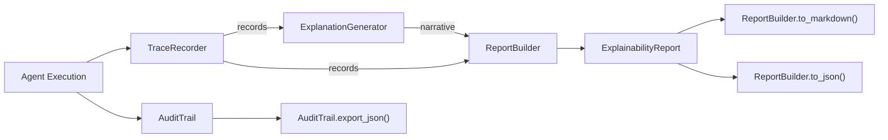

# Explainability Guide

Copyright 2026 Firefly Software Foundation. Licensed under the Apache License 2.0.

The Explainability module records agent decisions, generates human-readable explanations,
maintains an audit trail, and produces structured reports. Everything runs in-process; the
host service decides how (or whether) to persist or expose the resulting records.

The public surface is small and stable:

```python
from fireflyframework_agentic.explainability import (
    AuditEntry,
    AuditTrail,
    DecisionRecord,
    ExplainabilityReport,
    ExplanationGenerator,
    ReportBuilder,
    ReportSection,
    TraceRecorder,
    default_trace_recorder,
)
```

---

## Architecture



`TraceRecorder` feeds both the `ExplanationGenerator` and the `ReportBuilder`. The
`AuditTrail` is an independent append-only log used for compliance archival.

---

## Trace Recorder

The `TraceRecorder` captures the decision points an agent reaches during execution:
LLM calls, tool invocations, reasoning steps, and delegations. Records are held in
memory and retrieved later for explanation generation or reporting.

```python
from fireflyframework_agentic.explainability import TraceRecorder

recorder = TraceRecorder()
recorder.record(
    "tool_invocation",
    agent="writer",
    input_summary="search the web for recent filings",
    output_summary="3 documents retrieved",
    detail={"tool": "search_tool", "top_k": 3},
)
```

`record()` is the only mutating call:

```python
def record(
    self,
    category: str,
    *,
    agent: str = "",
    detail: dict[str, Any] | None = None,
    input_summary: str = "",
    output_summary: str = "",
) -> DecisionRecord
```

It creates a `DecisionRecord`, appends it, and returns it. The `category` is a free-form
string; the convention used across the framework is one of `"llm_call"`,
`"tool_invocation"`, `"reasoning_step"`, or `"delegation"`.

A `DecisionRecord` has these fields:

| Field | Type | Description |
|-------|------|-------------|
| `timestamp` | `datetime` | UTC, auto-populated at creation |
| `category` | `str` | decision kind (see convention above) |
| `agent` | `str` | originating agent name (default `""`) |
| `detail` | `dict[str, Any]` | arbitrary structured context |
| `input_summary` | `str` | short summary of the input |
| `output_summary` | `str` | short summary of the result |

Recorded decisions are read back through the `records` property (a copy of the internal
list), and the recorder supports `len()` and `clear()`:

```python
print(len(recorder))            # number of recorded decisions
for rec in recorder.records:    # read-only copy of all DecisionRecords
    print(rec.category, rec.agent)
recorder.clear()                # drop all records
```

A module-level singleton, `default_trace_recorder`, is provided for the common case where
a single shared recorder is enough (it is also the recorder used by
`ExplainabilityMiddleware` when none is supplied):

```python
from fireflyframework_agentic.explainability import default_trace_recorder
```

> The agent middleware stack includes an opt-in `ExplainabilityMiddleware`
> (`fireflyframework_agentic.agents`) that records an `"llm_call"` decision on each run.
> Unlike `ObservabilityMiddleware`, it is **not** auto-wired -- add it explicitly to an
> agent's `middleware` list. See the agents guide for details.

---

## Explanation Generator

The `ExplanationGenerator` turns a sequence of `DecisionRecord` objects into a
chronological, multi-line narrative suitable for display or for inclusion in a report.

```python
from fireflyframework_agentic.explainability import ExplanationGenerator

generator = ExplanationGenerator()
explanation = generator.generate(recorder.records)
print(explanation)
```

`generate(records)` walks the records in order, emitting one block per step with the
timestamp, category, agent, input/output summaries, and any `detail` entries. With no
records it returns `"No decision records available to explain."`.

---

## Audit Trail

The `AuditTrail` is an append-only log intended for compliance archival. Once appended,
entries are not removed or modified through the API. It is a plain in-memory list -- there
is no hashing, chaining, or integrity-verification step.

```python
from fireflyframework_agentic.explainability import AuditTrail

trail = AuditTrail()
trail.append(
    "writer",                 # actor: agent name, user id, or system
    "tool_execution",         # action
    resource="search_tool",
    detail={"query": "recent filings"},
    outcome="success",        # "success" or "failure"
)
```

`append()` builds and stores an `AuditEntry`, returning it:

```python
def append(
    self,
    actor: str,
    action: str,
    *,
    resource: str = "",
    detail: dict[str, Any] | None = None,
    outcome: str = "success",
) -> AuditEntry
```

An `AuditEntry` has the fields `timestamp` (UTC, auto-populated), `actor`, `action`,
`resource`, `detail`, and `outcome`. The trail exposes the recorded entries through the
`entries` property (a read-only copy), supports `len()`, and serialises the full log to a
JSON string via `export_json()`:

```python
print(len(trail))            # entry count
for entry in trail.entries:  # read-only copy of all AuditEntries
    print(entry.actor, entry.action, entry.outcome)

json_text = trail.export_json()  # JSON array of all entries
```

Persisting the exported JSON (to a file, object store, or database) is the host service's
responsibility.

---

## Report Builder

The `ReportBuilder` compiles decision records into a structured `ExplainabilityReport`. It
generates a narrative (via `ExplanationGenerator`) and a per-category statistics section.
The builder operates on decision records only -- audit entries are kept separate.

```python
from fireflyframework_agentic.explainability import ReportBuilder

builder = ReportBuilder(title="Loan Decision Explainability")
report = builder.build(recorder.records)

markdown = ReportBuilder.to_markdown(report)
json_data = ReportBuilder.to_json(report)
```

`build(records)` returns an `ExplainabilityReport`:

| Field | Type | Description |
|-------|------|-------------|
| `title` | `str` | report title (from the builder) |
| `generated_at` | `datetime` | UTC, auto-populated |
| `summary` | `str` | e.g. `"Report covering N decision points."` |
| `sections` | `list[ReportSection]` | `Narrative Explanation` and `Statistics` |
| `raw_records` | `list[DecisionRecord]` | the source records |

Each `ReportSection` has a `title` and `content`. Serialisation is done with the static
methods `ReportBuilder.to_markdown(report)` and `ReportBuilder.to_json(report)`, both of
which take an `ExplainabilityReport`.

---

## Integration Example

A typical integration records decisions during agent execution, generates an explanation,
builds a report, and archives the audit trail:

```python
from fireflyframework_agentic.explainability import (
    AuditTrail,
    ExplanationGenerator,
    ReportBuilder,
    TraceRecorder,
)

recorder = TraceRecorder()
trail = AuditTrail()

# ... during agent execution, record decisions and audit actions ...
recorder.record(
    "tool_invocation",
    agent="writer",
    input_summary="search the web",
    output_summary="3 documents retrieved",
    detail={"tool": "search_tool"},
)
trail.append("writer", "tool_execution", resource="search_tool", outcome="success")

# Generate a narrative explanation from the recorded decisions.
explanation = ExplanationGenerator().generate(recorder.records)
print(explanation)

# Build and render a structured report.
report = ReportBuilder(title="Agent Run Report").build(recorder.records)
print(ReportBuilder.to_markdown(report))

# Archive the audit trail (host decides where the JSON goes).
audit_json = trail.export_json()
```
