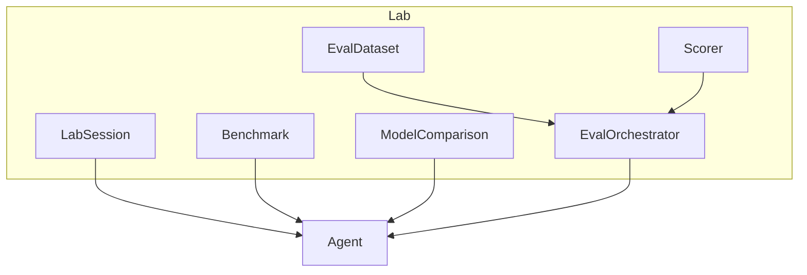
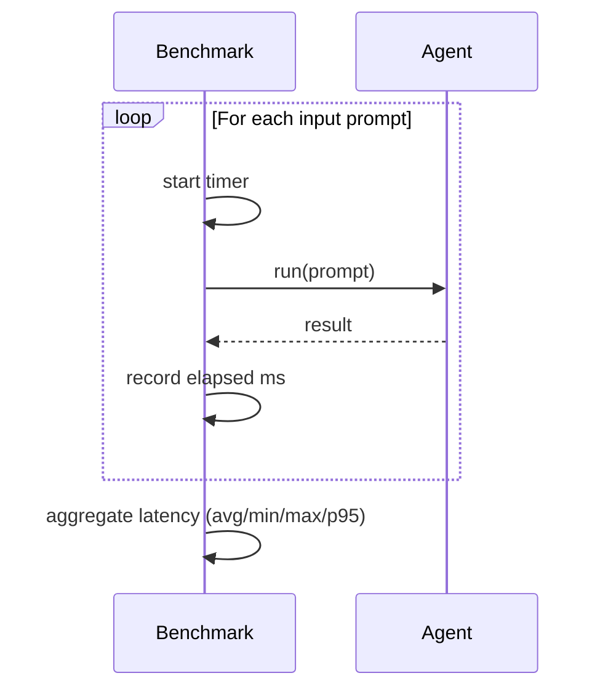

# Lab Guide

Copyright 2026 Firefly Software Foundation. Licensed under the Apache License 2.0.

The Lab module provides interactive sessions, benchmarking, side-by-side comparison,
dataset management, and pluggable evaluators for developing and testing GenAI agents.

---

## Concepts

The Lab is a development and testing environment where engineers can iterate on agent
behaviour without wiring agents into a host service. It supports interactive exploration,
reproducible benchmarks, and structured evaluation.

`lab` is an **optional leaf dev-tooling module**: nothing in the core framework imports it,
and it ships with the package (there is no separate extra to install). Use it from scripts,
notebooks, or tests; keep it out of production code paths.



---

## Interactive Sessions

A `LabSession` provides a conversational interface for testing an agent interactively.
Each exchange is recorded with timestamps and metadata.

```python
from fireflyframework_agentic.lab import LabSession

session = LabSession(name="writing-test", agent=writer_agent)
print(session.name)  # "writing-test"

response = await session.interact("Write a haiku about testing.")
print(response)

# Review the session history
for entry in session.history:
    print(f"[{entry.timestamp}] {entry.prompt} -> {entry.response}")

# Reset between experiments
session.clear_history()
```

---

## Benchmarking

The `Benchmark` runs an agent against a list of prompts and measures **latency only**
(average, min, max, p95). It does not score outputs — for correctness scoring against
expected answers, use the `EvalOrchestrator` described below.

`Benchmark.run(agent, agent_name="")` returns a `BenchmarkResult`. The optional
`agent_name` labels the result; when omitted it falls back to `getattr(agent, "name",
"unknown")`.

```python
from fireflyframework_agentic.lab import Benchmark

bench = Benchmark(inputs=[
    "Translate 'hello' to French.",
    "Translate 'goodbye' to French.",
])
result = await bench.run(translator_agent, agent_name="translator")
print(f"Runs: {result.total_runs}")
print(f"Avg latency: {result.avg_latency_ms:.1f} ms, P95: {result.p95_latency_ms:.1f} ms")
```



---

## Side-by-Side Comparison

The `ModelComparison` class runs the same prompts through multiple agents and collects
their outputs side by side.

```python
from fireflyframework_agentic.lab import ModelComparison

comparison = ModelComparison(prompts=[
    "Write a haiku about Python.",
    "Explain recursion in one sentence.",
])
entries = await comparison.compare({"writer_v1": agent_v1, "writer_v2": agent_v2})
for entry in entries:
    print(f"Input: {entry.prompt}")
    for agent_name, response in entry.responses.items():
        print(f" {agent_name}: {response}")
```

---

## Datasets

The `EvalDataset` class manages collections of `EvalCase` test inputs and optional
expected outputs. Datasets can be loaded from JSON files or built programmatically.

```python
from fireflyframework_agentic.lab import EvalDataset, EvalCase

# Programmatically
dataset = EvalDataset(cases=[
    EvalCase(input="Hello", expected_output="Hi"),
    EvalCase(input="Goodbye", expected_output="Bye"),
])

# Append cases incrementally
dataset.add(EvalCase(input="Thanks", expected_output="You're welcome"))
print(len(dataset))  # 3

# Persist to / load from a JSON file
dataset.to_json("test_data.json")
dataset = EvalDataset.from_json("test_data.json")
```

---

## Evaluators

The `EvalOrchestrator` runs an agent against an `EvalDataset` with a pluggable scorer
function. A `Scorer` is any callable `(expected: str, actual: str) -> float`. When no
scorer is supplied, the orchestrator uses `exact_match_scorer`, which returns `1.0` when
the stripped expected and actual strings are equal and `0.0` otherwise.

`evaluate(agent, dataset, agent_name="")` returns an `EvalReport` whose `results` list
holds one `EvalResult` (`input`, `expected`, `actual`, `score`) per case. The optional
`agent_name` labels the report and falls back to `getattr(agent, "name", "unknown")`.

```python
from fireflyframework_agentic.lab import EvalOrchestrator, EvalDataset, EvalCase
from fireflyframework_agentic.lab.evaluator import exact_match_scorer

# Default exact-match scoring
orchestrator = EvalOrchestrator()  # uses exact_match_scorer

# ...or a custom scorer
def fuzzy_scorer(expected: str, actual: str) -> float:
    return 1.0 if expected.lower() in actual.lower() else 0.0

orchestrator = EvalOrchestrator(scorer=fuzzy_scorer)
report = await orchestrator.evaluate(my_agent, dataset, agent_name="writer-v2")
print(f"Avg score: {report.avg_score:.2f} across {report.total_cases} cases")
for r in report.results:
    print(f"{r.input!r}: expected {r.expected!r}, got {r.actual!r} (score {r.score})")
```

> `exact_match_scorer` and the `Scorer` type alias live in
> `fireflyframework_agentic.lab.evaluator` (import them from that submodule); they are not
> re-exported from the `fireflyframework_agentic.lab` package and are not part of its `__all__`.
