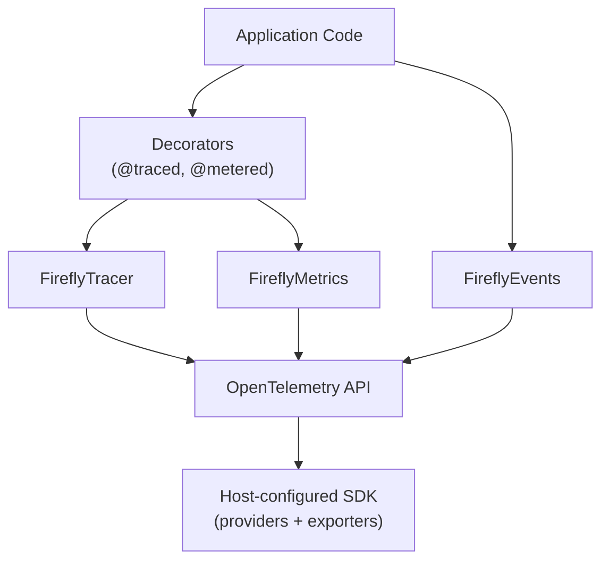
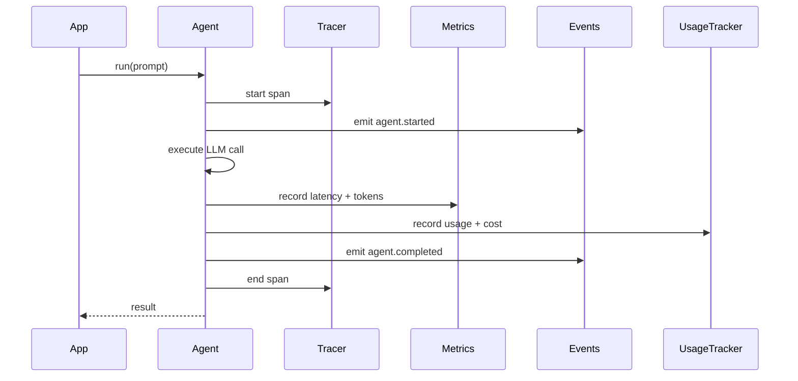

# Observability Guide

Copyright 2026 Firefly Software Foundation. Licensed under the Apache License 2.0.

The Observability module provides OpenTelemetry-native tracing, custom metrics, and
event recording for GenAI workloads.

> **Framework emits, host exports.** The framework *emits* model/agent spans,
> metrics, and events through the OpenTelemetry **API**. It deliberately does
> **not** configure the OpenTelemetry SDK, install global tracer/meter
> providers, wire up exporters, or propagate trace context across services —
> that is the **host** application's responsibility. Configure your SDK and
> exporters once in the host process and the framework's telemetry flows into
> them automatically.

---

## Architecture



---

## Tracing

`FireflyTracer` wraps the OpenTelemetry `Tracer` and adds convenience methods for
creating spans with GenAI-specific attributes. Each method is a context manager that
prefixes attribute keys with `firefly.` so spans group cleanly in any backend:

| Method | Span name | Purpose |
|--------|-----------|---------|
| `agent_span(agent_name, *, model="", **attrs)` | `agent.<name>` | Wrap an agent run |
| `tool_span(tool_name, **attrs)` | `tool.<name>` | Wrap a tool execution |
| `reasoning_span(pattern_name, step=0, **attrs)` | `reasoning.<pattern>.step_<n>` | Wrap a reasoning step |
| `custom_span(name, **attrs)` | `<name>` | Arbitrary span |

```python
from fireflyframework_agentic.observability import FireflyTracer

tracer = FireflyTracer(service_name="my-genai-app")

with tracer.agent_span("writer", model="gpt-4o") as span:
    result = await agent.run("Hello")
    span.set_attribute("firefly.tokens.total", result.usage().total_tokens)
```

Two helpers complement the span context managers:

- `tracer.event(name, **attrs)` attaches a zero-duration event to the *currently
  active* span — ideal for routing decisions, cache hits, or retries where opening
  a child span would be overkill (no-op when no span is active).
- `FireflyTracer.set_error(span, error)` (static) records an exception on a span and
  sets its status to error. The `@traced` decorator calls it automatically.

The module exposes a shared `default_tracer` singleton; the `@traced` decorator
operates on it.

### The @traced Decorator

For convenience, the `@traced` decorator automatically creates a `custom_span`
around any function call (sync or async). The span name defaults to the function's
qualified name; extra keyword args become span attributes. On exception it calls
`set_error` and re-raises.

```python
from fireflyframework_agentic.observability import traced

@traced(name="process_request")
async def process_request(prompt: str) -> str:
    ...
```

### Distributed Trace Correlation

Cross-service trace-context propagation (e.g. W3C Trace Context over HTTP or
message queues) is owned by the **host** application: configure the standard
OpenTelemetry propagators in your host and the spans the framework emits will
be parented correctly. The framework itself only emits spans; it does not
inject or extract `traceparent`/`tracestate` headers.

**Pipeline Context:**

Traces flow through pipeline steps via `PipelineContext.correlation_id`:

```python
from fireflyframework_agentic.pipeline.context import PipelineContext

# Create context with correlation ID for trace linking
context = PipelineContext(
    inputs={},
    correlation_id="trace-abc-123",
)

result = await pipeline.run(context)
# All steps share the same trace correlation ID
```

---

## Metrics

`FireflyMetrics` registers a fixed set of OpenTelemetry counters and histograms for
GenAI-specific measurements. There is no generic `increment`/`record_histogram` API —
instead you call typed `record_*` methods that take well-known keyword labels:

| Method | Instrument | Labels |
|--------|-----------|--------|
| `record_tokens(count, *, agent="", model="")` | `firefly.tokens.total` (counter) | agent, model |
| `record_prompt_tokens(count, *, agent="", model="")` | `firefly.tokens.prompt` (counter) | agent, model |
| `record_completion_tokens(count, *, agent="", model="")` | `firefly.tokens.completion` (counter) | agent, model |
| `record_cost(usd, *, agent="", model="")` | `firefly.cost.total` (counter) | agent, model |
| `record_latency(ms, *, operation="", agent="")` | `firefly.latency` (histogram) | operation, agent |
| `record_error(*, operation="", agent="", error_type="")` | `firefly.errors.total` (counter) | operation, agent, error_type |
| `record_reasoning_depth(steps, *, pattern="")` | `firefly.reasoning.depth` (histogram) | pattern |

```python
from fireflyframework_agentic.observability import FireflyMetrics

metrics = FireflyMetrics(service_name="my-genai-app")
metrics.record_tokens(1500, agent="writer", model="gpt-4o")
metrics.record_latency(142.5, operation="agent.run", agent="writer")
```

A shared `default_metrics` singleton is exposed; the `@metered` decorator and the
cost sinks record against it.

### The @metered Decorator

`@metered` records the wrapped function's latency (and an error on exception). Its
first parameter is `operation` (the label), defaulting to the function's qualified
name:

```python
from fireflyframework_agentic.observability import metered

@metered("agent_call")
async def call_agent(prompt: str) -> str:
    ...
```

---

## Events

`FireflyEvents` emits structured `FireflyEvent` records (serialised dicts logged via
the `fireflyframework_agentic.events` logger) for significant occurrences. There is
no generic `emit()`; instead it exposes typed methods, each accepting `**extra`
keyword detail:

| Method | Event type |
|--------|-----------|
| `agent_started(agent_name, model="", **extra)` | `agent.started` |
| `agent_completed(agent_name, *, tokens=0, latency_ms=0, **extra)` | `agent.completed` |
| `agent_error(agent_name, error, **extra)` | `agent.error` |
| `tool_executed(tool_name, *, success=True, latency_ms=0, **extra)` | `tool.executed` |
| `reasoning_step(pattern, step, step_type="", **extra)` | `reasoning.step` |

```python
from fireflyframework_agentic.observability import FireflyEvents

events = FireflyEvents()
events.agent_started("writer", model="gpt-4o")
```

A shared `default_events` singleton is exposed; the `EventBusSink` forwards every
usage record to it as an `agent.completed` event.

---

## Exporters and SDK Configuration

The framework does **not** configure OpenTelemetry exporters or install global
providers. It emits spans and metrics through the OpenTelemetry API; the **host**
application owns SDK/exporter setup (OTLP collector, console, Jaeger, Azure
Monitor, etc.). Configure the SDK once in your host process — for example with
the standard `opentelemetry-sdk` / `opentelemetry-exporter-otlp` packages — and
the framework's telemetry flows into it automatically.

---

## Usage Tracking

The `UsageTracker` automatically records token usage, cost estimates, and latency
for every agent run, reasoning pattern step, and pipeline execution.

```python
from fireflyframework_agentic.observability import default_usage_tracker

# After running agents, inspect accumulated usage
summary = default_usage_tracker.get_summary()
print(f"Total tokens: {summary.total_tokens}")
print(f"Total cost: ${summary.total_cost_usd:.4f}")
print(f"Requests: {summary.total_requests}")

# Filter by agent or pipeline correlation ID
agent_summary = default_usage_tracker.get_summary_for_agent("my-agent")
pipeline_summary = default_usage_tracker.get_summary_for_correlation("run-123")

# Lifetime cost accumulator (independent of record eviction)
print(f"Cumulative cost: ${default_usage_tracker.cumulative_cost_usd:.4f}")
```

### Recording a Call

`record_call()` is the high-level producer entry the framework uses internally. It
resolves cost via the resolver chain, builds a `UsageRecord`, commits it to the
`BudgetGate` (if configured), and fans the record out to every `CostSink`:

```python
default_usage_tracker.record_call(
    model="anthropic:claude-3-5-sonnet-latest",
    input_tokens=1_000,
    output_tokens=500,
    cache_read_tokens=8_000,   # optional cache / reasoning token fields
    reasoning_tokens=0,
    agent="writer",
    correlation_id="run-123",
    latency_ms=842.0,
    request_count=1,
)
```

In-tree producers that already hold a `UsageRecord` call the low-level
`record(record, scope_ctx=None)` instead. Other accessors: `add_sink(sink)`, the
`records` property (a copy of retained records), and `reset()`.

### Bounded Record Storage

`UsageTracker` accepts a `max_records` parameter that limits how many records
are retained in memory. When the limit is exceeded, the oldest records are
evicted (FIFO). This prevents unbounded memory growth in long-running services.

```python
from fireflyframework_agentic.observability.usage import UsageTracker

tracker = UsageTracker(max_records=5_000)
```

The default `max_records` is controlled by the `FIREFLY_AGENTIC_USAGE_TRACKER_MAX_RECORDS`
environment variable (default: `10_000`). Set to `0` for unlimited retention
(not recommended for production).

Note: cumulative cost (`cumulative_cost_usd`) is tracked independently and
is **not** affected by record eviction — it always reflects the total
lifetime cost.

### How It Works

`FireflyAgent.run()`, `run_sync()`, and `run_stream()` automatically extract
`result.usage()` (including cache-write/cache-read token counts) from Pydantic AI
results and call `default_usage_tracker.record_call(...)`, which prices the call via
the [cost resolver chain](#cost-resolution). For streaming, usage is captured when
the stream context manager exits (`__aexit__`), ensuring that token counts from
streamed responses are tracked transparently. Reasoning patterns do the same for
each ephemeral LLM call. Pipeline runs aggregate all records by `correlation_id`
into `PipelineResult.usage`.

---

## Cost Resolution

Each LLM call is priced by a chain of resolver callables, each returning `float | None`.
The default chain (`DEFAULT_RESOLVERS`) tries `provider_reported_cost` first (an
authoritative per-call USD from the provider payload — e.g. OpenRouter's
`usage.cost`; this is a **seam** for custom integrations, since pydantic-ai 1.x
does not surface that cost on the result), then falls back to `genai_prices_cost`
for token-by-token computation against the `genai-prices` price table.

**Model identity is provider-agnostic.** Pricing keys off
`get_model_identifier(model)` (`model_utils`), which normalises both
`"provider:model"` strings and pydantic-ai `Model` objects (reading the provider
from the model's own `_provider.name`) into a `provider:model` string — so any
pydantic-ai provider (OpenAI, Anthropic, Google, Groq, Bedrock, Mistral, Cohere,
DeepSeek, xAI, OpenRouter, Azure, …) prices uniformly. `CostContext` carries the
token breakdown:

```python
from fireflyframework_agentic.observability.cost_resolvers import resolve_cost, CostContext

cost = resolve_cost(CostContext(
    model="anthropic:claude-3-5-sonnet-latest",
    input_tokens=1_000,
    output_tokens=500,
    cache_creation_tokens=0,
    cache_read_tokens=8_000,
    reasoning_tokens=0,
))
```

Custom strategies plug in by passing your own chain: `resolve_cost(ctx, [my_fixed_rate, *DEFAULT_RESOLVERS])`. See `examples/cost_tracking.py`.

**Reasoning tokens are provider-aware.** `genai-prices` has no reasoning field;
the resolver folds reasoning into output tokens (`output_tokens + reasoning_tokens`,
priced at the output rate). Critically, `CostContext.reasoning_tokens` means
*reasoning the provider does **not** already count in `output_tokens`* — which is
**only Gemini's `thoughts_tokens`** (Gemini excludes them from `output_tokens`).
The callers compute this via `reasoning_tokens_not_in_output(usage)`, which reads
the Gemini-specific `thoughts_tokens` key, so OpenAI (whose `reasoning_tokens` are
already in `output_tokens` — re-adding would inflate o-series cost ~53%) and
Anthropic (which folds thinking into `output_tokens`) contribute `0`.

**Bedrock model ids** carry a vendor prefix (`bedrock:anthropic.claude-…`); on a
`genai-prices` miss the resolver retries on the bare model name with the vendor as
the provider before giving up.

When no resolver can price the model, `resolve_cost` returns `None`, increments the
`cost_unknown` metric, and logs a WARNING on every such call. The default
`UsageTracker` coerces `None` to `0.0`. In **strict mode** — `resolve_cost(ctx,
strict=True)`, or globally via `config.cost_strict` / `FIREFLY_AGENTIC_COST_STRICT=true`
— it raises `UnknownModelCostError` instead (a public export), failing the agent
run (and the workflow `agent()` call) rather than silently billing `$0`.

> **Budget caveat.** Because an unpriceable model contributes `$0`, the
> `BudgetGate` enforces only over models `genai-prices` *can* price. For
> budget-critical deployments, set `cost_strict=True` to fail closed on any model
> the price table doesn't know.

## Budgets

A `BudgetGate` holds a sequence of `BudgetRule` objects. Each rule filters via a `match` dict (AND of key-value pairs against the call's `ScopeContext`), has a window (`LIFETIME`, `MONTHLY`, `DAILY`), and a mode (`HARD` raises `BudgetExceededError`; `SOFT` logs).

```python
from fireflyframework_agentic.observability.budget import (
    BudgetGate, BudgetMode, BudgetRule, BudgetWindow, ScopeContext,
)
gate = BudgetGate([
    BudgetRule(name="acme-daily", limit_usd=5.0, window=BudgetWindow.DAILY,
               match={"tenant": "acme"}),
    BudgetRule(name="writer-lifetime", limit_usd=100.0, mode=BudgetMode.SOFT,
               match={"agent": "writer"}),
])
```

A rule matches a call when every key/value in its `match` dict is present in the
call's `ScopeContext.to_match_dict()`. `ScopeContext` carries `tenant`, `agent`,
`model`, `correlation_id`, plus arbitrary `labels`; built-in fields win over labels
on collision, and *empty* built-in fields are omitted from matching (so a rule keyed
on `tenant` never matches a call with an empty tenant).

Runtime methods:

- `precheck(estimated_cost_usd, ctx=None)` raises `BudgetExceededError` if the
  estimated cost would push a HARD rule over its limit (call before an LLM request).
- `commit(record, ctx=None)` accumulates `record.cost_usd` into every matching rule;
  HARD breaches raise, SOFT breaches log a warning. `UsageTracker.record()` calls this.
- `spend(rule_name)` returns accumulated spend for the current window bucket;
  `reset(rule_name=None)` clears one rule (or all).

For the single-tenant case, the `budget_limit_usd` config field auto-installs a
global HARD `BudgetRule` (`name="config_global"`) on the default tracker.

## Cost Sinks

`UsageTracker` fans every `UsageRecord` out to one or more `CostSink` instances. Built-ins: `OTelMetricsSink`, `EventBusSink`, `LoggingSink`, `JSONLFileSink`. The `CostSink` protocol defines `emit(record)` plus `flush()` and `close()` (both default no-ops; override them to drain buffers). `JSONLFileSink` supports size-based rotation via the `rotate_bytes` keyword:

```python
from fireflyframework_agentic.observability.sinks import (
    EventBusSink, JSONLFileSink, OTelMetricsSink,
)
from fireflyframework_agentic.observability.usage import UsageTracker
tracker = UsageTracker(sinks=[OTelMetricsSink(), EventBusSink(),
                              JSONLFileSink("/var/log/firefly/cost.jsonl",
                                            rotate_bytes=50_000_000)])
```

The default tracker is built with `[OTelMetricsSink(), EventBusSink()]`; attach more at runtime with `tracker.add_sink(sink)`. A failing sink does not break other sinks; failures increment the `cost_sink_errors` metric (labeled by sink class).

---

## API Quota Management

The `QuotaManager` handles **request-rate** concerns only: per-model rate limiting
and adaptive backoff for 429 responses. (Budget/cost enforcement is the
[`BudgetGate`](#budgets)'s job — `QuotaManager` does not track spend.) Its
constructor is keyword-only:

```python
from fireflyframework_agentic.observability.quota import QuotaManager

quota = QuotaManager(
    rate_limits={
        "openai:gpt-4o": 60,          # 60 requests/minute
        "anthropic:claude-opus-4": 50,
    },
    enable_adaptive_backoff=True,
)

# Before a request: enforce the rate limit (raises RateLimitError on breach)
quota.check_quota_before_request("openai:gpt-4o")
# ...or check without raising:
if not quota.check_rate_limit_available("openai:gpt-4o"):
    await asyncio.sleep(quota.get_backoff_delay("openai:gpt-4o"))

# After the request completes
quota.record_request("openai:gpt-4o", success=True)

# On a 429 error
quota.record_rate_limit_error("openai:gpt-4o")
delay = quota.get_backoff_delay("openai:gpt-4o")
```

### Rate Limiting

`RateLimiter` implements a **sliding window** algorithm for precise rate limiting:

```python
from fireflyframework_agentic.observability.quota import RateLimiter

limiter = RateLimiter(max_requests=60, window_seconds=60.0)

if limiter.is_allowed("openai:gpt-4o"):
    # Make request
    limiter.record("openai:gpt-4o")
else:
    raise RateLimitError("Rate limit exceeded")
```

The sliding window ensures accurate rate limiting without bursts at window boundaries.

### Adaptive Backoff

`AdaptiveBackoff` automatically increases retry delays for 429 responses:

```python
from fireflyframework_agentic.observability.quota import AdaptiveBackoff

backoff = AdaptiveBackoff(
    base_delay=1.0, # Start at 1 second
    max_delay=60.0, # Cap at 60 seconds
    multiplier=2.0, # Double each time
    jitter=True,    # Add 0-50% random jitter
)

# After receiving a 429 response: record the failure, then read the delay
backoff.record_failure("openai:gpt-4o")
delay = backoff.get_delay("openai:gpt-4o")
await asyncio.sleep(delay)

# On success, reset
backoff.reset("openai:gpt-4o")
```

`get_failure_count(key)` exposes the current consecutive-failure count. Exponential
backoff with jitter prevents thundering-herd issues when rate limits reset.

### Automatic Rate Limit Retry

`FireflyAgent.run()` automatically retries on HTTP 429 (rate limit) errors using
adaptive backoff. This is transparent — callers do not need to handle rate limits.

The retry loop:
1. Catches `ModelHTTPError(429)` and exceptions with "rate limit" or "throttl" in the message
2. Detects Bedrock `ThrottlingException` and `TooManyRequestsException` (boto3 `ClientError` shapes)
3. Parses `Retry-After` hints from error bodies when available
4. Uses `AdaptiveBackoff` for exponential delay with jitter
5. Resets backoff on success

Configuration via environment variables or `FireflyAgenticConfig`:

| Variable | Default | Description |
|----------|---------|-------------|
| `FIREFLY_AGENTIC_RATE_LIMIT_MAX_RETRIES` | `3` | Max retry attempts for 429 errors |
| `FIREFLY_AGENTIC_RATE_LIMIT_BASE_DELAY` | `1.0` | Base delay in seconds |
| `FIREFLY_AGENTIC_RATE_LIMIT_MAX_DELAY` | `60.0` | Maximum delay between retries |

```python
from fireflyframework_agentic.config import get_config, reset_config
import os

# Configure via environment
os.environ["FIREFLY_AGENTIC_RATE_LIMIT_MAX_RETRIES"] = "5"
os.environ["FIREFLY_AGENTIC_RATE_LIMIT_BASE_DELAY"] = "2.0"
reset_config()  # Pick up new values

# Or read current config
cfg = get_config()
print(f"Max retries: {cfg.rate_limit_max_retries}")
print(f"Base delay: {cfg.rate_limit_base_delay}s")
print(f"Max delay: {cfg.rate_limit_max_delay}s")
```

When `quota_enabled` is `True`, the agent uses the global `QuotaManager`'s
`AdaptiveBackoff` instance for shared state across all agents. When `quota_enabled`
is `False` (the default), each agent creates a standalone backoff tracker.

### Environment Configuration

```bash
# Enable quota (rate-limit) management (default: false)
export FIREFLY_AGENTIC_QUOTA_ENABLED=true

# Configure per-model rate limits (JSON) — consumed by the default QuotaManager
export FIREFLY_AGENTIC_QUOTA_RATE_LIMITS='{"openai:gpt-4o": 60, "anthropic:claude-opus-4": 50}'

# Enable adaptive backoff (default: true)
export FIREFLY_AGENTIC_QUOTA_ADAPTIVE_BACKOFF=true

# Rate limit retry settings (used by FireflyAgent.run() automatic retry)
export FIREFLY_AGENTIC_RATE_LIMIT_MAX_RETRIES=3
export FIREFLY_AGENTIC_RATE_LIMIT_BASE_DELAY=1.0
export FIREFLY_AGENTIC_RATE_LIMIT_MAX_DELAY=60.0
```

`create_quota_manager_from_config()` builds the default `QuotaManager` from
`quota_rate_limits` and `quota_adaptive_backoff` only. The `quota_budget_daily_usd`
config field exists but is **not** consumed by `QuotaManager` — for budget/cost
caps use the [`BudgetGate`](#budgets) (or the `budget_limit_usd` config field).

### Integration with Agents

Budget enforcement is integrated via middleware, while rate-limit enforcement is
integrated via direct `QuotaManager` checks:

```python
from fireflyframework_agentic.agents import FireflyAgent
from fireflyframework_agentic.agents.builtin_middleware import CostGuardMiddleware

# Budget enforcement via middleware (cost is the BudgetGate's domain)
agent = FireflyAgent(
    name="quota-agent",
    model="openai:gpt-4o",
    middleware=[CostGuardMiddleware(budget_usd=10.0)],
)

# Manual rate-limit checks
quota = QuotaManager(rate_limits={"openai:gpt-4o": 60})

async def call_with_quota(prompt):
    quota.check_quota_before_request(agent.model)  # raises RateLimitError if over
    result = await agent.run(prompt)
    quota.record_request(agent.model, success=True)
    return result
```

To inspect cost after a run, read it from the usage tracker
(`default_usage_tracker.cumulative_cost_usd` or a summary's `total_cost_usd`), not
from the Pydantic AI result object.

---

## JSON Structured Logging

For production log aggregation (ELK, Datadog, CloudWatch), the framework
provides a `JsonFormatter` that emits log records as single-line JSON objects
with `timestamp`, `level`, `logger`, and `message` fields.

Enable JSON logging with the `format_style` parameter:

```python
from fireflyframework_agentic import configure_logging

configure_logging("INFO", format_style="json")
```

Example output:

```json
{"timestamp": "2026-01-15T10:30:00+00:00", "level": "INFO", "logger": "fireflyframework_agentic.agents.base", "message": "run agent='writer' prompt='Write a...'"}
```

The `JsonFormatter` class can also be used standalone with any Python logger:

```python
from fireflyframework_agentic.logging import JsonFormatter
import logging

handler = logging.StreamHandler()
handler.setFormatter(JsonFormatter())
```

---

## Integration with Agents

Observability is designed to integrate transparently with the Agent layer. When an
agent is invoked, the framework automatically creates a trace span, records metrics,
emits events, and records usage for cost tracking. You do not need to instrument
agent code manually unless you want additional detail.


