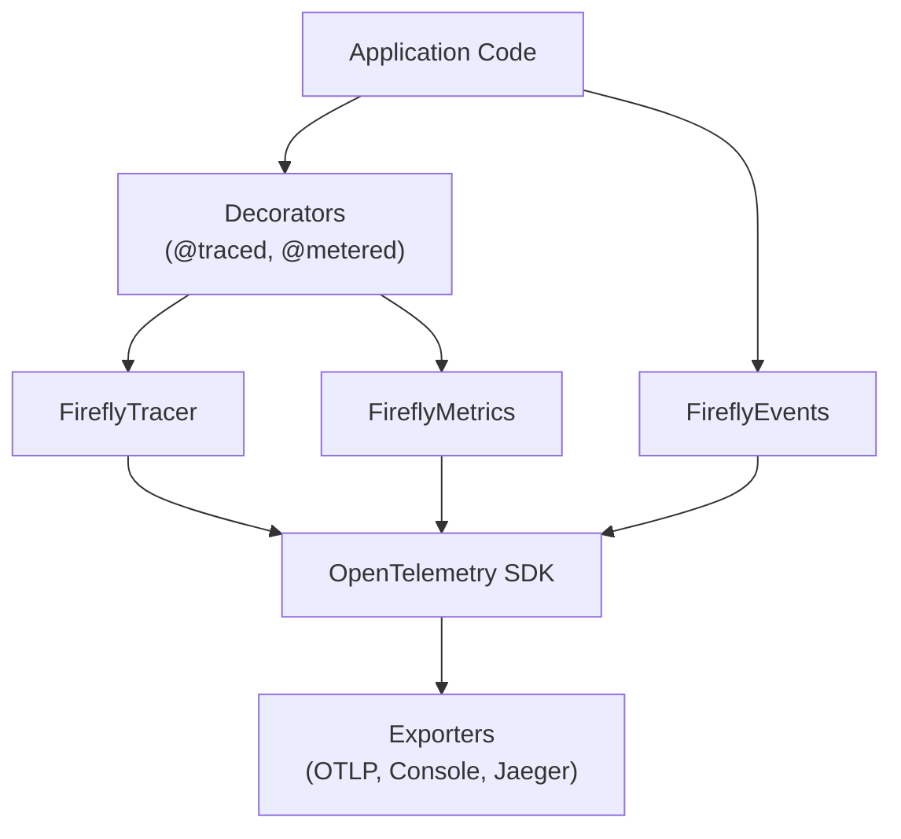
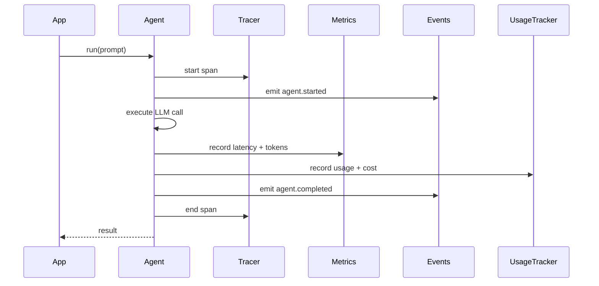

# Observability Guide

Copyright 2026 Firefly Software Foundation. Licensed under the Apache License 2.0.

The Observability module provides OpenTelemetry-native tracing, custom metrics, and
event recording for GenAI workloads.

---

## Architecture



---

## Tracing

`FireflyTracer` wraps the OpenTelemetry `Tracer` and adds convenience methods for
creating spans with GenAI-specific attributes (model name, token counts, agent name).

```python
from fireflyframework_agentic.observability import FireflyTracer

tracer = FireflyTracer(service_name="my-genai-app")

with tracer.start_span("agent.run", attributes={"agent.name": "writer"}) as span:
    result = await agent.run("Hello")
    span.set_attribute("tokens.total", result.usage.total_tokens)
```

### The @traced Decorator

For convenience, the `@traced` decorator automatically creates a span around any
function call:

```python
from fireflyframework_agentic.observability import traced

@traced(name="process_request")
async def process_request(prompt: str) -> str:
    ...
```

### Distributed Trace Correlation

The framework supports **W3C Trace Context** propagation for correlating traces
across service boundaries (HTTP, message queues, pipelines).

**Trace Context Functions:**

```python
from fireflyframework_agentic.observability.tracer import inject_trace_context, extract_trace_context

# Inject trace context into HTTP headers
headers = {}
inject_trace_context(headers)
# headers now contain: traceparent, tracestate

# Send request with trace context
response = await http_client.post(url, headers=headers)

# On receiving side, extract trace context
incoming_headers = request.headers
context = extract_trace_context(incoming_headers)
# Continue trace with extracted context
```

**Pipeline Context:**

Traces flow through pipeline steps via `PipelineContext.correlation_id`:

```python
from fireflyframework_agentic.pipeline.context import PipelineContext

# Create context with correlation ID for trace linking
context = PipelineContext(
    inputs={},
    correlation_id="trace-abc-123",
)

result = await pipeline.run(context)
# All steps share the same trace correlation ID
```

---

## Metrics

`FireflyMetrics` provides counters, histograms, and gauges for tracking GenAI-specific
measurements.

```python
from fireflyframework_agentic.observability import FireflyMetrics

metrics = FireflyMetrics(service_name="my-genai-app")
metrics.increment("agent.invocations", labels={"agent": "writer"})
metrics.record_histogram("agent.latency_ms", 142.5, labels={"agent": "writer"})
```

### The @metered Decorator

```python
from fireflyframework_agentic.observability import metered

@metered(name="agent_call")
async def call_agent(prompt: str) -> str:
    ...
```

---

## Events

`FireflyEvents` emits structured events (as OpenTelemetry log records) for significant
occurrences: agent started, tool invoked, reasoning step completed, error encountered.

```python
from fireflyframework_agentic.observability import FireflyEvents

events = FireflyEvents()
events.emit("agent.started", {"agent": "writer", "model": "gpt-4o"})
```

---

## Exporters

The `configure_exporters` function sets up OpenTelemetry exporters based on the
framework's configuration:

```python
from fireflyframework_agentic.observability import configure_exporters

configure_exporters(
    otlp_endpoint="http://localhost:4317",
    console=True,
)
```

Supported exporters:

- **OTLP** -- Sends traces and metrics to any OpenTelemetry-compatible collector.
- **Console** -- Prints spans and metrics to standard output (useful for development).

---

## Usage Tracking

The `UsageTracker` automatically records token usage, cost estimates, and latency
for every agent run, reasoning pattern step, and pipeline execution.

```python
from fireflyframework_agentic.observability import default_usage_tracker

# After running agents, inspect accumulated usage
summary = default_usage_tracker.get_summary()
print(f"Total tokens: {summary.total_tokens}")
print(f"Total cost: ${summary.total_cost_usd:.4f}")
print(f"Requests: {summary.total_requests}")

# Filter by agent or pipeline correlation ID
agent_summary = default_usage_tracker.get_summary_for_agent("my-agent")
pipeline_summary = default_usage_tracker.get_summary_for_correlation("run-123")
```

### Bounded Record Storage

`UsageTracker` accepts a `max_records` parameter that limits how many records
are retained in memory. When the limit is exceeded, the oldest records are
evicted (FIFO). This prevents unbounded memory growth in long-running services.

```python
from fireflyframework_agentic.observability.usage import UsageTracker

tracker = UsageTracker(max_records=5_000)
```

The default `max_records` is controlled by the `FIREFLY_AGENTIC_USAGE_TRACKER_MAX_RECORDS`
environment variable (default: `10_000`). Set to `0` for unlimited retention
(not recommended for production).

Note: cumulative cost (`cumulative_cost_usd`) is tracked independently and
is **not** affected by record eviction — it always reflects the total
lifetime cost.

### How It Works

`FireflyAgent.run()`, `run_sync()`, and `run_stream()` automatically extract
`result.usage()` from Pydantic AI results, compute cost via the configured cost
calculator, and feed a `UsageRecord` into the global `default_usage_tracker`.
For streaming, usage is captured when the stream context manager exits
(`__aexit__`), ensuring that token counts from streamed responses are tracked
transparently. Reasoning patterns do the same for each ephemeral LLM call in
`_structured_run()`. Pipeline runs aggregate all records by `correlation_id`
into `PipelineResult.usage`.

---

## Cost Resolution

Each LLM call is priced by a chain of resolver callables. The default chain tries the provider-reported cost first (e.g. OpenRouter's `usage.cost`), then falls back to `genai-prices` for token-by-token computation. Cache tokens, reasoning tokens, and the `BATCH` tier are all honored when the provider's price record exposes the relevant fields.

```python
from fireflyframework_agentic.observability.cost_resolvers import resolve_cost, CostContext, CallTier
cost = resolve_cost(CostContext(model="anthropic:claude-3-5-sonnet-latest",
                                input_tokens=1_000, output_tokens=500,
                                cache_read_tokens=8_000, tier=CallTier.BATCH))
```

Custom strategies plug in by passing your own chain: `resolve_cost(ctx, [my_fixed_rate, *DEFAULT_RESOLVERS])`. See `examples/cost_tracking.py`.

When `genai-prices` has no entry for a model, the resolver returns `0.0`, increments the `cost_unknown` metric, and logs a WARNING once per model.

## Budgets

A `BudgetGate` holds a sequence of `BudgetRule` objects. Each rule filters via a `match` dict (AND of key-value pairs against the call's `ScopeContext`), has a window (`LIFETIME`, `MONTHLY`, `DAILY`), and a mode (`HARD` raises `BudgetExceededError`; `SOFT` logs).

```python
from fireflyframework_agentic.observability.budget import (
    BudgetGate, BudgetMode, BudgetRule, BudgetWindow, ScopeContext,
)
gate = BudgetGate([
    BudgetRule(name="acme-daily", limit_usd=5.0, window=BudgetWindow.DAILY,
               match={"tenant": "acme"}),
    BudgetRule(name="writer-lifetime", limit_usd=100.0, mode=BudgetMode.SOFT,
               match={"agent": "writer"}),
])
```

For the single-tenant case, the `budget_limit_usd` config field auto-installs a global HARD rule on the default tracker.

## Cost Sinks

`UsageTracker` fans every `UsageRecord` out to one or more `CostSink` instances. Built-ins: `OTelMetricsSink`, `EventBusSink`, `LoggingSink`, `JSONLFileSink`, `WebhookSink`. Custom sinks implement the protocol's `emit(record)` method.

```python
from fireflyframework_agentic.observability.sinks import (
    EventBusSink, JSONLFileSink, OTelMetricsSink,
)
from fireflyframework_agentic.observability.usage import UsageTracker
tracker = UsageTracker(sinks=[OTelMetricsSink(), EventBusSink(),
                              JSONLFileSink("/var/log/firefly/cost.jsonl")])
```

A failing sink does not break other sinks; failures increment `cost_sink_errors` labeled by sink class.

---

## API Quota Management

The `QuotaManager` provides production-grade quota enforcement with rate limiting,
daily budget caps, and adaptive backoff for 429 rate limit responses.

```python
from fireflyframework_agentic.observability.quota import QuotaManager

quota = QuotaManager(
    daily_budget_usd=100.0,
    rate_limits={
        "openai:gpt-4o": 60, # 60 requests/minute
        "anthropic:claude-opus-4": 50,
    },
    adaptive_backoff=True,
)

# Check before making request
if not quota.check_budget_available(cost_usd=0.05):
    raise QuotaError("Daily budget exceeded")

if not quota.check_rate_limit_available("openai:gpt-4o"):
    # Apply backoff delay
    delay = quota.get_backoff_delay("openai:gpt-4o")
    await asyncio.sleep(delay)

# Record usage after request
quota.record_request("openai:gpt-4o", cost_usd=0.05, tokens=1500)
```

### Rate Limiting

`RateLimiter` implements a **sliding window** algorithm for precise rate limiting:

```python
from fireflyframework_agentic.observability.quota import RateLimiter

limiter = RateLimiter(max_requests=60, window_seconds=60.0)

if limiter.is_allowed("openai:gpt-4o"):
    # Make request
    limiter.record("openai:gpt-4o")
else:
    raise RateLimitError("Rate limit exceeded")
```

The sliding window ensures accurate rate limiting without bursts at window boundaries.

### Adaptive Backoff

`AdaptiveBackoff` automatically increases retry delays for 429 responses:

```python
from fireflyframework_agentic.observability.quota import AdaptiveBackoff

backoff = AdaptiveBackoff(
    base_delay=1.0, # Start at 1 second
    max_delay=60.0, # Cap at 60 seconds
    multiplier=2.0, # Double each time
    jitter_factor=0.1, # Add 10% jitter
)

# After receiving 429 response
delay = backoff.next_delay("openai:gpt-4o")
await asyncio.sleep(delay)

# On success, reset
backoff.reset("openai:gpt-4o")
```

Exponential backoff with jitter prevents thundering herd issues when rate limits reset.

### Automatic Rate Limit Retry

`FireflyAgent.run()` automatically retries on HTTP 429 (rate limit) errors using
adaptive backoff. This is transparent — callers do not need to handle rate limits.

The retry loop:
1. Catches `ModelHTTPError(429)` and exceptions with "rate limit" or "throttl" in the message
2. Detects Bedrock `ThrottlingException` and `TooManyRequestsException` (boto3 `ClientError` shapes)
3. Parses `Retry-After` hints from error bodies when available
4. Uses `AdaptiveBackoff` for exponential delay with jitter
5. Resets backoff on success

Configuration via environment variables or `FireflyAgenticConfig`:

| Variable | Default | Description |
|----------|---------|-------------|
| `FIREFLY_AGENTIC_RATE_LIMIT_MAX_RETRIES` | `3` | Max retry attempts for 429 errors |
| `FIREFLY_AGENTIC_RATE_LIMIT_BASE_DELAY` | `1.0` | Base delay in seconds |
| `FIREFLY_AGENTIC_RATE_LIMIT_MAX_DELAY` | `60.0` | Maximum delay between retries |

```python
from fireflyframework_agentic.config import get_config, reset_config
import os

# Configure via environment
os.environ["FIREFLY_AGENTIC_RATE_LIMIT_MAX_RETRIES"] = "5"
os.environ["FIREFLY_AGENTIC_RATE_LIMIT_BASE_DELAY"] = "2.0"
reset_config()  # Pick up new values

# Or read current config
cfg = get_config()
print(f"Max retries: {cfg.rate_limit_max_retries}")
print(f"Base delay: {cfg.rate_limit_base_delay}s")
print(f"Max delay: {cfg.rate_limit_max_delay}s")
```

When `quota_enabled` is `True` (the default), the agent uses the global
`QuotaManager`'s `AdaptiveBackoff` instance for shared state across all agents.
When disabled, each agent creates a standalone backoff tracker.

### Environment Configuration

```bash
# Enable quota management (default: true)
export FIREFLY_AGENTIC_QUOTA_ENABLED=true

# Set daily budget cap
export FIREFLY_AGENTIC_QUOTA_BUDGET_DAILY_USD=100.0

# Configure per-model rate limits (JSON)
export FIREFLY_AGENTIC_QUOTA_RATE_LIMITS='{"openai:gpt-4o": 60, "anthropic:claude-opus-4": 50}'

# Enable adaptive backoff (default: true)
export FIREFLY_AGENTIC_QUOTA_ADAPTIVE_BACKOFF=true

# Rate limit retry settings
export FIREFLY_AGENTIC_RATE_LIMIT_MAX_RETRIES=3
export FIREFLY_AGENTIC_RATE_LIMIT_BASE_DELAY=1.0
export FIREFLY_AGENTIC_RATE_LIMIT_MAX_DELAY=60.0
```

### Integration with Agents

Quota enforcement can be integrated via middleware or direct checks:

```python
from fireflyframework_agentic.agents import FireflyAgent
from fireflyframework_agentic.agents.builtin_middleware import CostGuardMiddleware

# Budget enforcement via middleware
agent = FireflyAgent(
    name="quota-agent",
    model="openai:gpt-4o",
    middleware=[CostGuardMiddleware(budget_usd=10.0)],
)

# Or manual quota checks
quota = QuotaManager(daily_budget_usd=100.0)

async def call_with_quota(prompt):
    if not quota.check_budget_available():
        raise QuotaError("Daily budget exhausted")

    result = await agent.run(prompt)
    quota.record_request(agent.model, cost_usd=result.usage.total_cost)
    return result
```

---

## JSON Structured Logging

For production log aggregation (ELK, Datadog, CloudWatch), the framework
provides a `JsonFormatter` that emits log records as single-line JSON objects
with `timestamp`, `level`, `logger`, and `message` fields.

Enable JSON logging with the `format_style` parameter:

```python
from fireflyframework_agentic import configure_logging

configure_logging("INFO", format_style="json")
```

Example output:

```json
{"timestamp": "2026-01-15T10:30:00+00:00", "level": "INFO", "logger": "fireflyframework_agentic.agents.base", "message": "run agent='writer' prompt='Write a...'"}
```

The `JsonFormatter` class can also be used standalone with any Python logger:

```python
from fireflyframework_agentic.logging import JsonFormatter
import logging

handler = logging.StreamHandler()
handler.setFormatter(JsonFormatter())
```

---

## Integration with Agents

Observability is designed to integrate transparently with the Agent layer. When an
agent is invoked, the framework automatically creates a trace span, records metrics,
emits events, and records usage for cost tracking. You do not need to instrument
agent code manually unless you want additional detail.


