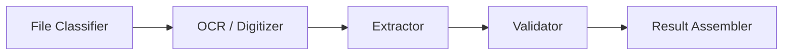
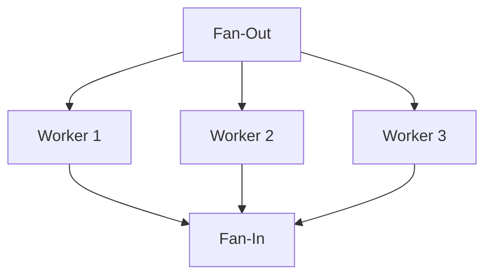

# Pipeline Guide

Copyright 2026 Firefly Software Foundation. Licensed under the Apache License 2.0.

The Pipeline module provides a DAG-based orchestrator for composing multi-step GenAI
workflows. It supports parallel execution, conditional branching, retries, timeouts,
and fan-out/fan-in patterns -- everything needed to model real-world enterprise
processing pipelines.

`PipelineBuilder` has two modes:

* **Port-based** (legacy, parallel) — nodes communicate via `output_key` /
  `input_key` edge ports and run concurrently within each topological level.
  Best for ETL-shaped DAGs. Documented in the bulk of this guide.
* **State-based** — opt-in via `PipelineBuilder("name", state=SomeModel)`.
  Nodes become `async (state) -> dict` over a typed shared state. One
  `.branch(source, router)` call covers conditional routing; `Send(target, payload)`
  covers runtime fan-out; a `Checkpointer` enables resume after failure. Best for
  agentic workflows and ReAct-style loops. See [State-Based Pipelines](#state-based-pipelines).

---

## Concepts

A pipeline is defined as a Directed Acyclic Graph (DAG) of **nodes** connected by
**edges**. Each node wraps a **step executor** that does the actual work (call an
agent, run a reasoning pattern, execute a function). The **engine** schedules nodes
by topological level so that independent nodes run concurrently.



---

## Building a Pipeline

### Fluent Builder API

The `PipelineBuilder` provides a chainable API for constructing pipelines:

```python
from fireflyframework_agentic.pipeline.builder import PipelineBuilder
from fireflyframework_agentic.pipeline.steps import AgentStep, CallableStep

engine = (
    PipelineBuilder("invoice-pipeline")
    .add_node("classify", AgentStep(classifier_agent))
    .add_node("extract", AgentStep(extractor_agent))
    .add_node("validate", CallableStep(validate_fn))
    .chain("classify", "extract", "validate")
    .build()
)
result = await engine.run(inputs="<base64-encoded invoice>")
```

The builder auto-wraps compatible objects:
- A `FireflyAgent` is wrapped in `AgentStep`.
- An `async` callable is wrapped in `CallableStep`.
- A `StepExecutor` implementation is used directly.

### Manual DAG Construction

For full control, construct the DAG directly:

```python
from fireflyframework_agentic.pipeline.dag import DAG, DAGNode, DAGEdge
from fireflyframework_agentic.pipeline.engine import PipelineEngine

dag = DAG("my-pipeline")
dag.add_node(DAGNode(node_id="step_a", step=my_step))
dag.add_node(DAGNode(node_id="step_b", step=other_step))
dag.add_edge(DAGEdge(source="step_a", target="step_b"))

engine = PipelineEngine(dag)
result = await engine.run(inputs="hello")
```

---

## Step Executors

Step executors are objects that implement the `StepExecutor` protocol:

```python
class StepExecutor(Protocol):
    async def execute(self, context: PipelineContext, inputs: dict[str, Any]) -> Any:
        ...
```

The framework provides these built-in executors:

- **AgentStep** -- Runs a `FireflyAgent` with the input as the prompt.
- **ReasoningStep** -- Runs a reasoning pattern (ReAct, CoT, etc.) through an agent.
- **CallableStep** -- Wraps any `async` function `(context, inputs) -> output`.
- **BatchLLMStep** -- Processes multiple prompts concurrently through an agent for
  cost optimization. See [Batch Processing](#batch-processing-batchllmstep) below.
- **BranchStep** _(deprecated)_ -- Routes execution to one of several downstream paths based on
  a predicate. Use `.branch(...)` in [State-Based Pipelines](#state-based-pipelines) instead.
- **FanOutStep** _(deprecated)_ -- Splits input into a list for parallel downstream processing.
  Use `Send` in [State-Based Pipelines](#runtime-fan-out-via-send) instead.
- **FanInStep** -- Merges outputs from multiple upstream nodes.
- **EmbeddingStep** -- Embeds the upstream text(s) using an embedding provider
  (`EmbeddingProtocol`). Accepts a single string or a list; `input_key` selects
  which inputs key holds the text(s).
- **RetrievalStep** -- Searches a vector store (`VectorStoreProtocol`) using the
  upstream text as the query. Embeds the query with the supplied `embedder`
  (or treats the input as a pre-computed embedding when `embedder=None`).
  Parameters: `store`, `embedder=None`, `top_k=5`, `input_key="input"`.

---

## State-Based Pipelines

Set `state=` on `PipelineBuilder` to switch to a declarative API designed for
agentic workflows. Nodes become `async (state) -> dict | None` functions over
a typed shared-state object; the engine reduces each node's partial-update
dict back into the state.

```python
from typing import Annotated
from pydantic import BaseModel
from fireflyframework_agentic.pipeline import PipelineBuilder, append


class AgentState(BaseModel):
    messages: Annotated[list[str], append] = []   # reducer: append
    intent: str | None = None                     # default reducer: replace
    answer: str | None = None


async def classify(state: AgentState) -> dict:
    return {"intent": "complaint" if "refund" in state.messages[-1] else "general"}


async def answer(state: AgentState) -> dict:
    return {"answer": "Here is your answer."}


async def escalate(state: AgentState) -> dict:
    return {"answer": "Escalated to human."}


def route(state: AgentState) -> str:
    return "escalate" if state.intent == "complaint" else "answer"


pipeline = (
    PipelineBuilder("support-agent", state=AgentState)
    .add_node(classify)              # node id derived from fn.__name__
    .add_node(answer)
    .add_node(escalate)
    .branch(classify, route)         # router returns target node id
    .build()
)
result = await pipeline.invoke(AgentState(messages=["I want a refund"]))
print(result.state.answer)
```

### Reducers

Reducers are declared as `Annotated[T, reducer_fn]` on the state schema. The
built-ins live in `fireflyframework_agentic.pipeline.reducers`:

| Reducer       | Semantics                                       |
|---------------|-------------------------------------------------|
| `replace`     | Last-write-wins (the default for any field).    |
| `append`      | Append a single item to a list.                 |
| `extend`      | Concatenate two iterables.                      |
| `merge_dict`  | Shallow-merge two dicts; update wins on conflict. |

Custom reducers are any callable `(current, update) -> merged`.

### Branching

`.branch(source, router, mapping=None)` registers a synchronous
`(state) -> str | Send | list[Send]` router on `source`:

* Returning a node id (string) routes to that node directly.
* Passing `mapping={"label": target_node, ...}` lets the router return an
  abstract label instead of a node id.
* Returning a `Send` or `list[Send]` triggers runtime fan-out (see below).

### Checkpoint + Resume

Pass a `Checkpointer` to persist state after each successful node. The framework
ships **one** backend, `FileCheckpointer`, plus the `Checkpointer` Protocol it
implements (`save`, `load_latest`, `list_runs`) and the `CheckpointRecord` model.
Anything that satisfies the Protocol is swappable without engine changes.

| Backend | Use when | Trade-off | Source |
|---|---|---|---|
| `FileCheckpointer` | Dev, single-host, ephemeral | No cross-process / cross-host sharing | shipped (`fireflyframework_agentic.pipeline`) |
| Redis-backed | Multi-worker, sub-day-scale runs | TTL eviction; not durable forever | example template (`examples/software_factory/checkpointers/redis.py`) |
| Postgres-backed | Long-lived runs, compliance, audit-friendly | Operational overhead of a DB | example template (`examples/software_factory/checkpointers/postgres.py`) |

`FileCheckpointer` writes one JSON file per node at
`<root>/<pipeline_name>/<run_id>/<sequence>_<node_id>.json`. The Redis and
Postgres variants are **not** importable framework classes — they are ~50–80 LOC
plug-and-play templates under `examples/software_factory/` that implement the
same `Checkpointer` Protocol against a caller-supplied connection. Copy whichever
you need into your project and adapt it.

```python
from fireflyframework_agentic.pipeline import FileCheckpointer

pipeline = (
    PipelineBuilder("software-factory", state=BuildState,
                    checkpointer=FileCheckpointer("./checkpoints"))
    .add_node(architect)
    .add_node(python_dev)
    .add_node(deployer)
    .add_node(evaluator)
    .chain(architect, python_dev, deployer, evaluator)
    .build()
)

# Fresh run
result = await pipeline.invoke(BuildState(requirements="user-mgmt service"))

# Resume after crash — picks up at the failed node, skips completed ones
result = await pipeline.invoke(run_id=result.run_id)

# Or jump into a specific node with explicit state
result = await pipeline.invoke(state=loaded_state, start_at=deployer)
```

To use a durable store, copy one of the example templates into your project.
Each implements `save` / `load_latest` / `list_runs` against a connection you
supply, so swapping it in is a one-line change at the builder:

```python
# After copying examples/software_factory/checkpointers/redis.py into your project:
from myproject.checkpointers.redis import RedisCheckpointer

checkpointer = RedisCheckpointer(client=my_existing_redis)
pipeline = PipelineBuilder("software-factory", state=BuildState,
                           checkpointer=checkpointer).add_node(architect).build()
```

### Cycles and `recursion_limit`

State pipelines permit cycles for ReAct loops and retry-with-critique patterns.
The builder accepts `recursion_limit` (default 25) as a safety net — a runaway
loop surfaces as `result.success=False` with a clean error, not an infinite hang.

```python
def route(state):
    return "done" if state.counter >= 3 else "step"

PipelineBuilder("loop", state=LoopState, recursion_limit=25)
    .add_node(step).add_node(done).branch(step, route).build()
```

### Runtime Fan-Out via `Send`

A router may return `list[Send(target, payload)]` to dispatch multiple
invocations of the same (or different) workers concurrently. Each Send's
payload is applied to a copy of the current state before its target runs;
results reduce back into shared state. Replaces the legacy `FanOutStep`.

```python
from fireflyframework_agentic.pipeline import Send

def dispatch(state):
    return [Send("worker", {"item": x}) for x in state.items]

PipelineBuilder("mapreduce", state=MapReduceState)
    .add_node(planner).add_node(worker).add_node(collect)
    .add_edge(worker, collect)
    .branch(planner, dispatch)
    .build()
```

When all worker targets share a common successor, the engine continues there
once the fan-out completes; the aggregator runs once with all results in
shared state.

### Observability

State pipelines emit lifecycle callbacks and OTel spans so ops can see what
an agent workflow is doing in real time.

The unified `EventHandler` protocol (exported from
`fireflyframework_agentic.pipeline`) carries the `run_id` on every callback (so
events correlate across resumes), and `on_node_start` / `on_node_pause` carry a
per-node `visit` counter (so cyclic graphs and `Send` fan-outs are
distinguishable). The engine dispatches by **inspecting each callback's declared
parameters** — so a handler whose method signature omits `run_id` or `visit`
(including any legacy `PipelineEventHandler` implementation) keeps working
unchanged; the engine simply drops the parameters it doesn't declare. Implement
any subset of methods; missing ones are no-ops.

`EventHandler` callbacks: `on_pipeline_start(pipeline_name, run_id)`,
`on_node_start(pipeline_name, run_id, node_id, visit)`,
`on_node_complete(pipeline_name, run_id, node_id, latency_ms)`,
`on_node_error(pipeline_name, run_id, node_id, error)`,
`on_node_skip(pipeline_name, run_id, node_id, reason)`,
`on_node_pause(pipeline_name, run_id, node_id, reason)`, and
`on_pipeline_complete(pipeline_name, run_id, success, duration_ms)`.

```python
from fireflyframework_agentic.pipeline import PipelineBuilder


class ProgressHandler:
    async def on_pipeline_start(self, pipeline_name, run_id):
        print(f"▶ [{pipeline_name}] run {run_id} starting")

    async def on_node_start(self, pipeline_name, run_id, node_id, visit):
        print(f"  ▶ {node_id} (visit #{visit})")

    async def on_node_complete(self, pipeline_name, run_id, node_id, latency_ms):
        print(f"  ✔ {node_id} ({latency_ms:.0f}ms)")

    async def on_node_error(self, pipeline_name, run_id, node_id, error):
        print(f"  ✗ {node_id}: {error}")

    async def on_pipeline_complete(self, pipeline_name, run_id, success, duration_ms):
        status = "OK" if success else "FAILED"
        print(f"═ [{pipeline_name}] {status} in {duration_ms:.0f}ms")


pipeline = (
    PipelineBuilder("agent", state=AgentState, event_handler=ProgressHandler())
    .add_node(classify).add_node(answer).add_node(escalate)
    .branch(classify, route)
    .build()
)
```

In parallel, the pipeline emits OTel spans automatically when
`observability_enabled` is True and `opentelemetry` is installed:

- One pipeline-level span `pipeline.state.<name>` around each `invoke`,
  attributes `firefly.pipeline`, `firefly.run_id`.
- One per-node span `pipeline.state.node.<node_id>` for each `fn(state)`
  call, parented under the pipeline span, attributes `firefly.node`,
  `firefly.visit`.
- For `Send` fan-out: one per-Send span as a sibling under the pipeline span.

Handler exceptions are swallowed — observability never breaks business logic.

### Human-in-the-loop (Pause)

Any node may return ``Pause(reason="...")`` instead of a state update to halt
the pipeline cleanly. The current state is checkpointed with a paused marker;
``invoke`` returns with ``result.paused=True`` and ``result.success=False``.

```python
from fireflyframework_agentic.pipeline import Pause

async def await_deploy_approval(state: DeployState) -> Pause:
    return Pause(reason="awaiting human approval to deploy to production")
```

To resume after the external approval comes in, call ``invoke`` with the same
``run_id`` and ``approve_pause=True``. Without ``approve_pause=True``, the
resume raises a ``PipelineError`` — the pause is sticky until explicitly
released. The successor of the paused node runs next; the pause node itself
is not re-executed.

```python
first = await pipeline.invoke(DeployState(...))
assert first.paused
# ...later, after approval...
done = await pipeline.invoke(run_id=first.run_id, approve_pause=True)
assert done.success
```

The configured `EventHandler` receives an ``on_node_pause`` callback when this
happens (the callback is optional — partial handlers without it continue to
work).

### Audit Log

Distinct from the ``Checkpointer`` (which stores the *latest* state for
crash recovery), an ``AuditLog`` is an append-only record of *every* node
visit for compliance, debugging, and replay. Wire one in via the
``audit_log`` kwarg:

```python
from fireflyframework_agentic.pipeline import (
    PipelineBuilder, FileAuditLog, LoggingAuditLog, OtelAuditLog,
)

PipelineBuilder("agent", state=AgentState, audit_log=FileAuditLog("./audit"))
```

Three backends ship, each conforming to the ``AuditLog`` Protocol (which
defines a single ``record(entry: AuditEntry)`` method):

| Backend | Use when | Read API | Trace-correlated | Source |
|---|---|---|---|---|
| ``FileAuditLog`` | Dev / single-host | yes | no | shipped (one JSONL file per run) |
| ``LoggingAuditLog`` | Generic log stacks (Splunk-HEC, Loki, JSON-logging) | no (write-only) | no | shipped (stdlib ``logging``) |
| ``OtelAuditLog`` | OTel-native stacks (Application Insights, Datadog APM, OTel Collector) | no (write-only) | **yes** | shipped (needs ``opentelemetry-sdk``) |

``FileAuditLog`` also implements ``QueryableAuditLog`` (adds
``list_entries(pipeline_name, run_id)``); the two write-only backends delegate
query/search to the user's existing observability stack. For a Postgres-backed
queryable audit log, copy the plug-and-play template at
``examples/software_factory/audit/postgres.py`` — it implements
``QueryableAuditLog`` against a caller-supplied ``psycopg.Connection``.

Audit-log write failures are non-fatal — logged but never abort the
pipeline.

### Mermaid Export

`PipelineEngine.to_mermaid()` and `DAG.to_mermaid()` render the topology as a
Mermaid flowchart. Branch edges declared with an explicit mapping show their
label; edges carrying a condition are annotated `if?`.

### When to use which mode

| Use port-based when… | Use state-based when… |
|----------------------|------------------------|
| Pure ETL: parallel, fan-out/fan-in, no shared state | Agentic workflow: classify → branch → respond / loop / retry |
| Each step's input is a single value from the previous step | Multiple agents reading/writing different fields of a shared object |
| You want the engine to run independent nodes concurrently | You want resume-after-failure and start-from-middle semantics |
| You're happy with `BranchStep` + per-node `condition` lambdas | You want one `.branch(...)` call and inspectable routing |

See [`examples/pipeline_state.py`](https://github.com/fireflyframework/fireflyframework-agentic/blob/main/examples/pipeline_state.py) for a
runnable demo covering branching, software-factory checkpoint/resume, and
map-reduce fan-out.

---

## Parallel Execution (Fan-Out / Fan-In)

> **`FanOutStep` is deprecated.** For runtime fan-out (one dispatch per item,
> arbitrary count), prefer `Send` from [State-Based Pipelines](#runtime-fan-out-via-send).
> `FanOutStep` still works for now (it emits a `DeprecationWarning` on
> construction); `FanInStep` is not deprecated.



```python
from fireflyframework_agentic.pipeline.steps import FanOutStep, FanInStep

engine = (
    PipelineBuilder("parallel")
    .add_node("split", FanOutStep(lambda doc: doc.pages))
    .add_node("ocr_1", AgentStep(ocr_agent))
    .add_node("ocr_2", AgentStep(ocr_agent))
    .add_node("merge", FanInStep())
    .add_edge("split", "ocr_1")
    .add_edge("split", "ocr_2")
    .add_edge("ocr_1", "merge", input_key="page_1")
    .add_edge("ocr_2", "merge", input_key="page_2")
    .build()
)
```

---

## Batch Processing (BatchLLMStep)

`BatchLLMStep` processes multiple prompts through an agent concurrently, optimizing
for cost and throughput. It's ideal for bulk classification, extraction, or
summarization tasks.

```python
from fireflyframework_agentic.pipeline.steps import BatchLLMStep
from fireflyframework_agentic.pipeline.builder import PipelineBuilder

classifier = FireflyAgent(
    name="sentiment-classifier",
    model="openai:gpt-4o-mini",
    instructions="Classify sentiment as: positive, negative, or neutral.",
)

pipeline = (
    PipelineBuilder("batch-sentiment")
    .add_node("load", lambda ctx, inp: ["Review 1", "Review 2", "Review 3"])
    .add_node("classify", BatchLLMStep(
        classifier,
        prompts_key="load", # Get prompts from "load" step output
        batch_size=10, # Process up to 10 concurrently
    ))
    .add_edge("load", "classify")
    .build()
)

result = await pipeline.run(inputs={})
classifications = result.outputs["classify"].output # List of results
```

### Parameters

- **`agent`** — The `FireflyAgent` to use for processing.
- **`prompts_key`** — Key to access prompts from either:
  - Previous step output: `context.get_node_result(prompts_key).output`
  - Initial inputs: `inputs[prompts_key]`
- **`batch_size`** — Maximum concurrent requests (default: 50).
- **`wait_for_completion`** — Whether to wait for all results (default: `True`).
- **`poll_interval_seconds`** — Polling interval for batch jobs (default: 60.0).
- **`max_wait_seconds`** — Maximum wait time for completion (default: 3600).
- **`on_batch_complete`** — Optional callback for each batch completion.

### Accessing Previous Step Outputs

BatchLLMStep automatically tries two data sources in order:

1. **Node result**: `context.get_node_result(prompts_key).output`
2. **Initial inputs**: `inputs[prompts_key]`

This allows flexible data flow in pipelines:

```python
# Pattern 1: From previous step
async def load_documents(context, inputs):
    return ["Doc 1", "Doc 2", "Doc 3"] # Returns list directly

builder.add_node("load", load_documents)
builder.add_node("classify", BatchLLMStep(agent, prompts_key="load"))
builder.add_edge("load", "classify")

# Pattern 2: From initial inputs
pipeline.run(PipelineContext(inputs={"prompts": ["Q1", "Q2", "Q3"]}))
# BatchLLMStep with prompts_key="prompts" will find them
```

### With Middleware

BatchLLMStep respects all agent middleware including caching, circuit breakers,
and cost guards:

```python
from fireflyframework_agentic.agents.prompt_cache import PromptCacheMiddleware
from fireflyframework_agentic.resilience.circuit_breaker import CircuitBreakerMiddleware

classifier = FireflyAgent(
    name="batch-classifier",
    model="anthropic:claude-haiku-4",
    instructions="Classify documents...",
    middleware=[
        PromptCacheMiddleware(), # Cache system prompt
        CircuitBreakerMiddleware(failure_threshold=5), # Protect against failures
    ],
)

step = BatchLLMStep(classifier, prompts_key="documents", batch_size=20)
```

### Error Handling

By default, exceptions from individual prompts are captured and returned as
`{"error": "<message>"}` entries in the results list, in input order. This
prevents one failure from blocking the entire batch:

```python
results = await step.execute(context, {"prompts": ["P1", "P2", "P3"]})
# results = [<output1>, {"error": "..."}, <output3>]

for i, result in enumerate(results):
    if isinstance(result, dict) and "error" in result:
        print(f"Prompt {i} failed: {result['error']}")
```

---

## Conditional Execution

Nodes can be gated by a condition function. If the condition returns `False`, the node
is skipped (marked as `skipped=True` in the result) and downstream nodes receive no
input from it.

```python
dag.add_node(DAGNode(
    node_id="ocr",
    step=AgentStep(ocr_agent),
    condition=lambda ctx: ctx.metadata.get("needs_ocr", False),
))
```

### Conditional Branching (BranchStep)

> **Deprecated.** Prefer [State-Based Pipelines](#state-based-pipelines) with
> `.branch(source, router)` — one call instead of `BranchStep` + per-node
> `condition` lambdas, and the topology becomes inspectable as data.
> `BranchStep` still works (it emits a `DeprecationWarning` on construction);
> removal will be tracked in a follow-up issue once internal callers migrate.

`BranchStep` provides router-based conditional branching. The router callable
receives the node's input and returns a string key. Downstream nodes use
condition gates to check the branch key and execute only the matching path.

```python
from fireflyframework_agentic.pipeline.steps import BranchStep, CallableStep

def classify_intent(inputs):
    text = inputs.get("input", "")
    return "positive" if "good" in text else "negative"

engine = (
    PipelineBuilder("branching")
    .add_node("branch", BranchStep(router=classify_intent))
    .add_node(
        "pos_handler",
        CallableStep(handle_positive),
        condition=lambda ctx: ctx.get_node_result("branch").output == "positive",
    )
    .add_node(
        "neg_handler",
        CallableStep(handle_negative),
        condition=lambda ctx: ctx.get_node_result("branch").output == "negative",
    )
    .add_edge("branch", "pos_handler")
    .add_edge("branch", "neg_handler")
    .build()
)
```

---

## Failure Strategies

Each node can be configured with a `FailureStrategy` that controls how the
pipeline behaves when the node fails:

- **`PROPAGATE`** -- Mark the node as failed but continue executing downstream
  nodes (they receive `None` inputs). This is the legacy behaviour.
- **`SKIP_DOWNSTREAM`** (default) -- Mark the node as failed and automatically
  skip all transitive downstream dependents.
- **`FAIL_PIPELINE`** -- Abort the entire pipeline immediately.

```python
from fireflyframework_agentic.pipeline.dag import DAGNode, FailureStrategy

dag.add_node(DAGNode(
    node_id="critical_step",
    step=AgentStep(agent),
    failure_strategy=FailureStrategy.FAIL_PIPELINE,
))

dag.add_node(DAGNode(
    node_id="optional_step",
    step=AgentStep(agent),
    failure_strategy=FailureStrategy.PROPAGATE,
))
```

---

## Retries and Timeouts

Each node can be configured with retry limits, per-node timeouts, and a
`backoff_factor` for exponential backoff between retries:

```python
dag.add_node(DAGNode(
    node_id="extract",
    step=AgentStep(extractor_agent),
    retry_max=3,
    timeout_seconds=30.0,
    backoff_factor=1.5,
))
```

Retries use **exponential backoff with jitter**. The delay for attempt *n* is
`backoff_factor × 2^(n-1)` plus random jitter. On exhaustion the node is
marked as failed and the pipeline reports `success=False`.

---

## Pipeline Context

You can attach a `MemoryManager` to the `PipelineContext` so that all steps share conversation and working memory. `AgentStep` injects the memory into downstream agent runs; `ReasoningStep` passes it to patterns via the `memory` kwarg.

```python
from fireflyframework_agentic.memory import MemoryManager
from fireflyframework_agentic.pipeline.context import PipelineContext

memory = MemoryManager(working_scope_id="invoice-run-42")
ctx = PipelineContext(inputs=document_bytes, metadata={"source": "email"}, memory=memory)
result = await engine.run(context=ctx)
```

`PipelineContext` is the shared data bus that flows through the DAG. It carries:

- `inputs` -- The original pipeline input.
- `metadata` -- Arbitrary key-value pairs.
- `correlation_id` -- A unique ID for observability correlation.
- Node results from completed upstream nodes.

```python
from fireflyframework_agentic.pipeline.context import PipelineContext

ctx = PipelineContext(
    inputs=document_bytes,
    metadata={"source": "email", "priority": "high"},
)
result = await engine.run(context=ctx)
```

---

## Pipeline Result

`PipelineResult` aggregates all node outcomes:

- `outputs` -- `dict[str, NodeResult]` for every node.
- `final_output` -- Output of the terminal node(s).
- `execution_trace` -- Ordered list of `ExecutionTraceEntry` events.
- `total_duration_ms` -- End-to-end elapsed time.
- `success` -- `True` only if all nodes succeeded or were intentionally skipped.
- `usage` -- Aggregated `UsageSummary` across all pipeline nodes (token counts, cost,
  latency) when cost tracking is enabled. `None` when disabled or no LLM calls were made.
- `run_id` -- Identifier for this run; resume later with `engine.run(run_id=...)`.
- `final_state` -- The final shared-state object for state-aware pipelines (and its
  `state` alias property). `None` when the engine had no state overlay. The
  state-based examples read e.g. `result.state.answer`.
- `paused` / `paused_node` / `pause_reason` -- Set when a node returned `Pause`;
  `paused_node` names the halting node. See [Human-in-the-loop](#human-in-the-loop-pause).
- `failed_nodes` -- Property listing IDs of nodes that failed.

```python
result = await engine.run(inputs="test")
if result.success:
    print(result.final_output)
else:
    print("Failed nodes:", result.failed_nodes)
```

---

## Eager Scheduling

By default, the pipeline engine uses **eager scheduling**: as soon as a node
completes and its downstream dependents have all inputs satisfied, those
dependents are scheduled immediately via `asyncio.create_task()` rather than
waiting for the entire execution level to finish. This reduces end-to-end
latency for pipelines with unbalanced node durations.

Eager scheduling is transparent -- no API changes are needed. The engine still
respects topological ordering and condition gates.

---

## Pipeline Event Handler

The legacy `PipelineEventHandler` protocol lets you receive real-time callbacks
as nodes start, complete, fail, or get skipped. Implement any subset of the
five hooks. New code should prefer the unified
[`EventHandler`](#observability) (which adds `run_id`, `visit`, and
`on_node_pause`); both are dispatched by signature inspection, so existing
`PipelineEventHandler` implementations keep working unchanged.

```python
from fireflyframework_agentic.pipeline.engine import PipelineEventHandler

class MyHandler:
    async def on_node_start(self, node_id: str, pipeline_name: str) -> None:
        print(f"Starting: {node_id}")

    async def on_node_complete(self, node_id: str, pipeline_name: str, latency_ms: float) -> None:
        print(f"Completed: {node_id} in {latency_ms:.1f}ms")

    async def on_node_error(self, node_id: str, pipeline_name: str, error: str) -> None:
        print(f"Failed: {node_id}: {error}")

    async def on_node_skip(self, node_id: str, pipeline_name: str, reason: str) -> None:
        print(f"Skipped: {node_id}: {reason}")

    async def on_pipeline_complete(self, pipeline_name: str, success: bool, duration_ms: float) -> None:
        print(f"Pipeline {'succeeded' if success else 'failed'} in {duration_ms:.1f}ms")
```

Pass the handler when constructing the engine:

```python
from fireflyframework_agentic.pipeline.engine import PipelineEngine

engine = PipelineEngine(dag, event_handler=MyHandler())
result = await engine.run(inputs="test")
```

This is useful for progress reporting in UIs, sending notifications on
failure, or feeding events to an observability pipeline.

---

## Triggers (FolderWatcher)

The framework is a pure in-process library: it does not bind a port or consume a
broker. Your host service owns inbound serving and chooses when to call
`engine.run(...)` / `pipeline.invoke(...)`.

For one common file-arrival trigger, `fireflyframework_agentic.pipeline.triggers`
ships `FolderWatcher` — a `watchfiles`-backed async iterator over new and changed
files under a folder. It debounces events and holds each candidate back until its
size is observed unchanged across `stability_polls` consecutive polls (a heuristic
for "the writer has finished"), and `startup_scan()` enumerates pre-existing files
so callers can reconcile against a ledger.

```python
from pathlib import Path
from fireflyframework_agentic.pipeline.triggers import FolderWatcher

watcher = FolderWatcher(Path("/inbox"), debounce_ms=500, stability_polls=2)

async for path in watcher.watch():       # requires `pip install watchfiles`
    result = await pipeline.invoke(IngestState(file=str(path)))
```
