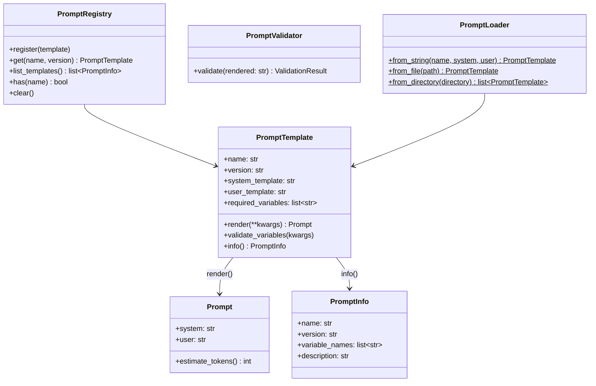
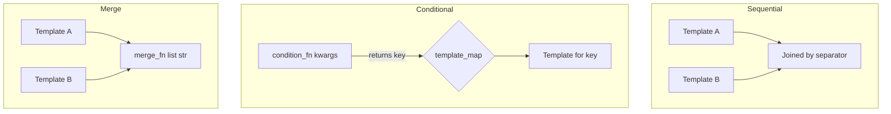

# Prompts Guide

Copyright 2026 Firefly Software Foundation. Licensed under the Apache License 2.0.

The Prompts module provides a Jinja2-based template engine with versioning, composition
strategies, validation, and file/string loaders. Templates split a prompt into a
**system** and a **user** part, and rendering yields a structured `Prompt` object.

---

## Concepts

A prompt template pairs a Jinja2 **system** template with a Jinja2 **user** template.
Both are rendered at runtime with concrete variables, producing a `Prompt` object whose
`.system` and `.user` fields carry the rendered text. Templates can be composed,
versioned, and validated.

The public surface of `fireflyframework_agentic.prompts` is:
`PromptTemplate`, `PromptInfo`, `PromptRegistry`, `prompt_registry`,
`SequentialComposer`, `ConditionalComposer`, `MergeComposer`, `PromptValidator`,
`ValidationResult`, and `PromptLoader`.



---

## Creating a Template

`PromptTemplate` takes three positional arguments — the template `name`, the
`system_template`, and the `user_template` — followed by keyword-only metadata
(`version`, `description`, `required_variables`, `metadata`). Either template may be an
empty string if you only need one of the two parts.

```python
from fireflyframework_agentic.prompts import PromptTemplate

template = PromptTemplate(
    "greeting",
    "You are a helpful {{ role }}.",          # system_template
    "Hello, {{ name }}! How can I help?",      # user_template
    version="1.0.0",
    required_variables=["name", "role"],
)

prompt = template.render(name="Alice", role="developer")
print(prompt.system)  # "You are a helpful developer."
print(prompt.user)    # "Hello, Alice! How can I help?"
print(prompt.estimate_tokens())  # rough heuristic: words / 0.75
```

`render(**kwargs)` returns a `Prompt` object (`.system`, `.user`), not a string. Before
rendering, it calls `validate_variables(kwargs)`, which raises `PromptValidationError`
if any name listed in `required_variables` is missing from the supplied kwargs.

`template.info()` returns a `PromptInfo` summary (`name`, `version`, `variable_names`,
`description`) suitable for serialisation or listings.

---

## Versioning

The `PromptRegistry` stores templates under `(name, version)` keys and tracks the latest
registered version per name. When you `get` a template without a version, the registry
returns the most recently registered version for that name.

```python
from fireflyframework_agentic.prompts import PromptRegistry

registry = PromptRegistry()
registry.register(template_v1)  # version="1.0.0"
registry.register(template_v2)  # version="2.0.0"

latest = registry.get("greeting")          # returns v2 (latest registered)
specific = registry.get("greeting", "1.0.0")  # returns v1

registry.has("greeting")        # True
registry.list_templates()       # list[PromptInfo]
len(registry)                   # total (name, version) entries
```

`get` raises `PromptNotFoundError` when no matching template is registered. The registry
also supports `clear()`, `__len__`, and `name in registry` membership checks.

A module-level singleton, `prompt_registry`, is exported for sharing one registry across
an application:

```python
from fireflyframework_agentic.prompts import prompt_registry

prompt_registry.register(template)
shared = prompt_registry.get("greeting")
```

---

## Composition

Templates can be composed using three strategies. Each composer exposes a
`render(**kwargs)` method that returns a `Prompt` object, composing the `.system` and
`.user` parts of its member templates independently.



- **`SequentialComposer(templates, *, separator="\n\n")`** — renders each template and
  joins the system parts (and the user parts) with `separator`.
- **`ConditionalComposer(condition_fn, template_map)`** — `condition_fn(**kwargs)`
  returns a string **key**; the matching template in `template_map`
  (`dict[str, PromptTemplate]`) is rendered. An unknown key raises `KeyError`.
- **`MergeComposer(templates, merge_fn)`** — renders all templates, then applies
  `merge_fn(list[str]) -> str` to the system parts and to the user parts separately.

```python
from fireflyframework_agentic.prompts import (
    SequentialComposer,
    ConditionalComposer,
    MergeComposer,
)

seq = SequentialComposer([base, context], separator="\n---\n")
prompt = seq.render(name="Alice", role="developer")

cond = ConditionalComposer(
    lambda *, tier, **_: "detailed" if tier == "pro" else "brief",
    {"detailed": detailed_tpl, "brief": brief_tpl},
)
prompt = cond.render(tier="pro", name="Alice")

merged = MergeComposer([a, b], merge_fn=lambda parts: " | ".join(parts))
prompt = merged.render(name="Alice")
```

---

## Validation

The `PromptValidator` inspects an already-rendered **string** and reports issues via a
`ValidationResult` (`valid: bool`, `errors: list[str]`). It performs two checks:

1. **Token limit** — if `max_tokens > 0`, the estimated token count
   (`word_count / 0.75`) must not exceed it. `max_tokens=0` (the default) disables the
   check.
2. **Required sections** — every substring in `required_sections` must appear in the
   rendered text.

It does **not** validate variable presence or types — that is enforced by
`PromptTemplate.validate_variables()` during `render()`. Because `validate()` takes a
string, pass a specific part of the rendered `Prompt` (`.system` or `.user`):

```python
from fireflyframework_agentic.prompts import PromptValidator

validator = PromptValidator(max_tokens=4000, required_sections=["helpful"])
prompt = template.render(name="Alice", role="developer")
result = validator.validate(prompt.system)
if not result.valid:
    print(result.errors)
```

---

## Loading from Files

`PromptLoader` is a collection of **static factory methods** — there is nothing to
instantiate.

- **`PromptLoader.from_string(name, system_template, user_template, *, version="1.0.0", description="")`**
  — build a template from inline strings.
- **`PromptLoader.from_file(path, *, name=None, version="1.0.0", description="")`** —
  read a **YAML** file and construct `PromptTemplate(**data)`. The file must contain the
  template fields as YAML keys (`name`, `system_template`, `user_template`, and any of
  `version`/`description`/`required_variables`/`metadata`). If `name` is omitted, it
  defaults to the file stem.
- **`PromptLoader.from_directory(directory, *, glob_pattern="*.j2", version="1.0.0")`** —
  load every YAML file matching `glob_pattern` in `directory`, returning
  `list[PromptTemplate]`.

```python
from fireflyframework_agentic.prompts import PromptLoader

inline = PromptLoader.from_string(
    "greeting",
    "You are a helpful {{ role }}.",
    "Hello, {{ name }}!",
)

template = PromptLoader.from_file("prompts/greeting.j2")
all_templates = PromptLoader.from_directory("prompts/")
```

A loadable file looks like:

```yaml
# prompts/greeting.j2
name: greeting
version: "1.0.0"
system_template: "You are a helpful {{ role }}."
user_template: "Hello, {{ name }}!"
required_variables: ["name", "role"]
```
