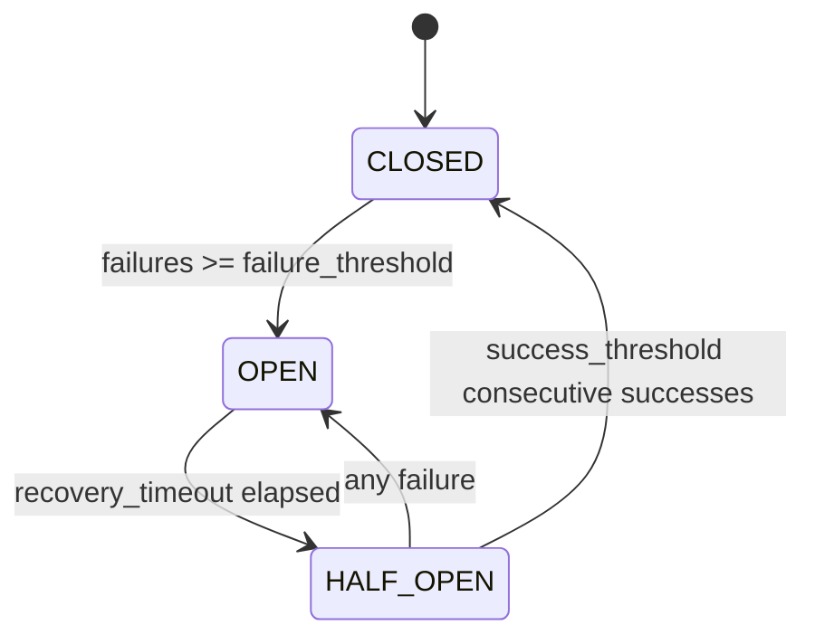

# Resilience Guide

Copyright 2026 Firefly Software Foundation. Licensed under the Apache License 2.0.

The Resilience module provides a **circuit breaker** for fault tolerance and failure
isolation. When an LLM provider or downstream service starts failing, the breaker
trips and fails fast — rejecting calls immediately instead of piling up timeouts —
then automatically probes for recovery. It can be used directly as an async context
manager, or wired into a `FireflyAgent` as middleware so every run is protected.

```python
from fireflyframework_agentic.resilience import (
    CircuitBreaker,
    CircuitBreakerMiddleware,
    CircuitBreakerOpenError,
    CircuitState,
)
```

---

## States and transitions

A breaker is a three-state machine. `CircuitState` has the values `CLOSED`, `OPEN`,
and `HALF_OPEN`:

- **CLOSED** — normal operation. Calls pass through and failures are counted. A
  success resets the failure count to zero.
- **OPEN** — too many failures. Calls fail fast with `CircuitBreakerOpenError`
  without touching the service.
- **HALF_OPEN** — recovery probe. After `recovery_timeout` the breaker lets calls
  through again to test health.



A single failure while `HALF_OPEN` re-opens the circuit immediately; it takes
`success_threshold` consecutive successes to fully close again.

---

## Using `CircuitBreaker` directly

`CircuitBreaker` is an async context manager. Entering it raises
`CircuitBreakerOpenError` when the circuit is OPEN (and the recovery timeout has not
yet elapsed); otherwise the wrapped block runs and the breaker records the outcome on
exit — a clean exit is a success, an exception is a failure.

```python
from fireflyframework_agentic.resilience import CircuitBreaker, CircuitBreakerOpenError

breaker = CircuitBreaker(
    failure_threshold=3,      # open after 3 failures while CLOSED
    recovery_timeout=30.0,    # wait 30s before probing recovery (HALF_OPEN)
    success_threshold=2,      # 2 consecutive successes to close from HALF_OPEN
)


async def fetch_data():
    async with breaker:               # raises CircuitBreakerOpenError if OPEN
        return await expensive_api_call()


try:
    data = await fetch_data()
except CircuitBreakerOpenError:
    data = get_cached_data()          # fast-fail: use a fallback instead of waiting
```

All constructor arguments are keyword-only:

- **`failure_threshold`** (default `5`) — failures while CLOSED before the circuit opens.
- **`recovery_timeout`** (default `60.0`) — seconds the circuit stays OPEN before a HALF_OPEN probe.
- **`success_threshold`** (default `2`) — consecutive successes in HALF_OPEN required to close.
- **`timeout`** (default `30.0`) — per-request timeout in seconds.
- **`excluded_exceptions`** (default `()`) — exception types that do **not** count as failures (e.g. validation errors), so expected errors never trip the breaker.

---

## Protecting an agent

`CircuitBreakerMiddleware` wires a breaker into a `FireflyAgent` so every run is
guarded. It enters the breaker in `before_run` (fast-failing when OPEN), records a
**success** in `after_run`, and records a **failure** in `on_error`.

```python
from fireflyframework_agentic.agents.base import FireflyAgent
from fireflyframework_agentic.resilience import CircuitBreakerMiddleware, CircuitBreakerOpenError

agent = FireflyAgent(
    "resilient-agent",
    model="openai:gpt-4o",
    middleware=[
        CircuitBreakerMiddleware(failure_threshold=3, recovery_timeout=30.0),
    ],
)

try:
    result = await agent.run("Question")
except CircuitBreakerOpenError:
    result = get_cached_response()    # circuit open — serve a fallback
```

Failure counting rides on the agent's **error lifecycle**: when a run raises, the
agent invokes each middleware's `on_error` hook (see the
[middleware error lifecycle](agents.md#error-lifecycle)), which is how the breaker
records the failure and flips `CLOSED → OPEN` once `failure_threshold` is reached.
This works across every run path — `run()`, `run_sync()`, `run_stream()`, and
`run_with_reasoning()`. A successful run records a success through `after_run`.

`CircuitBreakerMiddleware` also accepts `enabled=False` to construct an inert,
no-op middleware (handy for toggling protection by config without changing the chain).

---

## Inspecting and resetting

`CircuitBreaker` exposes its live state for monitoring and tests:

```python
breaker.state            # CircuitState.CLOSED | OPEN | HALF_OPEN
breaker.failure_count    # current failures recorded while CLOSED
breaker.success_count    # consecutive successes recorded while HALF_OPEN

breaker.get_metrics()    # dict: state, failure_count, success_count, thresholds,
                         # recovery_timeout, time_since_last_failure

await breaker.reset()    # force back to CLOSED (manual recovery / test cleanup)
```

`CircuitBreakerMiddleware.get_metrics()` returns the same metrics dict wrapped with an
`"enabled"` flag (`{"enabled": False}` when the middleware is disabled).

---

## API reference

| Symbol | Purpose |
|---|---|
| `CircuitBreaker(*, failure_threshold=5, recovery_timeout=60.0, success_threshold=2, timeout=30.0, excluded_exceptions=())` | Async context-manager breaker. `async with breaker:` runs the block, records success/failure on exit. |
| `CircuitBreaker.state` / `.failure_count` / `.success_count` | Live introspection properties. |
| `CircuitBreaker.get_metrics()` | Snapshot dict of state, counts, thresholds and timings. |
| `await CircuitBreaker.reset()` | Force the breaker back to `CLOSED`. |
| `CircuitState` | Enum: `CLOSED`, `OPEN`, `HALF_OPEN` (`.value` → `"closed"` / `"open"` / `"half_open"`). |
| `CircuitBreakerOpenError` | Raised on entry when the circuit is OPEN; catch it to serve a fallback. |
| `CircuitBreakerMiddleware(*, failure_threshold=5, recovery_timeout=60.0, success_threshold=2, enabled=True)` | Agent middleware: guards every run via `before_run` / `after_run` / `on_error`. |
| `CircuitBreakerMiddleware.get_metrics()` | Breaker metrics plus an `"enabled"` flag. |

All four symbols are importable from `fireflyframework_agentic.resilience`.
