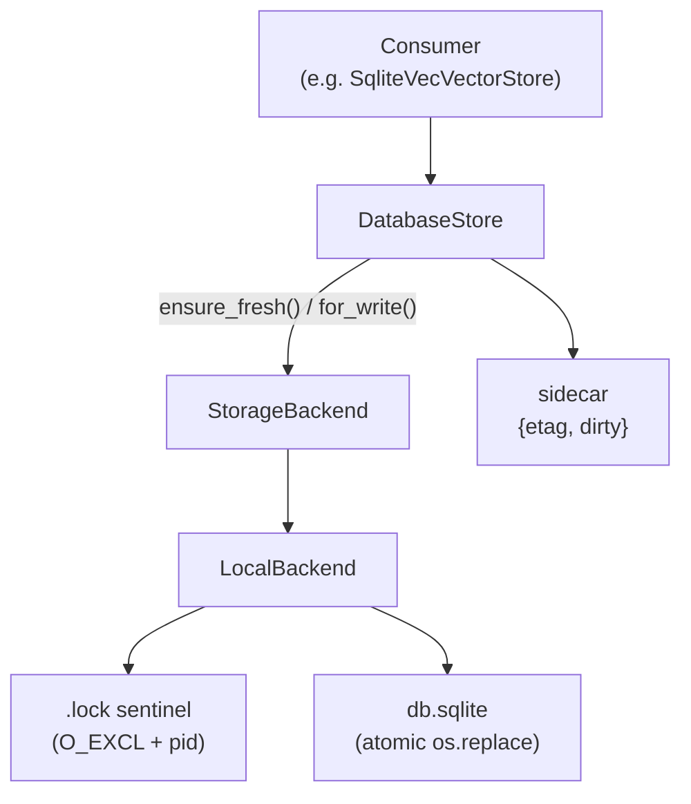

# Storage Guide

Copyright 2026 Firefly Software Foundation. Licensed under the Apache License 2.0.

The Storage module is a **managed-SQLite-file durable layer**: it keeps a single
SQLite database file consistent across reads and writes, with **atomic publish**
(temp-file + `os.replace`), **cross-process write leasing**, **etag-based
freshness**, and **crash recovery**. It is *not* a generic blob store or a
key/value API — its one job is to let many readers and a serialized writer share
one SQLite file safely, whether that file lives on the local filesystem or
(through the abstract backend contract) a remote object store.

Today it powers the [`sqlite-vec` vector store](vectorstores.md), which is its
primary consumer.

---

## When to use it

Reach for `DatabaseStore` when you have a SQLite-backed corpus that must be:

- **Written by one process at a time** (a lease serializes writers; readers are
  never blocked) and **read by many** — concurrent batch jobs, multiple workers.
- **Published atomically** — a crash mid-write must never leave a torn file. The
  backend writes to a temp file and `os.replace`s it into place.
- **Refreshed lazily** — readers pull a new copy only when the backend's etag
  changes, throttled by a freshness window.
- **Crash-safe** — an upload that committed locally but never confirmed is
  detected and re-pulled on the next write (a persisted `dirty` flag).

If you just need a vector store, use `SqliteVecVectorStore` (which wires this up
for you). Use `DatabaseStore` directly only when you manage a custom SQLite file.

```python
from fireflyframework_agentic.storage import DatabaseStore, LocalBackend
```

---

## Architecture



- **`StorageBackend`** — abstract contract owning the *physical* file and its
  exclusive write lock (metadata, download, upload, lock/unlock).
- **`LocalBackend`** — the shipped concrete backend: a SQLite file on the local
  filesystem, locked by an `O_EXCL` sentinel file.
- **`DatabaseStore`** — the orchestrator: a local working copy, an etag sidecar
  for freshness and crash recovery, write sessions, and upload-with-retry.

---

## `StorageBackend` (the contract)

`StorageBackend` is an `ABC` that owns one file and exclusive write locking
against it. Implementations are safe to use from a single asyncio event loop (not
required to be thread-safe across loops).

| Method | Purpose |
|---|---|
| `async metadata() -> StorageMetadata` | Current remote metadata (etag, size, modified, exists). |
| `async download(dest) -> StorageMetadata` | Atomically replace `dest` with the current contents; returns the metadata read. |
| `async upload(src, *, if_match=None, if_none_match=None) -> StorageMetadata` | Atomically publish `src`. `if_match` succeeds only when the remote etag matches; `if_none_match="*"` succeeds only when the remote does not exist (first write). A conditional failure raises `StorageLeaseError`; transport/5xx raise `StorageTransientError` (retried by the caller). |
| `async acquire_lock(*, timeout) -> LockToken` | Acquire the exclusive write lock, waiting up to `timeout`. |
| `async release_lock(token) -> None` | Release a lock acquired via `acquire_lock`. |
| `async renew_lock(token) -> LockToken` | Optional (default raises). For backends with bounded leases that must extend before expiry. |
| `local_path -> Path \| None` | The on-disk file the backend stores bytes in, or `None` for a remote backend whose working copy must be a separate local file. |

> **`LocalBackend` is the only shipped backend.** The contract deliberately
> anticipates remote backends (an object store reached over the network, with
> conditional `if_match`/`if_none_match` puts and bounded leases via `renew_lock`),
> but none ship today — implement `StorageBackend` to add one.

---

## `LocalBackend`

A SQLite file on the local filesystem, with cross-process locking via an
`O_EXCL` sentinel file (`<path>.lock`) plus an in-process `asyncio.Lock`.

```python
from pathlib import Path
from fireflyframework_agentic.storage import LocalBackend

backend = LocalBackend(Path("/data/corpus/index.sqlite"), stale_lock_seconds=600.0)
```

- **`path`** — `LocalBackend(path, *, stale_lock_seconds=600.0)`. `path` is the
  managed SQLite file; the lock sentinel is `path` + `.lock`.
- **Atomic upload/download** — bytes are copied to a unique temp file and
  `os.replace`d into place, so a reader never sees a partial file.
- **Stale-lock reclaim** — the sentinel records the owning pid; a held sentinel
  whose process is dead, or whose age exceeds `stale_lock_seconds`, is reclaimed
  so a crashed writer can't wedge the file forever.
- **`local_path`** returns the file path, so a co-located `DatabaseStore` shares
  the same inode (no duplicate working copy).

---

## `DatabaseStore`

The orchestrator. It keeps a **local working copy** of the backend file, a
persistent **sidecar** (`{etag, dirty}`) next to it, and serializes writes
through the backend's lock.

```python
store = DatabaseStore(
    backend,
    store_id="local:/data/corpus/index.sqlite",
    cache_path=None,            # explicit working-copy path (see precedence below)
    retry_policy=None,          # defaults to RetryPolicy()
    read_freshness_seconds=5.0, # skip the etag check within this window
)
```

**Cache-location precedence** (where the working copy lives):

1. An explicit `cache_path=` — used verbatim.
2. Else `backend.local_path` if set — **co-locate** the working copy with the
   backend file (same inode, no duplicate; `rm -rf <root>` actually resets state).
3. Else `~/.cache/fireflyframework_agentic/dbstore/<store_id>/db.sqlite`
   (override the root with `FIREFLY_DBSTORE_CACHE_ROOT`) — for remote backends
   whose working copy must be a separate local file.

### Reading: `ensure_fresh()`

```python
path, generation = await store.ensure_fresh()
# `path` is the local SQLite file; open a sqlite3 connection against it.
# `generation` increments whenever the cache is replaced — reopen your
# connection when it changes.
```

`ensure_fresh()` checks the backend's etag against the sidecar (throttled by
`read_freshness_seconds`) and downloads a fresh copy only when it differs. Use
`await store.exists()` for a cheap "does the corpus exist?" check that skips the
download entirely.

### Writing: `for_write()`

```python
async with store.for_write(lock_timeout=30.0) as session:
    # The exclusive lock is held for the duration of the block.
    conn = sqlite3.connect(session.path)
    conn.execute("INSERT INTO docs VALUES (?, ?)", (doc_id, payload))
    conn.commit()
    conn.close()
# On clean exit: WAL is checkpointed into the main file, then the file is
# uploaded (with retry). On exception: nothing is published.
```

`for_write()` is an async context manager that acquires the lock, reconciles the
local copy with the remote (downloading if the etag drifted, or re-pulling after
a crash if the sidecar is `dirty`), and yields a `WriteSession(path, generation)`.
On a clean exit it **checkpoints the WAL** (so frames in `<file>-wal` from a
long-lived connection aren't dropped) and then **uploads with retry** per the
`RetryPolicy`. If the upload fails terminally, the local copy is discarded and
re-pulled, and a `StorageUploadError` is raised — the caller must re-run the
batch (the idempotency contract).

---

## Types & exceptions

| Symbol | What it is |
|---|---|
| `StorageMetadata(etag, size_bytes, modified, exists)` | Backend metadata snapshot (`NamedTuple`). |
| `LockToken(token, acquired_at, expires_at)` | A held write lock (`NamedTuple`); `expires_at=None` means no auto-expiry (Local). |
| `WriteSession(path, generation)` | Yielded by `for_write`; `path` is the locked local file, `generation` bumps on cache replace. |
| `RetryPolicy(max_attempts=3, initial_backoff_s=1.0, max_backoff_s=30.0, jitter=True, retry_on=(StorageTransientError,))` | Upload retry policy (exponential backoff + jitter). |
| `DatabaseStoreError` | Base storage error; carries a `.context` dict. |
| `StorageTransientError` | Retryable transport/5xx/throttling (internal — the retry helper consumes it). |
| `StorageUploadError` | Terminal upload failure; local re-pulled, caller must re-run the batch. |
| `StorageDownloadError` | Terminal download failure. |
| `StorageLeaseError` | Lease lost/never acquired, or a conditional `if_match`/`if_none_match` failed. |
| `StoreUnavailableError` | Configuration/init problem (bad credentials, missing container, malformed URL). |

> **Name collision.** `fireflyframework_agentic.storage.DatabaseStoreError` is a
> **different class** from `fireflyframework_agentic.memory.DatabaseStoreError`.
> Import the one matching the layer you're catching — they do not share a base
> beyond `FireflyAgenticError`.

---

## Using it through a consumer

The shipped consumer is `SqliteVecVectorStore`, which accepts either a path (it
builds a `LocalBackend`-backed `DatabaseStore` for you) or a pre-built store:

```python
from fireflyframework_agentic.storage import DatabaseStore, LocalBackend
from fireflyframework_agentic.vectorstores import SqliteVecVectorStore

# A) Let the store manage it — just give it a file path:
vs = SqliteVecVectorStore("/data/corpus/index.sqlite")

# B) Share one DatabaseStore across components (coordinated reads + writes):
store = DatabaseStore(LocalBackend("/data/corpus/index.sqlite"), store_id="corpus")
vs = SqliteVecVectorStore(store)
```

Internally it calls `ensure_fresh()` before reads (reopening its `sqlite3`
connection when `generation` changes) and wraps batch writes in
`async with store.for_write() as session:` so an upsert/delete batch publishes
atomically under a single lease.

---

## Crash-safe writes elsewhere in the framework

The atomic-write idea this layer is built on — write to a temp file, then
`os.replace` it into place — is also applied by two lightweight file persisters
that are **separate** from this managed-SQLite layer:

- **`FileCheckpointer`** ([pipeline](pipeline.md)) — pipeline checkpoint records.
- **`FileJournalBackend`** ([workflows](workflows.md)) — the durable resume journal.

Those persist a single JSON file each (no leasing, no etag reconciliation); reach
for `DatabaseStore` when you need coordinated, multi-writer SQLite durability.

See also: [Vector Stores Guide](vectorstores.md) for the `sqlite-vec` backend that
consumes this layer.
