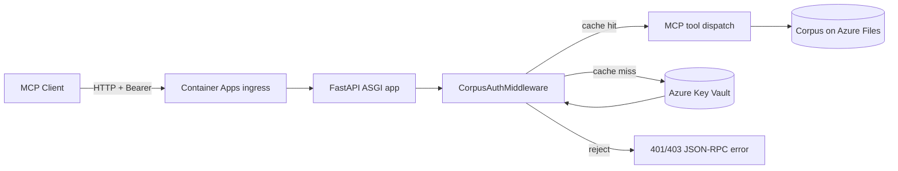

# Design: Per-Corpus Capability Tokens in Azure Key Vault for the MCP Server

**Date:** 2026-05-12
**Branch:** `feat/mcp-corpus-keyvault-auth` → target `main`
**Status:** Draft (brainstorming)

## Goal

Give each corpus its own capability token, stored in Azure Key Vault, so that
clients calling the `firefly-mcp-http` server over Streamable HTTP can only
interact with corpora they hold a token for. Concretely:

- A secret named `firefly-mcp-corpus-token-<corpus_id>` exists in a configured
  Key Vault for every corpus that should be reachable.
- Each MCP tool call carries `Authorization: Bearer <token>`. The server
  authorises the call iff that token equals the current Key Vault value for
  the `corpus_id` argument of the called tool.
- Tools that do not target a specific corpus (`list_corpora`) are either
  denied or filtered to the corpora the bearer is authorised for.

## Why

Today `firefly-mcp-http` performs **no** in-process authorisation
(`exposure/mcp/http_cli.py` comment: "Auth is enforced at the ingress
layer"). A single ingress JWT therefore grants access to every corpus the
process can see. We want a second, finer-grained layer that:

1. **Scopes credentials to one corpus.** Leaking a token for corpus A must
   not expose corpus B.
2. **Stores secrets where ops already keep them.** Key Vault is the existing
   secret store for the Container App (managed identity already configured
   per `docs/deploy/corpus-persistence.md`).
3. **Decouples token rotation from deploys.** Rotating a corpus token is
   `az keyvault secret set …`, not a code change or restart.

---

## Non-goals

- **End-user identity / SSO.** Tokens are capability credentials, not user
  identities. If user-level audit is required, it must come from the ingress
  JWT or downstream logs — this layer does not replace it.
- **Token issuance UI.** Out of scope for this PR. Admins create / rotate /
  revoke via `az keyvault secret set|disable|delete`. A future PR may add a
  small admin CLI.
- **stdio transport.** Stdio is only used by locally-spawned MCP subprocesses
  (Claude Code, etc.) with no network exposure; the existing comment in
  `transports.run_stdio` explicitly says "no network, no auth". Capability
  tokens are HTTP-only.
- **Authorisation for non-corpus tools.** Tools that are not corpus-scoped
  (e.g. a hypothetical future `system.health` tool) are unaffected; this
  middleware only fires when the called tool has a `corpus_id` argument.

---

## Architecture



The new middleware sits **inside** the FastAPI app, after ingress, before
FastMCP's request dispatcher. It runs on every request to `/mcp/*` except
`/healthz`.

### Components

| Component | Path | Responsibility |
|---|---|---|
| `KeyVaultTokenStore` | `fireflyframework_agentic/security/keyvault.py` | Async wrapper around `azure.keyvault.secrets.aio.SecretClient`. One method: `async get_corpus_token(corpus_id) -> str \| None`. |
| `CorpusTokenCache` | `fireflyframework_agentic/security/keyvault.py` | In-memory TTL cache keyed by `corpus_id`, storing `sha256(token)` (not the plaintext). TTL configurable, default 300 s. |
| `CorpusAuthMiddleware` | `fireflyframework_agentic/exposure/mcp/auth.py` | Starlette middleware. Extracts bearer + parses the JSON-RPC body to find `corpus_id`. Validates via the cache + store. |
| `build_app` wiring | `fireflyframework_agentic/exposure/mcp/http_cli.py` | Adds the middleware iff `FIREFLY_MCP_CORPUS_AUTH_ENABLED=true`. Reads vault URL from `FIREFLY_MCP_KEYVAULT_URL`. |
| Docs | `docs/deploy/mcp-corpus-auth.md` | Operator runbook: provisioning, rotation, revocation, recovery. |
| Tests | `tests/test_exposure/mcp/test_corpus_auth.py` | Unit + integration tests; the Key Vault client is stubbed in tests. |

### Token format

- **Generation:** `secrets.token_urlsafe(32)` → ≥256 bits of entropy, URL-safe
  characters only, ~43 characters.
- **Storage:** Each corpus gets one Key Vault secret named
  `firefly-mcp-corpus-token-<corpus_id>`. Corpus IDs are constrained to
  `[a-z0-9-]{1,63}` (already enforced upstream by `_agent_for`); the vault
  naming scheme matches that character class so no escaping is needed.
- **Rotation:** New version of the same secret via `az keyvault secret set`.
  Key Vault retains the previous version, but our validator only checks the
  current value — old tokens stop working after cache TTL expires.
- **Revocation:** `az keyvault secret set-attributes --enabled false`. The
  SDK call then raises `ResourceNotFoundError`; the validator denies the
  request. Effective time-to-deny = cache TTL.
- **Grace period for rotation:** **None in v1.** If zero-downtime rotation
  becomes a requirement, a v2 can use a tag on the previous version
  (`previous_token_until=<ISO timestamp>`); flagged as future work, not
  built now.

### Request flow

1. Middleware reads `Authorization: Bearer <token>`. Missing or malformed →
   `401 Unauthorized` (JSON-RPC `error` body with `code = -32001`).
2. Middleware reads the JSON-RPC request body. For batched requests, the
   middleware splits and authorises each individually.
3. For each call:
   - If the tool is corpus-scoped (its registered schema has a `corpus_id`
     field), the middleware extracts the value. Missing `corpus_id` →
     `400 Bad Request`.
   - It computes `digest = sha256(token + corpus_id)` (corpus binding —
     prevents reusing one cache lookup across corpora).
   - On cache hit and digest match → forward.
   - On cache miss → call `KeyVaultTokenStore.get_corpus_token(corpus_id)`.
     - Not found → `403 Forbidden`.
     - Found → compare with `hmac.compare_digest`. On match, write digest
       into cache with TTL; forward. On mismatch → `403 Forbidden`.
4. The body must then be re-streamed to the downstream ASGI handler.
   Implementation note: we read the body once, store it on `request.scope`,
   and provide a `receive()` callable that replays it (standard Starlette
   pattern).

### Cross-corpus listing (`list_corpora`)

The `list_corpora` tool currently returns every corpus on disk. Under this
design it instead:

- If the bearer is valid for **any** corpus, returns the list filtered to
  that one corpus (single-entry list).
- This is enforced by the middleware setting `request.state.authorised_corpora`
  and the tool reading that state. (FastMCP exposes the Starlette request
  to tool handlers via `mcp.context`; the tool inspects it.)
- If no bearer is present and corpus auth is enabled → `401`.

### What we do **not** change

- The MCP stdio transport (no network, no auth).
- The REST exposure layer (`exposure/rest/`) — it already has its own
  `add_auth_middleware`. This work is MCP-only.
- The existing `RBACManager` JWT machinery in `fireflyframework_agentic/
  security/rbac.py`. Capability tokens are not JWTs and need no roles.

---

## Configuration

| Env var | Required | Default | Notes |
|---|---|---|---|
| `FIREFLY_MCP_CORPUS_AUTH_ENABLED` | no | `false` | Toggles the middleware. False = current behaviour (deny-nothing). |
| `FIREFLY_MCP_KEYVAULT_URL` | yes, if enabled | — | e.g. `https://kv-firefly-prod.vault.azure.net`. |
| `FIREFLY_MCP_TOKEN_CACHE_TTL_SECONDS` | no | `300` | Cache TTL for the corpus-token digests. |
| `FIREFLY_MCP_TOKEN_SECRET_PREFIX` | no | `firefly-mcp-corpus-token-` | Override only if a tenant naming convention requires it. |

`DefaultAzureCredential` is used to authenticate to Key Vault: in Container
Apps it picks up the user-assigned managed identity already provisioned for
SharePoint ingestion (`firefly-mcp-mi` per the deploy doc); locally it falls
back to `az login`. The managed identity needs **Key Vault Secrets User**
(`get`) on the vault — no `set` / `list` / `delete`. (Least privilege —
the runtime cannot mint or destroy tokens.)

---

## Risk analysis (STRIDE)

| Threat | Vector | Mitigation | Residual risk |
|---|---|---|---|
| **S**poofing — attacker presents a forged bearer | Random 256-bit token; no offline forgery without breaking SHA-256 / RNG | Negligible |
| **S**poofing — token leak via logs | Logger filter strips `Authorization` header; never log raw token; cache stores SHA-256 only | Low — depends on no `print(request.headers)` slipping in. Test asserts logs don't contain the secret. |
| **S**poofing — token leak via traceback / error response | Errors return JSON-RPC bodies without echoing the token; pytest fixture asserts | Low |
| **T**ampering — body rewritten between middleware read and handler dispatch | Middleware reads once, replays via `receive()`. ASGI guarantees no mutation by downstream layers without going through `receive()`. | None — same body served to both layers |
| **R**epudiation — denying a call was made | Each authorised call emits a structured log record with `corpus_id`, `tool`, hashed-token-prefix, request_id (mirrors the ingress trace) | Low — depends on ingress logs being retained |
| **I**nformation disclosure — KV secret listed by a compromised replica | Managed identity has only `get` on this vault (no `list`); attacker without prior knowledge of `corpus_id` cannot enumerate | Medium — `corpus_id` is not a secret; an attacker who learns one can probe with stolen tokens. Mitigated by rate-limit (see below) |
| **I**nformation disclosure — token leak via in-process exception | Custom `ValueError("invalid")` raised; no `repr(token)` anywhere | Low |
| **I**nformation disclosure — cross-corpus access via cache reuse | Cache key includes `corpus_id`; digest is `sha256(token + corpus_id)` so a hit for corpus A does not validate corpus B | None |
| **D**enial of service — repeated KV calls | TTL cache (default 300 s); on KV outage the cache continues to serve cached digests for the TTL window. KV throttling at ~2000 RPS far exceeds expected throughput. | Low |
| **D**enial of service — auth-loop replay | The existing `RateLimiter` in `exposure/rest/middleware.py` is **not** wired up on the MCP HTTP app today. **This PR adds** a per-IP token-bucket on `/mcp` (default 60 req/min) to bound attacker probing. | Low |
| **D**enial of service — KV unavailable on cold start | Middleware fails closed (`503 Service Unavailable`). Healthcheck remains green if KV is reachable. Container Apps will not route traffic if `/healthz` flips on KV failure (explicit follow-up: optional KV ping in `/healthz`). | Medium — accepted; operator runbook documents recovery |
| **E**levation of privilege — token for corpus A used against corpus B | Middleware extracts `corpus_id` from the request body, not from the token; comparison is `corpus_id`-specific | None |
| **E**levation of privilege — `list_corpora` enumerates all corpora | Filtered by `request.state.authorised_corpora`; tool tests cover this | None |
| **E**levation of privilege — write tools (`ingest_corpus_*`) reachable with read intent | All tools that take `corpus_id` are gated identically. If finer read/write split is needed, two tokens per corpus in v2. | Low — flagged as future scope |

### Security controls summary

- **Defence in depth:** This is a *second* layer behind ingress; ingress
  remains the perimeter authn boundary.
- **Constant-time comparison** via `hmac.compare_digest` everywhere.
- **No plaintext in logs, caches, or memory beyond the request scope.** The
  cache stores `sha256(token + corpus_id)`; the request handler does not
  retain the raw token.
- **Least-privilege managed identity:** `get` on Key Vault Secrets only.
- **Fail-closed on KV errors** (503), not fail-open.
- **Rate limit** on `/mcp` to bound brute-force / probing.
- **Header allow-list** in middleware so the bearer is not propagated to
  downstream tools (defence against `corpus_rag` accidentally logging it).
- **Test that asserts** `pytest`'s captured log output does not contain the
  test token after a full request.

### Open security questions (flagged, not blocking)

- Should we additionally pin tokens to a list of allowed source IPs (Key
  Vault tag)? Useful for service-to-service callers but adds operator
  burden. **Decision: not in v1.**
- Should we add HMAC-signed short-lived sub-tokens minted from the
  long-lived KV token for mobile / browser callers? **v2.**

---

## Data flow

```
Client                Middleware                KV                Tool
  |                       |                       |                |
  |--POST /mcp body+Bearer|                       |                |
  |---------------------->|                       |                |
  |                       | parse body            |                |
  |                       | extract corpus_id     |                |
  |                       | sha256(token+id)      |                |
  |                       | cache lookup          |                |
  |                       |  hit -> forward       |                |
  |                       |  miss -> get_secret-->|                |
  |                       |                       |--SecretClient->|
  |                       |<----secret------------|                |
  |                       | compare_digest        |                |
  |                       | cache.set(digest,TTL) |                |
  |                       |--------- dispatch -------------------->|
  |                       |                       |          ...   |
  |<-------- response ----|                       |                |
```

---

## Testing strategy

### Unit tests (`tests/test_exposure/mcp/test_corpus_auth.py`)

1. **Happy path:** bearer matches KV value → 200, tool invoked once.
2. **Wrong corpus_id:** bearer for `corpus-a` used on a `corpus-b` call → 403,
   tool never invoked.
3. **Missing bearer:** no `Authorization` header → 401, body is JSON-RPC error.
4. **Malformed bearer:** `Authorization: Token foo` → 401.
5. **Tampered bearer:** valid prefix + wrong suffix → 403.
6. **Unknown corpus_id:** KV returns 404 → 403 (not 404, to avoid enumeration).
7. **KV outage on cache miss:** SDK raises `ServiceRequestError` → 503;
   ingress trace tag set to `kv_outage`.
8. **Cache hit:** two consecutive valid calls → KV called once. Asserted via
   a stub counter.
9. **Cache expiry:** advance time past TTL → KV called again.
10. **Body replay:** downstream handler receives the exact body the client
    sent (byte-for-byte equal).
11. **`list_corpora` filter:** with token for `corpus-a` only, response lists
    `[corpus-a]` even if `corpus-b` exists on disk.
12. **No-token log leak:** with logging at DEBUG, the captured log buffer
    must not contain the raw token string after a request.
13. **Disabled mode:** `FIREFLY_MCP_CORPUS_AUTH_ENABLED=false` → middleware
    is absent, current behaviour preserved.
14. **Rate limit:** 61st request from one IP inside the window → 429.
15. **Constant-time compare:** stub `hmac.compare_digest` to a sentinel and
    assert it (not `==`) was used for the final check. (Belt-and-braces for
    future refactors.)

### Integration test

Uses `pytest-httpserver` to fake the Key Vault REST endpoint. End-to-end
request through `build_app()` → middleware → mocked tool. Asserts headers
forwarded, body replayed, KV called with correct secret name.

### Manual test plan (for the PR)

```bash
# 1. Provision a test KV secret (locally: az login required)
az keyvault secret set --vault-name $KV --name firefly-mcp-corpus-token-demo \
    --value "$(python -c 'import secrets; print(secrets.token_urlsafe(32))')"

# 2. Start the server with auth enabled
export FIREFLY_MCP_CORPUS_AUTH_ENABLED=true
export FIREFLY_MCP_KEYVAULT_URL=https://$KV.vault.azure.net
firefly-mcp-http &

# 3. Call without bearer -> 401
curl -i http://localhost:8000/mcp -X POST -H 'content-type: application/json' \
    -d '{"jsonrpc":"2.0","id":1,"method":"tools/call","params":{"name":"corpus_query","arguments":{"corpus_id":"demo","question":"hi","top_k":3}}}'

# 4. Call with valid bearer -> 200
curl -i http://localhost:8000/mcp -X POST \
    -H "authorization: Bearer $(az keyvault secret show --vault-name $KV --name firefly-mcp-corpus-token-demo --query value -o tsv)" \
    -H 'content-type: application/json' \
    -d '{"jsonrpc":"2.0","id":1,"method":"tools/call","params":{"name":"corpus_query","arguments":{"corpus_id":"demo","question":"hi","top_k":3}}}'

# 5. Call with valid bearer but wrong corpus_id -> 403
# ... same as (4) but arguments.corpus_id = "other"

# 6. Rotate and observe old token denied within cache TTL
az keyvault secret set --vault-name $KV --name firefly-mcp-corpus-token-demo \
    --value "$(python -c 'import secrets; print(secrets.token_urlsafe(32))')"
sleep 305  # past cache TTL
# Old token now -> 403
```

---

## Rollout

- **Flag default off.** `FIREFLY_MCP_CORPUS_AUTH_ENABLED=false` keeps
  current behaviour.
- Operator turns it on per environment once tokens are provisioned. The
  deploy doc gains a "first-time setup" section that scripts the
  provisioning loop over existing corpora.
- Backwards compatibility: stdio clients are unaffected (no middleware on
  that transport).

## Open work (explicit, post-merge)

- Optional KV reachability ping in `/healthz`.
- Admin CLI / REST endpoint for token CRUD (separate PR).
- Read-only vs read-write split (two tokens per corpus) if needed.
- Token rotation grace period via `previous_token_until` tag.

---

## Spec self-review notes (inline)

- **Placeholders / TODO:** none.
- **Internal consistency:** Architecture diagram matches the request-flow
  steps; component table matches the file list created in the plan.
- **Scope:** Single PR. Excludes admin CRUD (called out as future).
- **Ambiguity check:** The behaviour of `list_corpora` is explicit
  (single-entry filtered list, 401 if no bearer when enabled). The cache
  digest formula is explicit. Rate-limit default is explicit. Failure
  modes (401 / 403 / 503) and their conditions are explicit.
