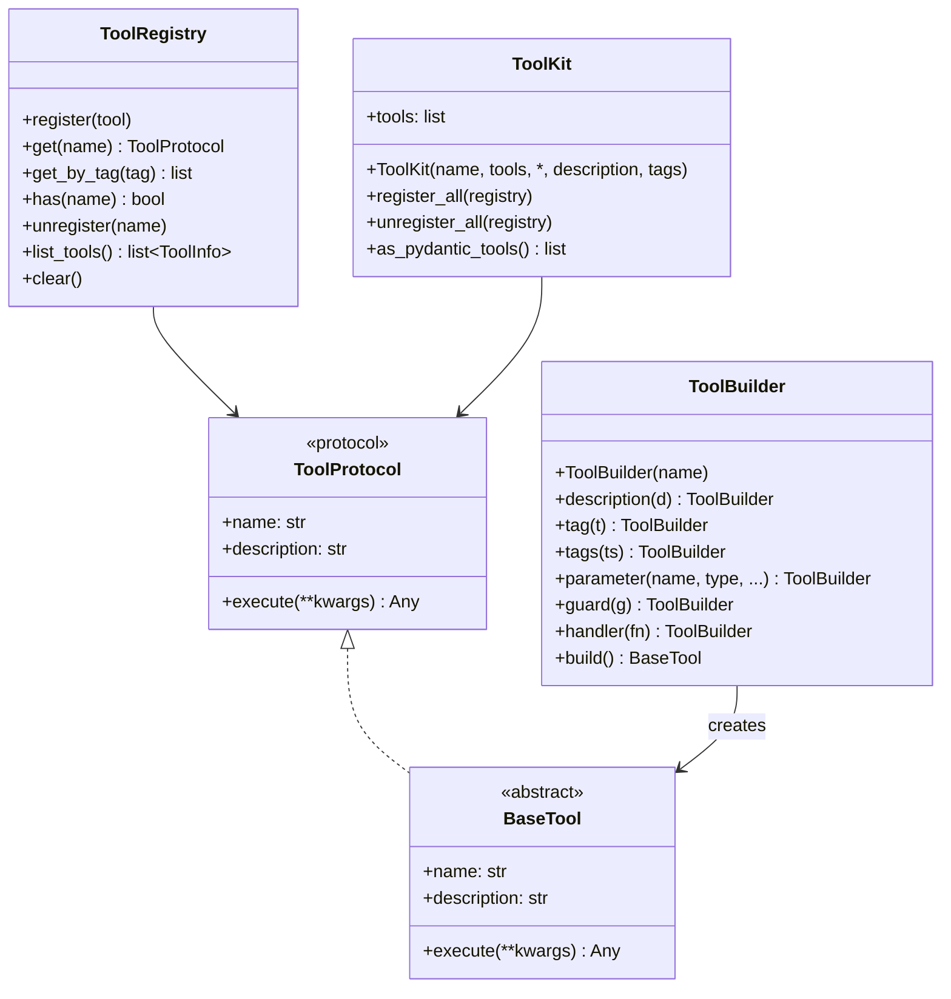
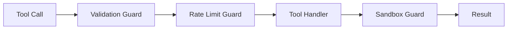
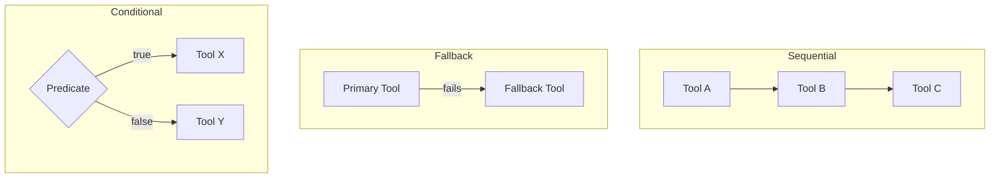

# Tools Guide

Copyright 2026 Firefly Software Foundation. Licensed under the Apache License 2.0.

The Tools module provides a protocol-driven system for defining, guarding, composing,
and registering tools that agents can invoke.

---

## Concepts

A tool is any callable that an agent can use to interact with external systems or
perform computations. The framework wraps tools with metadata, guards, and composition
logic.

The core contract lives in `fireflyframework_agentic.tools.base`:

- **`ToolProtocol`** -- a runtime-checkable `Protocol` (properties `name`, `description`;
  `async execute(**kwargs)`). Implement it directly for composition, or subclass `BaseTool`
  for guard evaluation, timeout, and error handling out of the box.
- **`GuardProtocol`** -- `async check(tool_name, kwargs) -> GuardResult`.
- **`GuardResult`** -- `GuardResult(passed: bool, reason: str | None = None)`; guards return it.
- **`ParameterSpec`** -- `ParameterSpec(name, type_annotation, description="", required=True,
  default=None)`; declared specs drive the Pydantic AI JSON schema the LLM sees.
- **`ToolInfo`** -- serialisable summary (`name`, `description`, `tags`, `parameter_count`)
  returned by `BaseTool.info()` and `ToolRegistry.list_tools()`.

All six are exported from `fireflyframework_agentic.tools`.



---

## Creating a Tool

### Using the Decorator

```python
from fireflyframework_agentic.tools import firefly_tool

@firefly_tool(name="calculator", description="Evaluate a math expression")
async def calculator(expression: str) -> str:
    return str(eval(expression))
```

### Using the Builder

The fluent `ToolBuilder` lets you construct tools step by step. Beyond `description()`,
`handler()`, and `guard()`, it also exposes `tag()`, `tags()`, and
`parameter(name, type_annotation, *, description, required, default)` — declared
parameters generate the JSON schema the LLM uses to call the tool. `build()` raises
`ValueError` if no handler was set.

```python
from fireflyframework_agentic.tools import ToolBuilder
from fireflyframework_agentic.tools.guards import RateLimitGuard

tool = (
    ToolBuilder("weather")
    .description("Get current weather for a city")
    .tags(["web", "geo"])
    .parameter("city", "str", description="City name", required=True)
    .guard(RateLimitGuard(max_calls=10, period_seconds=60))
    .handler(get_weather_fn)
    .build()
)
```

---

## Guards

Guards wrap tool execution to enforce policies. They run before and/or after the
tool's handler.



Each guard implements `GuardProtocol.check(tool_name, kwargs) -> GuardResult`. When a
guard returns `GuardResult(passed=False, reason=...)`, `BaseTool.execute()` raises a
`ToolError` before the handler runs.

### Built-in Guards

- **ValidationGuard** -- `ValidationGuard(required_keys)` — rejects the call when any
  required keyword argument is missing.
- **RateLimitGuard** -- `RateLimitGuard(max_calls, period_seconds=60.0)` — sliding-window
  rate limiter that caps invocations per time window.
- **ApprovalGuard** -- `ApprovalGuard(callback)` — human-in-the-loop gate; `callback` is
  an async callable `(tool_name, kwargs) -> bool` that must return `True` to approve.
- **SandboxGuard** -- `SandboxGuard(*, allowed_patterns=(), denied_patterns=())` — converts
  each kwarg value to a string and rejects it if it matches a `denied_patterns` regex
  (unless it also matches an `allowed_patterns` regex, which takes precedence).
- **CompositeGuard** -- `CompositeGuard(guards)` — AND-composition; evaluates guards in
  order and short-circuits on the first failure.

### Applying Guards

Two equivalent paths. The `@guarded` decorator appends a guard to an existing `BaseTool`:

```python
from fireflyframework_agentic.tools import firefly_tool, guarded
from fireflyframework_agentic.tools.guards import RateLimitGuard

@guarded(RateLimitGuard(max_calls=10, period_seconds=60))
@firefly_tool("search", description="Search the web")
async def search(query: str) -> str:
    ...
```

Or pass a guard chain straight to a tool's constructor via the `guards=` keyword
(accepted by `BaseTool`, the built-in tools, `firefly_tool`, and `ToolBuilder.guard()`):

```python
from fireflyframework_agentic.tools.builtins import ShellTool
from fireflyframework_agentic.tools.guards import SandboxGuard

shell = ShellTool(
    allowed_commands=["ls", "cat"],
    guards=[SandboxGuard(denied_patterns=[r"rm\s+-rf"])],
)
```

### Retry

`retryable(max_retries=3, backoff=1.0)` is a cross-cutting decorator (alongside `guarded`)
exported from `fireflyframework_agentic.tools`. It wraps a `BaseTool`'s `execute` so that
failures are retried with exponential backoff — the call is attempted up to
`max_retries + 1` times, doubling the delay (starting at `backoff` seconds) after each
failure. If every attempt fails, the last exception propagates.

```python
from fireflyframework_agentic.tools import firefly_tool, retryable

@retryable(max_retries=3, backoff=0.5)
@firefly_tool("fetch", description="Fetch a flaky upstream")
async def fetch(url: str) -> str:
    ...
```

---

## Composition

Tools can be composed into higher-level operations. Each composer implements
`ToolProtocol`, so it can be registered or nested inside other composers.

- **SequentialComposer** -- `SequentialComposer(name, tools, *, description="")` — runs
  tools in order; the first receives the original kwargs, each subsequent tool receives a
  single `input=` kwarg set to the previous tool's return value.
- **FallbackComposer** -- `FallbackComposer(name, tools, *, description="")` — tries tools
  in priority order until one succeeds; raises `ToolError` if all fail.
- **ConditionalComposer** -- `ConditionalComposer(name, router_fn, tool_map, *,
  description="")` — `router_fn(**kwargs)` returns the key of the tool in `tool_map` to run.

```python
from fireflyframework_agentic.tools import ConditionalComposer
from fireflyframework_agentic.tools.builtins import CalculatorTool, TextTool

router = ConditionalComposer(
    name="dispatch",
    router_fn=lambda **kw: "math" if kw.get("kind") == "math" else "text",
    tool_map={"math": CalculatorTool(), "text": TextTool()},
)
```



---

## Built-in Tools

The framework ships with nine ready-to-use tools in `tools/builtins/`.

### Concrete tools (ready to use)

- **DateTimeTool** -- Get the current date, time, or Unix timestamp with timezone conversion. Actions: `now`, `date`, `time`, `timestamp`, `timezones`.
- **CalculatorTool** -- Safely evaluate math expressions using AST-based parsing (no `eval`). Supports arithmetic, functions (`sqrt`, `sin`, `cos`, `log`, etc.), and constants (`pi`, `e`).
- **JsonTool** -- Parse, validate, extract (dot-path), format, and list keys of JSON data.
- **TextTool** -- Text utilities: count (words/chars/sentences/lines), extract (regex), truncate, replace, and split.
- **HttpTool** -- Make HTTP requests (GET, POST, PUT, DELETE). Uses a pooled `httpx.AsyncClient` when available, falling back to `urllib` via `asyncio.to_thread` to keep the event loop non-blocking.
- **FileSystemTool** -- Read, write, and list files within a sandboxed base directory. Path-traversal attacks are rejected.
- **ShellTool** -- Execute shell commands restricted to an explicit allow-list using `create_subprocess_exec` (no shell metacharacter injection). Empty allow-list rejects all commands (safe default).

### Abstract tools (subclass to use)

- **SearchTool** -- Web search abstraction. Subclass and implement `_search()` with your provider (Tavily, SerpAPI, Brave, etc.).
- **DatabaseTool** -- SQL/NoSQL query abstraction. Subclass and implement `_execute_query()` with your driver. Read-only mode enforced by default.

```python
from fireflyframework_agentic.tools.builtins import (
    DateTimeTool,
    CalculatorTool,
    JsonTool,
    TextTool,
)

datetime_tool = DateTimeTool(default_timezone="America/New_York")
json_tool = JsonTool()
text_tool = TextTool()
calculator = CalculatorTool()
```

---

## Using Built-in Tools with Agents

`FireflyAgent` automatically converts `BaseTool` and `ToolKit` instances into
Pydantic AI tools. You can pass them directly to the `tools` parameter:

```python
from fireflyframework_agentic.agents import FireflyAgent
from fireflyframework_agentic.tools.builtins import DateTimeTool, CalculatorTool

agent = FireflyAgent(
    name="assistant",
    model="openai:gpt-4o",
    tools=[DateTimeTool(), CalculatorTool()], # auto-converted
)
```

You can also use a `ToolKit` to group tools:

```python
from fireflyframework_agentic.tools.toolkit import ToolKit
from fireflyframework_agentic.tools.builtins import DateTimeTool, JsonTool, TextTool

kit = ToolKit("utilities", [DateTimeTool(), JsonTool(), TextTool()], description="Common helpers")
agent = FireflyAgent(name="helper", model="openai:gpt-4o", tools=[kit])
```

The constructor is `ToolKit(name, tools, *, description="", tags=())`. Beyond direct use
with an agent, a kit can register or remove its tools in bulk against a `ToolRegistry`
via `register_all(registry)` / `unregister_all(registry)`, expose its tools as Pydantic AI
tools with `as_pydantic_tools()`, and reports its size through `len(kit)`.

Plain async functions and `pydantic_ai.Tool` objects are passed through unchanged.

---

## HttpTool with Connection Pooling

`HttpTool` provides HTTP client functionality with optional connection pooling
for improved performance in production deployments.

### Basic Usage

```python
from fireflyframework_agentic.tools.builtins import HttpTool

http_tool = HttpTool()

# All built-in tools expose a keyword-only `execute(**kwargs)`. HttpTool reads
# `url` (required) and `method` (default "GET"), plus optional `body` and `headers`.
response = await http_tool.execute(url="https://api.example.com/data", method="GET")
print(response["status"]) # 200
print(response["headers"]) # dict of response headers
print(response["body"]) # Response text
```

### Connection Pooling

Enable connection pooling to reuse TCP connections across requests, reducing
latency and improving throughput:

```python
from fireflyframework_agentic.tools.builtins import HttpTool

http_tool = HttpTool(
    use_pool=True, # Enable connection pooling (default: True)
    pool_size=100, # Max concurrent connections (default: 100)
    pool_max_keepalive=20, # Max keepalive connections (default: 20)
    timeout=30.0, # Request timeout in seconds
)
```

Connection pooling uses `httpx.AsyncClient` under the hood, providing:

- **TCP connection reuse** — Eliminates handshake overhead for repeated requests
- **HTTP/2 support** — Automatic upgrade when server supports it
- **Automatic keepalive** — Maintains connection pools efficiently
- **Thread-safe** — Safe for concurrent use across agents

### Configuration

`FireflyAgenticConfig` carries the pool defaults (`http_pool_enabled`, `http_pool_size`,
`http_pool_max_keepalive`, `http_pool_timeout`), settable from the environment with the
`FIREFLY_AGENTIC_` prefix. Pass the resolved values into the `HttpTool` constructor:

```bash
# Enable connection pooling (default: true)
export FIREFLY_AGENTIC_HTTP_POOL_ENABLED=true

# Configure pool size
export FIREFLY_AGENTIC_HTTP_POOL_SIZE=100
export FIREFLY_AGENTIC_HTTP_POOL_MAX_KEEPALIVE=20

# Set default request timeout (seconds)
export FIREFLY_AGENTIC_HTTP_POOL_TIMEOUT=30.0
```

```python
from fireflyframework_agentic import get_config
from fireflyframework_agentic.tools.builtins import HttpTool

cfg = get_config()
http_tool = HttpTool(
    use_pool=cfg.http_pool_enabled,
    pool_size=cfg.http_pool_size,
    pool_max_keepalive=cfg.http_pool_max_keepalive,
    timeout=cfg.http_pool_timeout,
)
```

### Fallback to urllib

If `httpx` is not installed, `HttpTool` automatically falls back to `urllib`
with `asyncio.to_thread()` for non-blocking I/O:

```python
# Works even without httpx installed
http_tool = HttpTool(use_pool=False) # Forces urllib
```

### Performance Comparison

With connection pooling enabled:

- **Latency**: 50-70% reduction for repeated requests to the same host
- **Throughput**: 2-3x improvement for high-volume workloads
- **Memory**: Minimal overhead (~10KB per pooled connection)

### Usage with Agents

```python
from fireflyframework_agentic.agents import FireflyAgent
from fireflyframework_agentic.tools.builtins import HttpTool

agent = FireflyAgent(
    name="api-agent",
    model="openai:gpt-4o",
    tools=[HttpTool(use_pool=True, pool_size=50)],
)

# Agent can make efficient HTTP requests with connection reuse
result = await agent.run("Fetch data from https://api.example.com/users")
```

### Cleanup

When using connection pooling, call `await http_tool.close()` when done to release the
underlying `httpx.AsyncClient` (an unclosed client emits a `ResourceWarning`):

```python
http_tool = HttpTool(use_pool=True)

try:
    response = await http_tool.execute(url="https://api.example.com")
finally:
    await http_tool.close() # Release connection pool
```

---

## CachedTool

`CachedTool` wraps any `ToolProtocol` implementation and transparently
memoises results using a TTL-based in-memory cache keyed on the tool's
input arguments. This is ideal for deterministic tools (lookups, calculations)
where repeated calls with the same arguments should avoid redundant work.

```python
from fireflyframework_agentic.tools.cached import CachedTool
from fireflyframework_agentic.tools.builtins import HttpTool

cached_http = CachedTool(HttpTool(), ttl_seconds=600.0, max_entries=256)
result = await cached_http.execute(url="https://api.example.com/data")
# Second call with same args returns cached result
result2 = await cached_http.execute(url="https://api.example.com/data")
```

Parameters:

- **`ttl_seconds`** — Time-to-live in seconds for cached entries (default: 300).
  Pass `0` to disable caching (pass-through).
- **`max_entries`** — Maximum entries before FIFO eviction (default: 1024).

Cache management methods:

- **`invalidate(**kwargs)`** — Remove a specific entry by its arguments.
- **`clear()`** — Drop all cached entries. Returns the number evicted.
- **`cache_size`** — Current number of entries in the cache.

`CachedTool` conforms to `ToolProtocol`, so it integrates transparently with
`FireflyAgent`, `ToolKit`, and `ToolRegistry`.

---

## Tool Timeout

`BaseTool` supports an optional `timeout` parameter (in seconds) that wraps
the tool's `_execute` call in `asyncio.wait_for`. If the call exceeds the
timeout, a `ToolTimeoutError` is raised.

`ToolTimeoutError` lives in `fireflyframework_agentic.exceptions` (it is not re-exported
from `fireflyframework_agentic.tools`), so import it explicitly:

```python
from fireflyframework_agentic.exceptions import ToolTimeoutError
from fireflyframework_agentic.tools.builtins import HttpTool

# Timeout HTTP calls after 10 seconds
http_tool = HttpTool(timeout=10.0)

try:
    result = await http_tool.execute(url="https://slow-api.example.com")
except ToolTimeoutError:
    print("Tool timed out")
```

This is useful for enforcing SLAs and preventing runaway tool executions
in production pipelines.

---

## Tool Registry

The `ToolRegistry` provides thread-safe tool lookup by name and tag. A module-level
singleton `tool_registry` is also exported — `firefly_tool(..., auto_register=True)`
(the default) registers decorated tools into it automatically.

```python
from fireflyframework_agentic.tools import ToolRegistry, tool_registry

registry = ToolRegistry()
registry.register(my_tool)

tool = registry.get("my_tool")          # raises ToolNotFoundError if absent
math_tools = registry.get_by_tag("math") # list[ToolProtocol]
exists = registry.has("my_tool")         # bool ("my_tool" in registry also works)
infos = registry.list_tools()            # list[ToolInfo]
registry.unregister("my_tool")
registry.clear()                         # primarily for tests
count = len(registry)
```
